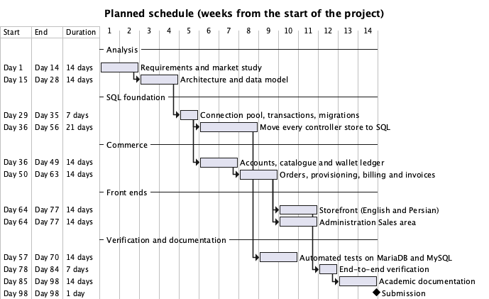

# Introduction

A platform-as-a-service (PaaS) lets a developer run an application by describing what should run rather than by configuring machines. The developer supplies a container image or source code, chooses how much CPU and memory the application may use, and the platform schedules the workload, routes traffic to it, and charges for the resources consumed. Heroku popularised this model [1], and regional providers such as Liara [2] offer it to markets where international payment methods are unavailable, pricing in local currency and charging a prepaid wallet.

SwarmOps is an open control plane for Docker Swarm clusters. It already provides the operator side of such a platform: it enrolls servers through a machine agent, renders and validates application stacks, installs a Traefik gateway, queues every change as a durable command, and records every operator action in an audit ledger. It does not provide the customer side, and its storage design limits what can be built on it.

This proposal describes a university project that closes both gaps and documents the result to an academic standard.

# Problem statement

The project addresses three concrete problems.

**P1 — State without a relational model.** SwarmOps stores its controller state in eleven encrypted JSON snapshot files (servers, keys, applications, credentials, routing, the command queue, the audit ledger, core topology, the agent registry and source settings). Each store loads its whole snapshot into memory, changes it under a mutex and rewrites the file. This design cannot enforce referential integrity between stores, cannot make one change span two stores atomically, cannot be queried with ad-hoc reports, and forces the whole data set into memory.

**P2 — No customers and no commerce.** SwarmOps authenticates exactly one operator whose credentials come from the environment. There is no user table, no product catalogue, no way for someone else to request resources, no payment, and no billing. It is a tool for its owner, not a service others can buy.

**P3 — Provisioning is not tied to payment.** On a commercial platform, taking a customer's money and starting that customer's workload must succeed or fail together. A naive implementation that charges a wallet and then separately calls a deployment API can charge without deploying (if the process stops between the two steps) or deploy without charging.

# Background and related work

**Heroku** runs applications in containers called dynos. Usage is prorated to the second and a dyno's charge in a month never exceeds the price of its tier; invoices are produced after the month ends [1].

**Liara** is an Iranian PaaS. Customers top up a wallet in Toman, choose a plan tier (for example 0.5 vCPU and 512 MB of memory), and are charged hourly from the wallet while the application runs, again with a monthly ceiling [2]. When the wallet is empty the application is stopped until the customer tops up.

**Portainer, Dokku and CapRover** provide web interfaces for running containers on one's own servers, but they are operator tools: they have no customer accounts, catalogue or billing.

The design of SwarmOps Cloud borrows the commercial model of Heroku and Liara (plan tiers, prepaid wallet, hourly charges with a monthly cap, invoices) and implements it on an operator tool, SwarmOps. Established patterns inform the implementation: the append-only ledger for money [3], the transactional outbox for coupling a database change to an asynchronous action [4], and row locking with `SELECT … FOR UPDATE SKIP LOCKED` for a database-backed work queue [5].

# Objectives

| ID | Objective | Measure of success |
|---|---|---|
| O1 | Keep all SwarmOps controller state in a relational database. | Every one of the eleven stores reads and writes MariaDB 11.4 and MySQL 8.4 through versioned SQL migrations; an import command moves existing snapshot files into the database. |
| O2 | Let customers buy hosting. | A customer can register, top up a wallet, order a plan, follow the order, see the running project, read invoices and open support tickets. |
| O3 | Let administrators run the business and the platform. | An administrator can confirm or reject orders, choose the server a deployment runs on, manage plans, adjust wallets with a recorded reason, run billing, issue invoices and answer tickets, alongside the existing server and gateway operations. |
| O4 | Handle money correctly. | Balances never become negative, are always equal to the sum of the ledger, and a retried request never charges or credits twice — including under concurrent requests. |
| O5 | Tie payment to provisioning. | Charging an order and queuing its deployment happen in one database transaction; a deployment that fails is refunded exactly once. |
| O6 | Serve Persian-speaking customers. | The storefront works in English and Persian, with right-to-left layout and Persian digits. |
| O7 | Document the system to an academic standard. | Proposal, requirements specification, C4 architecture model, architecture document, database design, API reference, test report, user manual and operations guide, in English and Persian. |

# Scope

**In scope**

- A SQL persistence layer for SwarmOps with a connection pool, retrying transactions, embedded migrations and encrypted secret columns.
- Migration of all eleven controller stores to SQL, keeping their public interfaces.
- A commerce subsystem: accounts and sessions, plan catalogue, wallet ledger, orders, provisioning, hourly billing, suspension and resumption, invoices with included tax, support tickets and reports.
- A customer storefront and a Sales area in the administration console.
- Automated tests against both database engines and an end-to-end run on a single-node Swarm.
- The documents listed under O7.

**Out of scope**

- A real payment gateway. Top-ups are simulated and clearly labelled as such; the idempotency key a gateway reference would use is implemented.
- Public default domains for customer applications (for example `app.example-cloud.com`), which require a platform-owned wildcard domain.
- Email verification and password reset by email.
- Multi-region operation, autoscaling and Kubernetes.

# Methodology

The project follows an iterative, incremental process. Each increment ends with a working, tested system and is committed separately so it can be reviewed and resumed.

1. **Analysis.** Study the SwarmOps code base and the commercial model of Heroku and Liara; write the requirements.
2. **SQL foundation.** Build the persistence package and the migration runner; decide the engine-compatibility rules (only features shared by MariaDB 11.4 and MySQL 8.4).
3. **Schema and store migration.** Design the relational schema in third normal form and port the stores one at a time, from the simplest (audit) to the most concurrency-sensitive (the command queue).
4. **Commerce backend.** Implement the commerce service and its HTTP interfaces, with tests for concurrency, idempotency and atomicity written alongside.
5. **Front ends.** Build the storefront and the Sales area with the existing component kit, following the console's information-architecture rules.
6. **Verification.** Run the full test suite on both engines and exercise the complete customer and administrator journey in a browser against a real single-node Swarm.
7. **Documentation.** Write the documents from the implemented system, render diagrams from source, and build Word and PDF versions in both languages.

The planned schedule is shown in Figure 1.

{width=100%}

# Tools and technologies

| Area | Choice | Reason |
|---|---|---|
| Backend language | Go 1.26 | SwarmOps is written in Go; strong standard library for HTTP and SQL. |
| Database | MariaDB 11.4 LTS and MySQL 8.4 LTS | Widely taught and deployed; both long-term-support releases support CHECK constraints, JSON columns and `SKIP LOCKED`. |
| Driver | go-sql-driver/mysql | The de facto MySQL driver for Go's `database/sql`. |
| Front end | React 19, TypeScript, Vite 8 | The existing console's stack and component kit. |
| Orchestration | Docker Swarm, Traefik v3.6 | The platform SwarmOps already operates. |
| Diagrams | C4 model [6] with C4-PlantUML | Standard, text-based architecture diagrams kept with the code. |
| Documents | Markdown, pandoc, XeLaTeX, Vazirmatn font | One source per document, rendered to Word and PDF in both languages. |

# Risks and mitigations

| Risk | Likelihood | Impact | Mitigation |
|---|---|---|---|
| Porting the command queue introduces a concurrency defect. | Medium | High | Keep the store's interface; test leasing, retries and fencing on both engines; use row locks rather than in-process mutexes. |
| MariaDB and MySQL differ in syntax or behaviour. | Medium | Medium | Use only shared features; run the whole test suite against both engines in continuous integration. |
| Money is charged twice or balances drift. | Low | High | Append-only ledger, idempotency keys with unique constraints, a CHECK constraint on the balance, and a concurrency test with fifty parallel charges. |
| A failed deployment leaves a customer charged. | Medium | High | Transactional outbox for the deployment command; automatic refund on failure, tested for exactly-once behaviour. |
| Persian typesetting of the documents fails. | Medium | Low | Test the right-to-left pipeline early with a sample document. |
| The end-to-end run needs infrastructure unavailable on a laptop. | Medium | Medium | Use a single-node Swarm and a loopback machine agent; state clearly what could not be verified locally. |

# Expected outcomes

- A working SwarmOps Cloud: controller state in SQL, a storefront, a Sales area, transactional provisioning and billing.
- A relational schema with migrations, views for reporting, and a data dictionary.
- A test suite that passes on MariaDB and MySQL, and a report of an end-to-end run.
- The complete document set in English and Persian, as Markdown, Word and PDF.

# Evaluation

The project will be judged successful when each objective's measure in the objectives table is met and demonstrated: by automated tests for O1, O4 and O5; by an end-to-end browser run for O2, O3 and O6; and by the delivered documents for O7. Anything that cannot be verified locally will be listed as such in the test report rather than claimed.

# References

[1] Heroku, "Usage & Billing," Heroku Dev Center. [Online]. Available: https://devcenter.heroku.com/articles/usage-and-billing. Accessed: Sep. 2026.

[2] Liara, "Pricing," Liara Cloud. [Online]. Available: https://liara.ir/pricing. Accessed: Sep. 2026.

[3] M. Kleppmann, *Designing Data-Intensive Applications*. Sebastopol, CA, USA: O'Reilly Media, 2017.

[4] C. Richardson, "Pattern: Transactional outbox," microservices.io. [Online]. Available: https://microservices.io/patterns/data/transactional-outbox.html. Accessed: Sep. 2026.

[5] Oracle, "MySQL 8.4 Reference Manual — Locking Read Concurrency with NOWAIT and SKIP LOCKED." [Online]. Available: https://dev.mysql.com/doc/refman/8.4/en/innodb-locking-reads.html. Accessed: Sep. 2026.

[6] S. Brown, "The C4 model for visualising software architecture." [Online]. Available: https://c4model.com. Accessed: Sep. 2026.
