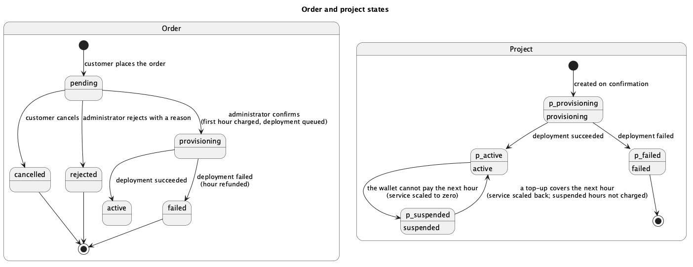

# Introduction

## Purpose

This specification defines what SwarmOps Cloud must do and the qualities it must have. It is written for the course instructor evaluating the project, for developers maintaining the system, and for testers deriving test cases.

## Scope

SwarmOps Cloud lets customers buy container hosting and lets administrators run both the business and the platform. It consists of:

- a **storefront** where customers register, top up a prepaid wallet, order plans, follow orders and projects, read invoices and open support tickets;
- an **administration console** where administrators confirm or reject orders, manage plans, wallets, billing and tickets, and operate servers, the gateway and applications;
- **SwarmOps Core**, the server that implements both, keeps all state in MariaDB or MySQL, and deploys applications to Docker Swarm through a machine agent.

Real payment processing, public default domains for applications, email verification and multi-region operation are outside the scope of this release.

## Definitions, acronyms and abbreviations

| Term | Meaning |
|---|---|
| Administrator | A person who operates SwarmOps Cloud through the console. |
| Agent | The SwarmOps machine agent: a service on each server that performs Docker and Swarm operations for Core. |
| Command | A durable, typed unit of work (for example `application.deploy`) stored in the database and executed by the command worker. |
| Core | SwarmOps Core, the server process. |
| CSRF | Cross-site request forgery. |
| DSN | Data source name: the connection string of the database. |
| Ledger | The append-only list of wallet transactions. |
| Outbox | The transactional outbox pattern: a message (here, a command) is written in the same transaction as the business change that causes it. |
| PaaS | Platform as a service. |
| Plan | A product: CPU, memory and disk limits with an hourly price and a monthly cap. |
| Project | A customer's application created by a confirmed order. |
| Rial, toman | Iranian currency units. Amounts are stored in rials and shown in tomans (1 toman = 10 rials). |
| SPA | Single-page application. |
| Swarm manager | A Docker Swarm node that can schedule services. |

## References

[1] ISO/IEC/IEEE 29148:2018, *Systems and software engineering — Life cycle processes — Requirements engineering*.

[2] S. Brown, "The C4 model for visualising software architecture," https://c4model.com.

[3] SwarmOps Cloud, *Project Proposal*, September 2026.

[4] SwarmOps Cloud, *C4 Architecture Model*, *Database Design* and *API Reference*, September 2026.

## Overview

Section 2 describes the product as a whole. Section 3 lists the specific requirements. Section 4 describes the use cases. Section 5 traces requirements to objectives, implementation and verification.

# Overall description

## Product perspective

SwarmOps Cloud extends SwarmOps, an existing control plane for Docker Swarm. SwarmOps already enrolled servers, rendered application stacks, installed the Traefik gateway, queued changes as commands and audited operator actions. This release replaces its file-based storage with a relational database and adds the commerce subsystem and the storefront. Figure 1 shows the system in its environment; the C4 model document describes it in detail.

{width=100%}

## Product functions

- Customer accounts with sessions, CSRF protection and rate-limited sign-in.
- A plan catalogue that administrators edit and customers order from.
- A prepaid wallet whose every change is a ledger row.
- Orders that administrators confirm, with payment and provisioning in one transaction.
- Automatic deployment of the ordered image to a Swarm manager, with refunds for failures.
- Hourly billing capped at a monthly price, suspension when the wallet cannot pay, and resumption after a top-up.
- Monthly invoices with included value-added tax.
- Support tickets between customers and administrators.
- Reports on customers, revenue and platform activity.
- The existing SwarmOps operations: servers, gateway, applications, command runs and audit.

## User classes and characteristics

| User class | Characteristics | Interface |
|---|---|---|
| Customer | A developer or small business. Knows how to build and publish a container image; no knowledge of Swarm required. May prefer Persian. | Storefront |
| Administrator | Runs the service. Understands Docker Swarm and the platform's billing rules. | Administration console |
| Application visitor | Uses an application a customer deployed. Never sees SwarmOps. | The customer's application |
| Billing job and command worker | Parts of Core that act without a person, on a schedule or when a command is due. | Internal |

## Operating environment

- **Core:** a Go 1.26 binary on Ubuntu 24.04 or macOS.
- **Database:** MariaDB 11.4 LTS or MySQL 8.4 LTS, InnoDB, `utf8mb4`.
- **Cluster:** Docker Swarm on Ubuntu nodes running the SwarmOps agent, with a Traefik v3.6 gateway on a manager labelled `nim.edge=true`.
- **Clients:** current desktop and mobile browsers, down to a 400-pixel-wide screen.

## Design and implementation constraints

- **C-1** Only database features common to MariaDB 11.4 and MySQL 8.4 may be used: InnoDB transactions, CHECK constraints, JSON columns, `SELECT … FOR UPDATE SKIP LOCKED` and `GET_LOCK`.
- **C-2** The data-encryption key must never be stored in the database.
- **C-3** Only one Core may act on the cluster at a time. It is the *active* core, identified by an authority epoch.
- **C-4** The public Go interfaces of the existing SwarmOps stores must be kept, so that the rest of SwarmOps is unaffected by the change of storage.
- **C-5** The console must follow its information-architecture rules. There is one navigation registry, every page has a route, destructive actions need a typed confirmation phrase, and every API reading is displayed somewhere.

## Assumptions and dependencies

- **A-1** Payments are simulated: a top-up credits the wallet without contacting a gateway, and the storefront says so.
- **A-2** An ordered image is published to a registry the cluster can pull from. It answers `GET /healthz` with status 200 on the ordered port and contains `wget` or `curl` for that check.
- **A-3** A Swarm manager is connected, and the managed Traefik gateway is installed on it, before orders can be deployed.
- **A-4** Applications receive an internal route inside the cluster; public domains are not assigned in this release.

# Specific requirements

Each requirement has an identifier, a statement, and a priority: **M** (must) or **S** (should).

## External interface requirements

### User interfaces

- **UI-1 (M)** The storefront is served at `/store`. It offers these pages, each reachable by an address: plans, sign-in, registration, dashboard, wallet, checkout for a plan, orders, projects, invoices and support.
- **UI-2 (M)** The console has a Sales area with five pages — Orders, Customers, Plans, Billing and Support — registered in the console's navigation and router.
- **UI-3 (M)** The storefront offers English and Persian. Persian uses right-to-left layout and Persian digits, and the choice is remembered in the browser.
- **UI-4 (M)** Money is shown in tomans with thousands separators. The storefront states that prices are in tomans.
- **UI-5 (M)** Every status is shown in words beside its colour.
- **UI-6 (S)** Pages work at 400 pixels wide. The storefront follows the viewer's light or dark theme; the console keeps the light theme it had before this project.

### Software interfaces

- **SI-1 (M)** Core connects to MariaDB 11.4 or MySQL 8.4 with a DSN read from a protected file in production, and forces UTC, `parseTime` and `utf8mb4`.
- **SI-2 (M)** Core calls the machine agent over HTTPS with a pinned certificate and an API key.
- **SI-3 (M)** The agent deploys stacks through the Docker Engine API, and the gateway is Traefik v3.6.

### Communications interfaces

- **CI-1 (M)** The storefront calls `/api/store/v1`; the console calls `/api/v1`. Both exchange JSON over HTTPS.
- **CI-2 (M)** The storefront session travels in the cookie `swarmops_store_session` (HttpOnly, SameSite=Strict, Path=/, Secure when secure cookies are configured). Every request that changes data carries the session's token in the `X-CSRF-Token` header.

## Functional requirements

### Accounts (ACC)

- **FR-ACC-1 (M)** A visitor can register with an email address, a full name and a password of 10 to 72 characters. The email address must be valid and unused.
- **FR-ACC-2 (M)** A registered customer can sign in with email and password. Passwords are stored as bcrypt hashes (cost 12). An unknown email address takes as long to reject as a wrong password.
- **FR-ACC-3 (M)** After eight failed sign-in attempts for the same key within fifteen minutes, further attempts are refused until the window passes.
- **FR-ACC-4 (M)** A session lasts twelve hours. Signing out revokes it.
- **FR-ACC-5 (M)** A request that changes data is refused with status 403 unless its CSRF token matches the session's.
- **FR-ACC-6 (S)** When the storefront's token is refused because the session changed (for example after signing in from another tab), the storefront reads the current session once and repeats the request with the same idempotency key.
- **FR-ACC-7 (M)** An administrator can suspend a customer. Suspension revokes all of the customer's sessions and prevents sign-in; it does not stop running projects. An administrator can reactivate the customer.
- **FR-ACC-8 (M)** The console's operator is represented by an administrator account, so that decisions such as order reviews and wallet adjustments are attributed to a user.

### Catalogue (CAT)

- **FR-CAT-1 (M)** Anyone can list the plans currently offered, in display order, with their CPU, memory, disk, hourly price, monthly cap, description and features. The Persian storefront shows the Persian description and features when a plan has them, and the English ones otherwise.
- **FR-CAT-2 (M)** An administrator can create or edit a plan. The code is 2–32 lowercase letters, digits or hyphens. The name is required. The description and its Persian version are each under 255 characters. CPU is 100–64,000 millicores and memory 128 MiB–256 GiB. The hourly price is positive and the monthly cap is at least one hour's price. There are at most 12 features in each language, each under 160 characters.
- **FR-CAT-3 (M)** An administrator can withdraw a plan. A withdrawn plan is hidden from the storefront but remains attached to existing orders and projects.
- **FR-CAT-4 (M)** An order keeps the hourly and monthly prices in force when it was placed; later price changes do not affect it.

### Wallet (WAL)

- **FR-WAL-1 (M)** Each customer has one wallet whose balance is never negative.
- **FR-WAL-2 (M)** A customer can top up between 100,000 and 2,000,000,000 rials. Each top-up carries an idempotency key; repeating a request with the same key credits the wallet only once.
- **FR-WAL-3 (M)** Every change to a balance is recorded as a ledger row with its kind (`topup`, `order_charge`, `usage`, `refund` or `adjustment`), signed amount, resulting balance, reference and description. Ledger rows are never updated or deleted.
- **FR-WAL-4 (M)** An administrator can adjust a wallet by a non-zero amount with a stated reason. The adjustment is a ledger row and cannot make the balance negative.
- **FR-WAL-5 (M)** The console shows whether a wallet's balance equals the sum of its ledger.
- **FR-WAL-6 (M)** A top-up resumes any of the customer's suspended projects that the new balance can pay for.

### Orders (ORD)

- **FR-ORD-1 (M)** A signed-in customer can order an offered plan by giving:
  - an application name: a lowercase letter followed by up to 40 lowercase letters, digits or hyphens, not already in use;
  - a container image with a tag other than `latest`, or a digest;
  - the port the application listens on;
  - an optional note of under 500 characters.
- **FR-ORD-2 (M)** A new order is `pending`. The customer can cancel it while it is pending.
- **FR-ORD-3 (M)** An administrator can reject a pending order with a reason, which the customer sees.
- **FR-ORD-4 (M)** An administrator can confirm a pending order by choosing a connected Swarm manager. The console requires the phrase `CONFIRM_ORDER_<id>` to be typed first. Core refuses confirmation when:
  - mutations are disabled;
  - command storage or the audit ledger is unavailable;
  - the server is unknown or not a Swarm manager;
  - the application does not pass planning on that server.
- **FR-ORD-5 (M)** Confirmation requires the wallet to hold at least 24 hours of the plan's hourly price.
- **FR-ORD-6 (M)** Confirmation is one database transaction. It locks the wallet, charges the first hour, creates the project and its first usage record, and inserts the `application.deploy` command with the idempotency key `cloud-order-<id>`. Either all of these happen or none does.
- **FR-ORD-7 (M)** An order becomes `active` when its deployment succeeds and `failed` when it fails (Figure 2).

{width=90%}

### Provisioning (PRV)

- **FR-PRV-1 (M)** The command worker executes the deployment on the chosen server. It limits the application to the plan's CPU and memory and routes it through the gateway.
- **FR-PRV-2 (M)** When the deployment command ends in `needs_attention`, `failed` or `cancelled`, the project and order become `failed`. The first-hour charge is refunded exactly once (idempotency key `order-refund-<id>`), and the refunded hour's usage record is removed so it is neither shown nor invoiced.
- **FR-PRV-3 (M)** Only the active core executes commands and records their outcomes.

### Billing (BIL)

- **FR-BIL-1 (M)** Each running project is charged its hourly price once per clock hour. A second charge for the same project and hour is impossible.
- **FR-BIL-2 (M)** A project's charges in a calendar month never exceed its plan's monthly cap.
- **FR-BIL-3 (M)** Billing runs automatically every five minutes on the active core, and an administrator can run it on demand. Running it again charges nothing already charged.
- **FR-BIL-4 (M)** When a wallet cannot pay a project's next hour, the project becomes `suspended` and its service is scaled to zero.
- **FR-BIL-5 (M)** When a top-up can pay the next hour, a suspended project is resumed and its service scaled back. The hours it spent suspended are not charged.

### Invoices (INV)

- **FR-INV-1 (M)** For each calendar month, each customer with usage receives one invoice listing each project's hours and amount.
- **FR-INV-2 (M)** Prices include value-added tax at a configurable rate (default 10 %). The tax contained in a total is `total × rate / (10000 + rate)` with the rate in basis points. For every invoice, total = subtotal + tax.
- **FR-INV-3 (M)** Invoices are numbered `INV-YYYYMM-NNNNNN` and issued as paid, because charges come from the prepaid wallet.
- **FR-INV-4 (M)** Last month's invoices are issued automatically, and an administrator can issue a chosen month's invoices. Issuing twice creates no duplicate.
- **FR-INV-5 (M)** A customer can read their own invoices only; an administrator can read all.

### Support (SUP)

- **FR-SUP-1 (M)** A customer can open a ticket with:
  - a subject of 3 to 160 characters;
  - a message of under 5,000 characters;
  - a priority of low, normal or high;
  - optionally, one of their own projects.
- **FR-SUP-2 (M)** Customers and administrators can reply. An administrator's reply marks the ticket `answered`; either side can close it.
- **FR-SUP-3 (M)** A customer can see only their own tickets.

### Reports (REP)

- **FR-REP-1 (M)** The console shows:
  - this month's revenue (charges less refunds);
  - the numbers of active and suspended projects;
  - the total balance customers hold.
- **FR-REP-2 (M)** The console lists customers with balance, live projects and pending orders, and revenue by month with amounts charged, refunded and topped up and the number of paying customers.

### Platform operations (OPS)

- **FR-OPS-1 (M)** The existing SwarmOps operations remain available to administrators: servers, gateway installation and repair, applications, command runs and audit.
- **FR-OPS-2 (M)** Every administrator action that changes state is recorded in the audit ledger.

### Data management (DAT)

- **FR-DAT-1 (M)** All SwarmOps controller state is stored in the relational database: audit, applications, credentials, source connections and settings, servers and keys, core topology, the agent registry, routing and the command queue.
- **FR-DAT-2 (M)** The schema is created by numbered SQL migrations applied in order. Each migration's checksum is recorded and verified, and a database lock prevents two processes migrating at once.
- **FR-DAT-3 (M)** The `migrate-state` command imports existing encrypted snapshot files into the database and keeps the files as a backup.
- **FR-DAT-4 (M)** Secret columns are encrypted with AES-GCM. The associated data binds each value to its table, column and row, so an encrypted value copied to another row cannot be decrypted.

## Non-functional requirements

### Security

- **NFR-SEC-1 (M)** The protections already specified must hold: passwords as bcrypt hashes, sessions in HttpOnly SameSite=Strict cookies, CSRF tokens on every change, and rate-limited sign-in (FR-ACC-2 to FR-ACC-5).
- **NFR-SEC-2 (M)** A customer can never read or change another customer's orders, projects, invoices, wallet or tickets. No customer session reaches an administration route.
- **NFR-SEC-3 (M)** Secrets in the database are encrypted (FR-DAT-4), and the data key and DSN are read from files readable only by the service.
- **NFR-SEC-4 (M)** Destructive and costly administrator actions require a typed confirmation phrase in the console.

### Integrity and reliability

- **NFR-REL-1 (M)** Money invariants hold under concurrent requests: the balance is never negative, it equals the sum of the ledger, and no idempotent request applies twice.
- **NFR-REL-2 (M)** Transactions run at READ COMMITTED isolation and are retried automatically after a deadlock (error 1213) or lock-wait timeout (error 1205).
- **NFR-REL-3 (M)** Database constraints — primary and foreign keys, unique keys and CHECK constraints — enforce integrity independently of the application code.
- **NFR-REL-4 (M)** A restart of Core loses no accepted command, charge or order.

### Performance and scalability

- **NFR-PERF-1 (M)** Every foreign key and every column used to filter or order a frequent query is indexed.
- **NFR-PERF-2 (M)** Claiming due commands uses row locks with `SKIP LOCKED`, so waiting work does not block the claim.
- **NFR-PERF-3 (S)** Stores read from the database on demand rather than holding whole data sets in memory. The exceptions are the server manager's live connections and the in-memory caches the remote manager keeps.

### Portability

- **NFR-PORT-1 (M)** The system runs unchanged on MariaDB 11.4 and MySQL 8.4, and the full automated test suite passes on both.

### Usability and accessibility

- **NFR-USE-1 (M)** Error messages from validation name the field and say how to correct it.
- **NFR-USE-2 (S)** The storefront checkout states the image requirements (tag, health endpoint) before the customer orders.
- **NFR-USE-3 (M)** Status is never conveyed by colour alone (UI-5).

### Maintainability

- **NFR-MAINT-1 (M)** Automated tests cover accounts, wallet concurrency, idempotency, order atomicity, billing, suspension, invoices, tickets, reports and the HTTP interfaces. Continuous integration runs them against both engines.
- **NFR-MAINT-2 (M)** Architecture diagrams are kept as text next to the code and rendered during the documentation build.

# Use cases

Figure 3 shows the actors and use cases. The principal use cases are described below; the others follow directly from the functional requirements they name.

{width=100%}

## UC-03 Order a plan

| | |
|---|---|
| **Actor** | Customer |
| **Requirements** | FR-ORD-1, FR-ORD-2, FR-CAT-4 |
| **Precondition** | The customer is signed in and the plan is offered. |
| **Main flow** | 1. The customer chooses a plan on the Plans page. 2. The checkout shows the hourly price, the monthly cap and the balance required at approval. 3. The customer enters the application name, image and port, and optionally a note. 4. The customer places the order. 5. The system stores the order with the current prices and shows it as *In review*. |
| **Alternative flows** | 3a. A field is invalid: the system names the field and the rule, and nothing is stored. 3b. The name is taken: the system says so. |
| **Postcondition** | A pending order exists; no money has moved. |

## UC-05 Review and confirm an order

| | |
|---|---|
| **Actor** | Administrator |
| **Requirements** | FR-ORD-4, FR-ORD-5, FR-ORD-6, FR-PRV-1, FR-PRV-2 |
| **Precondition** | The order is pending; a Swarm manager is connected and the gateway is installed. |
| **Main flow** | 1. The administrator opens Sales › Orders and chooses *Review*. 2. The system shows the customer, application, image, port, plan and note, and lists eligible servers. 3. The administrator chooses a server and types `CONFIRM_ORDER_<id>`. 4. The administrator confirms. 5. In one transaction, the system charges the first hour, creates the project and queues the deployment. 6. The worker deploys the application; the order and project become active. |
| **Alternative flows** | 4a. The wallet holds less than 24 hours of the price: the system refuses and states the required amount. 4b. The server is not a connected manager, or the application fails planning: the system refuses and nothing is charged. 6a. The deployment fails: the order and project become failed and the hour is refunded. |
| **Postcondition** | Either the application runs and the first hour is paid, or no net charge remains. |

## UC-08 Bill running projects hourly

| | |
|---|---|
| **Actor** | Billing job (or an administrator on demand) |
| **Requirements** | FR-BIL-1 to FR-BIL-5 |
| **Precondition** | This core is the active core. |
| **Main flow** | 1. For each active project, the system determines the hours not yet charged since activation or resumption. 2. For each such hour, below the monthly cap, it charges the wallet and records the usage in one transaction. |
| **Alternative flows** | 2a. The wallet cannot pay: the project is suspended and its service scaled to zero. 2b. The hour was already charged: nothing happens. |
| **Postcondition** | Every elapsed hour of every running project is charged exactly once, or the project is suspended. |

## UC-10 Open and answer a support ticket

| | |
|---|---|
| **Actors** | Customer, Administrator |
| **Requirements** | FR-SUP-1 to FR-SUP-3 |
| **Main flow** | 1. The customer opens a ticket on the Support page. 2. The administrator sees it under Sales › Support with status *open*. 3. The administrator replies; the ticket becomes *answered*. 4. The customer reads the reply and may reply or close the ticket. |
| **Postcondition** | The conversation is stored and visible only to the customer and administrators. |

# Traceability

Table 1 traces each group of requirements to the objective it serves (see the Proposal), the implementation that meets it and the verification that demonstrates it. Test names refer to Go tests in the repository; *E2E* refers to steps of the end-to-end run reported in the Test Plan and Report.

| Requirements | Objective | Implementation | Verification |
|---|---|---|---|
| FR-DAT-1 to FR-DAT-4 | O1 | `internal/sqlstore`, migrations `0001`–`0007`, the eleven rewritten stores, `cmd/api/migrate_state.go` | Store test suites on MariaDB and MySQL; `internal/sqlstore` migration and deadlock-retry tests |
| FR-ACC-1 to FR-ACC-5, FR-ACC-7 | O2, O3 | `internal/cloud/accounts.go`, `api/http/cloud_api.go` | `TestRegisterLoginAndSessionsAreSafe`, `TestASuspendedCustomerLosesEverySession`; E2E registration and sign-in |
| FR-ACC-6 | O2 | `web/src/store/api.ts` | E2E stale-token ticket (403, session read, 201) |
| FR-CAT-1 to FR-CAT-4 | O2, O3 | `internal/cloud/catalog.go`, Sales › Plans | `TestOrdersRefuseTakenNamesAndInvalidApplications`; E2E checkout shows snapshot prices |
| FR-WAL-1 to FR-WAL-6 | O4 | `internal/cloud/wallet.go`, migration `0008` | `TestConcurrentChargesNeverOverdrawAndMatchTheLedger`, `TestATopUpIsCreditedOncePerIdempotencyKey`; E2E top-up |
| FR-ORD-1 to FR-ORD-7 | O2, O3, O5 | `internal/cloud/orders.go`, `queue.Store.SubmitInTx` | `TestConfirmingAnOrderChargesProvisionsAndQueuesTogether`, `TestAConfirmationThatCannotQueueItsDeploymentChargesNothing`, `TestConfirmationRequiresTheReserve`; E2E orders 1–3 |
| FR-PRV-1 to FR-PRV-3 | O5 | `OnCommandTransition`, command worker | `TestTheDeploymentOutcomeActivatesOrFailsAndRefundsOnce`; E2E refunds of orders 1 and 2, activation of order 3 |
| FR-BIL-1 to FR-BIL-5 | O4 | `internal/cloud/billing.go`, `cmd/api/cloud_billing.go` | `TestBillingIsHourlyCappedAndIdempotent`, `TestAWalletThatCannotPaySuspendsAndATopUpResumesWithoutBackCharging` |
| FR-INV-1 to FR-INV-5 | O3, O4 | `internal/cloud/invoices.go` | `TestInvoicesStateIncludedTaxAndAreIssuedOnce` |
| FR-SUP-1 to FR-SUP-3 | O2, O3 | `internal/cloud/tickets.go`, Sales › Support | `TestTicketsAreVisibleOnlyToTheirCustomerAndAdministrators`; E2E ticket opened and answered |
| FR-REP-1, FR-REP-2 | O3 | `internal/cloud/reports.go`, views in `0008` | `TestReportsReadTheViews` |
| FR-OPS-1, FR-OPS-2 | O3 | existing SwarmOps operations, `internal/audit` | Existing SwarmOps test suites; E2E gateway prerequisite repair and installation |
| UI-1 to UI-6 | O2, O3, O6 | `web/src/store`, `web/src/screens/sales` | Console rule tests (`operator-workflows.test.mjs`); E2E in English and Persian |
| NFR-SEC-1 to NFR-SEC-4 | O4 | as above | HTTP authorisation tests in `api/http/cloud_api_test.go` |
| NFR-REL-1 to NFR-REL-4 | O4, O5 | `sqlstore.WithTx`, constraints in migrations | Concurrency and atomicity tests above; deadlock-retry test |
| NFR-PORT-1 | O1 | engine-neutral SQL | Full suite on MariaDB 11.4 and MySQL 8.4 |

: Traceability of requirements
