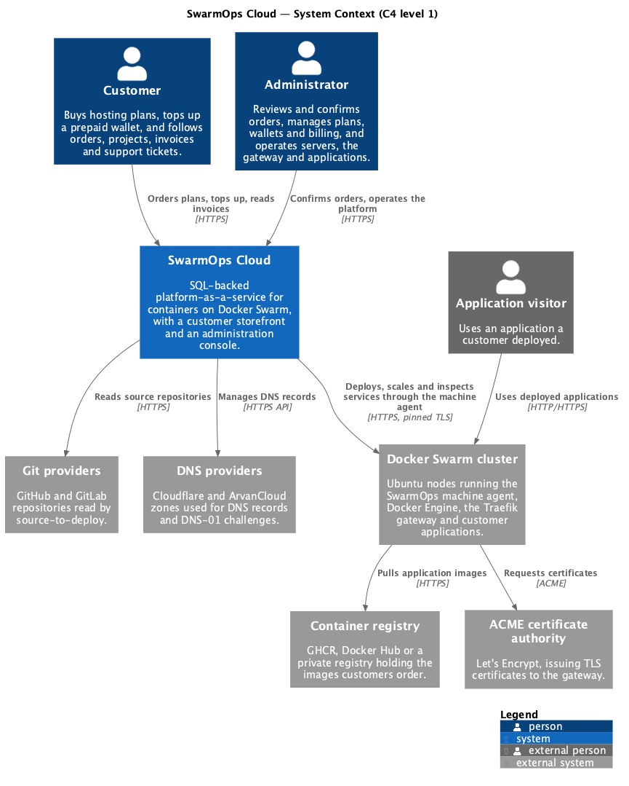
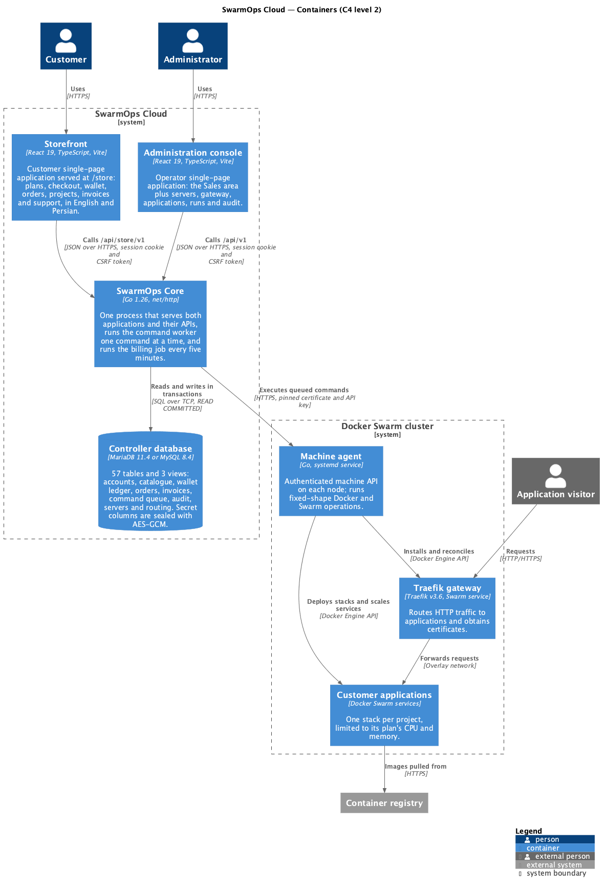
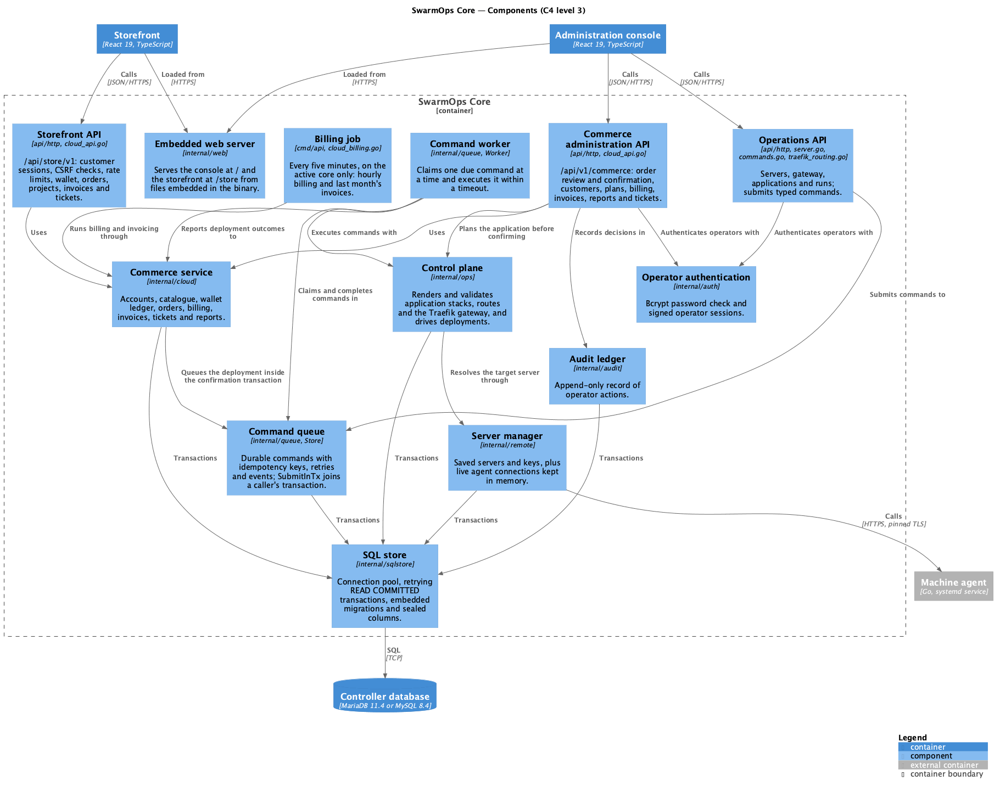
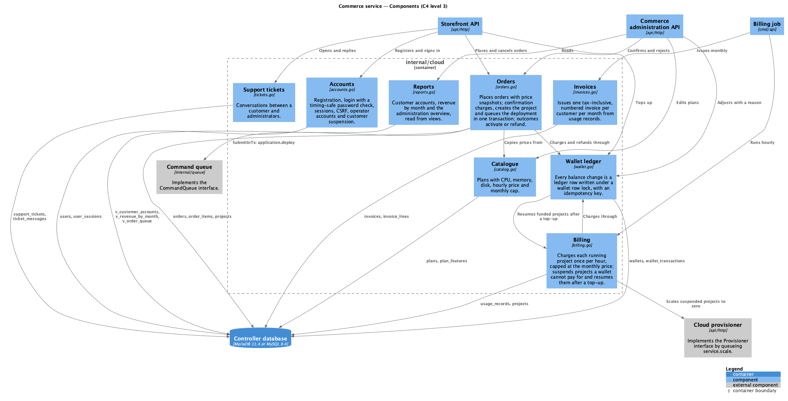
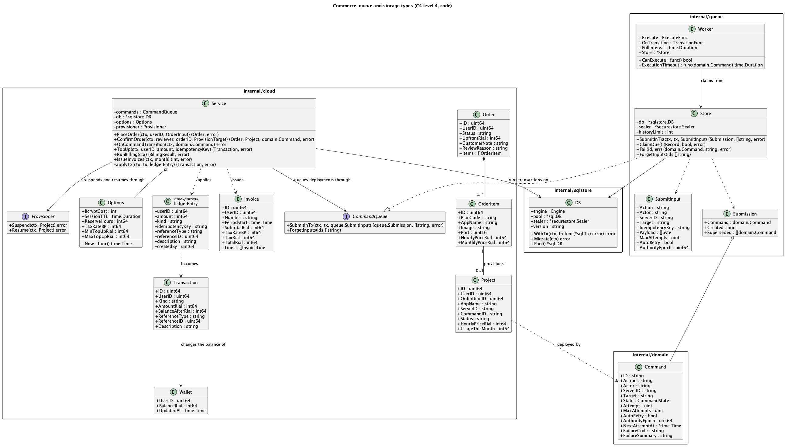
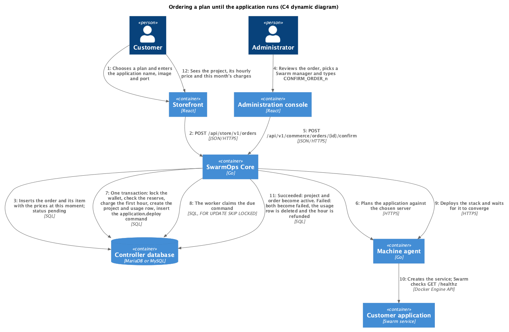
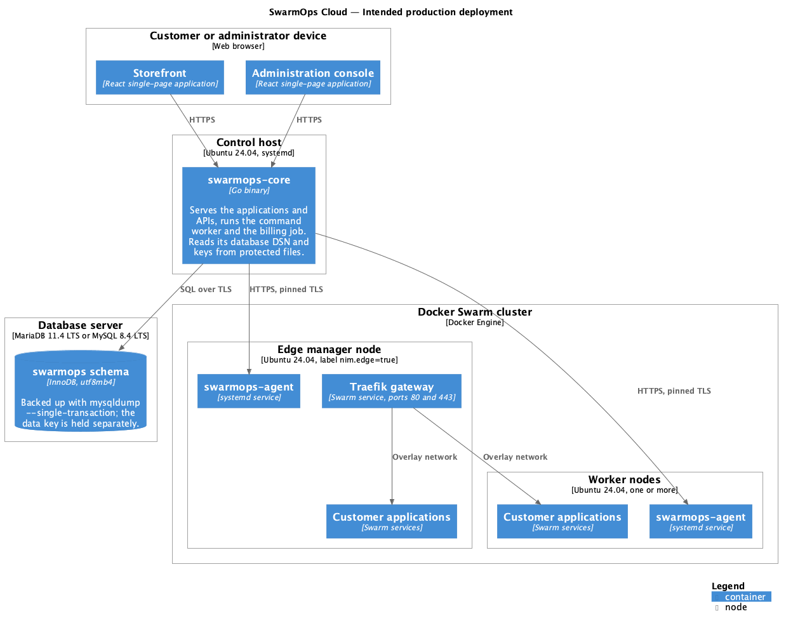
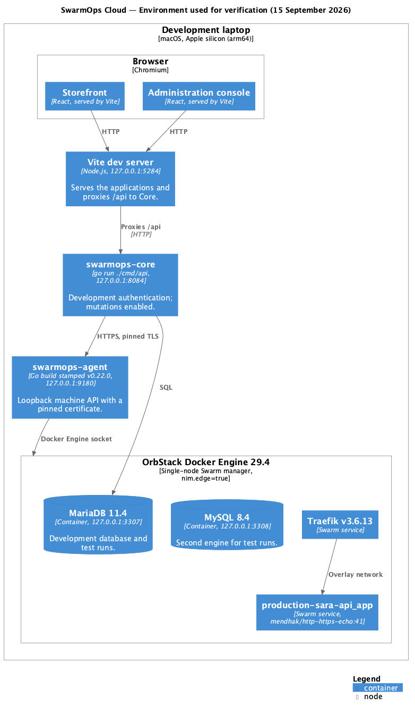

# The C4 model

The C4 model, introduced by Simon Brown [1], describes a software system at four levels of zoom:

1. **System context** — the system as a box, the people who use it and the other systems it depends on.
2. **Containers** — the separately running or deployable units inside the system (applications, databases, services) and how they communicate.
3. **Components** — the major structural building blocks inside one container and their responsibilities.
4. **Code** — the classes, types and interfaces that implement a component.

Two supplementary diagram types are used here. *Dynamic diagrams* show how elements collaborate at run time for one scenario. *Deployment diagrams* show how containers map onto infrastructure.

**Notation.** People are drawn as person shapes, the system under discussion and its parts in blue, and external systems in grey. Databases are drawn as cylinders. Arrows are one-directional and labelled with the intent of the interaction and, where useful, the protocol. Each diagram includes a legend.

**Sources.** The diagrams are kept in `docs/academic/diagrams/*.puml` and use the C4-PlantUML library bundled with PlantUML. The documentation build renders them to PNG and SVG.

# Level 1 — System context

Figure 1 shows SwarmOps Cloud in its environment.

{width=100%}

| Element | Kind | Responsibility |
|---|---|---|
| Customer | Person | Buys hosting plans, tops up a prepaid wallet, follows orders and projects, reads invoices and opens support tickets. |
| Administrator | Person | Confirms or rejects orders; manages plans, wallets, billing and tickets; operates servers, the gateway and applications. |
| Application visitor | External person | Uses an application that a customer deployed. |
| SwarmOps Cloud | Software system | The system described here: storefront, administration console and SwarmOps Core with its database. |
| Docker Swarm cluster | External system | The servers that run the machine agent, Docker Engine, the Traefik gateway and customer applications. |
| Container registry | External system | Holds the images customers order. |
| Git providers | External system | Repositories read by the source-to-deploy feature SwarmOps already had. |
| DNS providers | External system | Cloudflare and ArvanCloud zones used for records and DNS-01 certificate challenges. |
| ACME certificate authority | External system | Issues TLS certificates to the gateway. |

: Elements of the system context

**Boundary decisions.** The Swarm cluster is outside the system boundary because customers' workloads run there and it is operated through a narrow interface: fixed-shape operations sent to the machine agent. A payment gateway does not appear: top-ups are simulated in this release (Proposal, section 6).

# Level 2 — Containers

Figure 2 opens the SwarmOps Cloud box.

{width=100%}

| Container | Technology | Responsibility |
|---|---|---|
| Storefront | React 19, TypeScript, Vite; served at `/store` | Customer single-page application in English and Persian: plans, checkout, wallet, orders, projects, invoices, support. |
| Administration console | React 19, TypeScript, Vite; served at `/` | Operator single-page application: the Sales area plus servers, gateway, applications, runs and audit. |
| SwarmOps Core | Go 1.26, `net/http` | Serves both applications and their JSON APIs; authenticates users; runs the command worker and the billing job. |
| Controller database | MariaDB 11.4 or MySQL 8.4 | Holds all state: 57 tables and 3 views across nine migrations. Secret columns are encrypted. |
| Machine agent | Go, systemd service on each node | Performs Docker and Swarm operations requested by Core. |
| Traefik gateway | Traefik v3.6, Swarm service | Routes HTTP traffic to applications and obtains certificates. |
| Customer applications | Docker Swarm services | One stack per project, limited to its plan's CPU and memory. |

: Containers

**Why the worker and billing job are not separate containers.** Both run inside the Core process. Only the *active* core may execute commands or charge wallets (constraint C-3 of the SRS). Keeping them in the same process means the check that decides whether this core is active is the same check the API uses, so a standby core cannot bill or deploy by accident. They appear as components at level 3.

**Why one database for both platform and commerce.** Confirming an order must charge the wallet and queue the deployment atomically. Because the command queue and the wallet ledger live in the same database, a single local transaction achieves this without a distributed protocol. Section 6 describes the pattern.

# Level 3 — Components

## SwarmOps Core

Figure 3 shows the components inside SwarmOps Core.

{width=100%}

| Component | Code | Responsibility |
|---|---|---|
| Embedded web server | `internal/web` | Serves the console and the storefront from files embedded in the binary. |
| Storefront API | `api/http/cloud_api.go` | `/api/store/v1`: customer session cookie, CSRF check, sign-in rate limiting, and the customer's wallet, orders, projects, invoices and tickets. |
| Commerce administration API | `api/http/cloud_api.go` | `/api/v1/commerce`: order review and confirmation, customers, plans, billing, invoices, reports and tickets, behind operator authentication. |
| Operations API | `api/http` (`server.go`, `commands.go`, `traefik_routing.go` and others) | The existing SwarmOps operations; each change is submitted as a command. |
| Operator authentication | `internal/auth` | Checks the operator password and signs operator sessions. |
| Commerce service | `internal/cloud` | Business rules for accounts, catalogue, wallet, orders, billing, invoices, tickets and reports. |
| Billing job | `cmd/api/cloud_billing.go` | Every five minutes on the active core: hourly billing, then last month's invoices. |
| Command queue | `internal/queue` (`Store`) | Durable commands with idempotency keys, retries, events and outputs; `SubmitInTx` joins a caller's transaction. |
| Command worker | `internal/queue` (`Worker`) | Claims one due command at a time and executes it within a timeout; reports transitions. |
| Control plane | `internal/ops` | Renders and validates application stacks, routes and the gateway; drives deployments. |
| Server manager | `internal/remote` | Saved servers and keys in SQL; live agent connections in memory. |
| Audit ledger | `internal/audit` | Append-only record of operator actions. |
| SQL store | `internal/sqlstore` | Connection pool, retrying transactions, embedded migrations and sealed columns. |

: Components of SwarmOps Core

## Commerce service

Figure 4 opens the commerce service. Each component corresponds to one source file in `internal/cloud`, and all share one `Service` value.

{width=100%}

| Component | File | Responsibility | Tables |
|---|---|---|---|
| Accounts | `accounts.go` | Registration, sign-in with a timing-safe check, sessions and CSRF tokens, operator accounts, customer suspension. | `users`, `user_sessions` |
| Catalogue | `catalog.go` | Plans and their features. | `plans`, `plan_features`, `product_categories` |
| Wallet ledger | `wallet.go` | Applies every balance change as a ledger row under a wallet row lock, with an idempotency key. | `wallets`, `wallet_transactions` |
| Orders | `orders.go` | Places orders with price snapshots; confirmation charges, creates the project and queues the deployment in one transaction; outcomes activate or refund. | `orders`, `order_items`, `projects`, `usage_records` |
| Billing | `billing.go` | Hourly charges capped monthly; suspension and resumption through the provisioner. | `usage_records`, `projects` |
| Invoices | `invoices.go` | Monthly, tax-inclusive, numbered invoices from usage records. | `invoices`, `invoice_lines` |
| Support tickets | `tickets.go` | Customer–administrator conversations. | `support_tickets`, `ticket_messages` |
| Reports | `reports.go` | Customer accounts, revenue by month and the overview, read from views. | `v_customer_accounts`, `v_revenue_by_month`, `v_order_queue` |

: Components of the commerce service

The service depends on two interfaces rather than on concrete packages. **`CommandQueue`** is implemented by the command queue's `Store`. **`Provisioner`** is implemented in the HTTP layer by queueing a `service.scale` command. This keeps `internal/cloud` testable with fakes and free of HTTP and Swarm details.

# Level 4 — Code

Figure 5 shows the principal types behind orders, the wallet and the command queue.

{width=100%}

Four points in this diagram carry the design:

- **`Service.applyTx`** is the only code that changes a balance. It takes an unexported `ledgerEntry`, locks the wallet row with `SELECT … FOR UPDATE`, and returns the existing transaction if the idempotency key was already used. Otherwise it inserts the ledger row and updates the cached balance. A CHECK constraint on `wallets.balance_rial >= 0` rejects any overdraft the code might miss.
- **`Service.ConfirmOrder`** runs inside `sqlstore.DB.WithTx`. It calls `applyTx` and inserts the project and usage rows. It then calls `CommandQueue.SubmitInTx` with the same `*sql.Tx`, so the deployment command is committed with the charge.
- **`Service.OnCommandTransition`** receives the final state of an `application.deploy` command. It activates the project and order, or fails them, deletes the refunded usage row and refunds the charge with a fixed idempotency key.
- **`queue.Worker`** claims one `Record` at a time with `Store.ClaimDue`, which locks the next due row with `FOR UPDATE SKIP LOCKED`. It executes the command within `ExecutionTimeout`, and `Store.Fail` schedules a retry with backoff unless the error is permanent.

# Dynamic view — from order to running application

Figure 6 shows the scenario that ties the system together. The numbered steps are explained in the table.

{width=100%}

| Step | What happens | Guarantee |
|---|---|---|
| 1–3 | The customer orders; Core stores the order and its item with the current prices. | Later price changes do not affect the order. |
| 4–5 | The administrator reviews the order, picks a Swarm manager and confirms with a typed phrase. | Accidental confirmation is prevented. |
| 6 | Core plans the application against the chosen server before touching money. | An application that cannot run is refused without a charge. |
| 7 | One transaction locks the wallet, checks the 24-hour reserve, charges the first hour, creates the project and usage row, and inserts the deployment command. | Charge and deployment request commit together or not at all. |
| 8 | The command worker claims the command. | Only the active core executes; a crash before completion leaves the command to be retried. |
| 9–10 | The agent deploys the stack; Swarm waits for the health check. | The plan's CPU and memory limits apply. |
| 11 | The outcome activates the order and project, or fails them and refunds the hour. | The refund happens exactly once. |
| 12 | The customer sees the project and its charges. | — |

: Steps of the order-to-deploy scenario

This scenario was run end to end during verification. Order 1 failed because the gateway was not yet installed. Order 2 failed because its image did not answer the health check. Both were refunded. Order 3 became active (Test Plan and Report, section 5).

# Deployment view

## Intended production deployment

Figure 7 shows the deployment the design targets.

{width=100%}

| Node | Runs | Notes |
|---|---|---|
| Customer or administrator device | Storefront, console | Any current browser. |
| Control host | `swarmops-core` | Ubuntu 24.04 with systemd. Reads the database DSN and keys from protected files. |
| Database server | The `swarmops` schema | MariaDB 11.4 LTS or MySQL 8.4 LTS. Backed up with `mysqldump --single-transaction`; the data key is kept separately. |
| Edge manager node | Agent, Traefik, applications | Labelled `nim.edge=true`; publishes ports 80 and 443. |
| Worker nodes | Agent, applications | One or more. |

: Nodes of the production deployment

## Environment used for verification

Figure 8 shows the environment in which the system was actually run and verified on 15 September 2026. It differs from production in the ways listed after the figure.

{width=100%}

- Core and the agent ran as processes on a macOS laptop rather than as systemd services on Ubuntu.
- The Swarm had a single node, the laptop's Docker Engine, which served as both manager and edge.
- The agent was a source build stamped with version v0.22.0, the version of this code base.
- The browser reached the applications through the Vite development server rather than through Core's embedded files.
- Certificates were not issued, because the gateway had no public hostname.

# References

[1] S. Brown, "The C4 model for visualising software architecture." [Online]. Available: https://c4model.com. Accessed: Sep. 2026.

[2] R. Nordmann and contributors, "C4-PlantUML." [Online]. Available: https://github.com/plantuml-stdlib/C4-PlantUML. Accessed: Sep. 2026.

[3] PlantUML. [Online]. Available: https://plantuml.com. Accessed: Sep. 2026.
