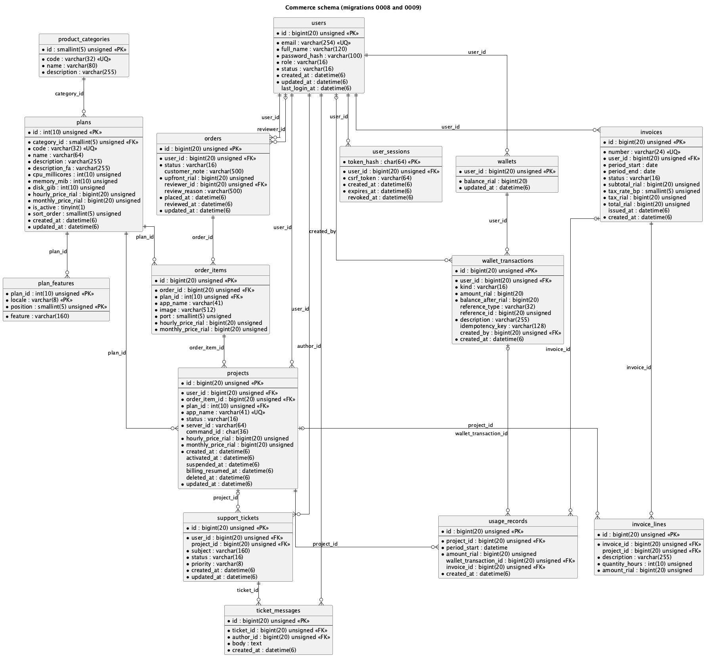
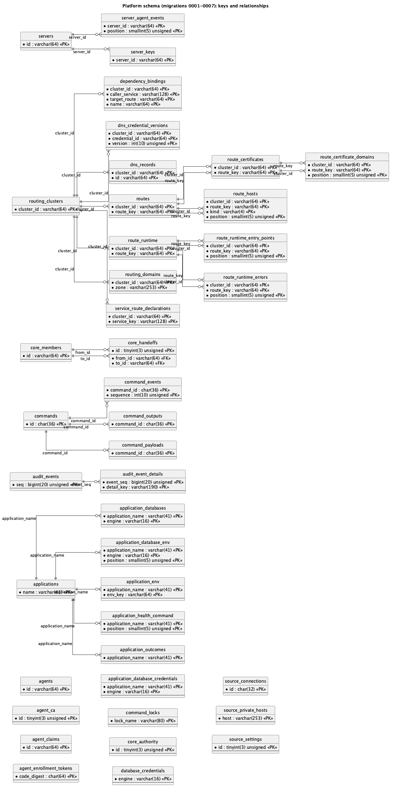

# Introduction

The database serves two purposes. It replaces the encrypted snapshot files in which SwarmOps kept its controller state (servers, applications, routing, the command queue, the audit ledger and others). It also holds the new commerce data: customers, plans, wallets, orders, projects, usage, invoices and support tickets. Keeping both in one database is the design's central decision: confirming an order must charge a wallet and queue a deployment in a single transaction (Software Architecture Document, section 6.1).

## Requirements on the data

| ID | Requirement | Source |
|---|---|---|
| D-1 | A wallet balance is never negative and always equals the sum of its ledger. | FR-WAL-1, FR-WAL-3, NFR-REL-1 |
| D-2 | A retried top-up, charge or refund is applied at most once. | FR-WAL-2, FR-PRV-2 |
| D-3 | A project is charged at most once per hour, and its charges in a month never exceed its plan's monthly cap. | FR-BIL-1, FR-BIL-2 |
| D-4 | Confirmation, charge and deployment request commit together. | FR-ORD-6 |
| D-5 | Every reference points at an existing row. | NFR-REL-3 |
| D-6 | Secrets are unreadable without the separately held data key. | FR-DAT-4 |
| D-7 | The schema runs unchanged on MariaDB 11.4 and MySQL 8.4. | NFR-PORT-1 |
| D-8 | Reports are available without application code. | FR-REP-1, FR-REP-2 |

: Requirements on the data

# Conceptual model

The commerce domain has these entities and relationships:

- A **user** is a customer or an administrator. Each customer has exactly one **wallet**, and every change to it is a **wallet transaction**.
- A **plan** belongs to a **product category** and lists **features**.
- A customer places **orders**. Each order has one or more **order items**, each naming a plan together with the application to run and the prices at the time of ordering. Administrators review orders.
- A confirmed order item produces one **project**. A project accrues one **usage record** for each charged hour, and each usage record is paid by one wallet transaction.
- Each month a customer receives an **invoice**. Its **invoice lines** summarise the usage records it covers, and each usage record is covered by at most one invoice.
- A customer opens **support tickets**, which contain **ticket messages** written by the customer or by administrators.

The platform domain consists of groups that existed before as separate snapshot files:

- **audit:** events and their details;
- **applications:** environment, databases, health commands and outcomes, plus credentials;
- **source:** connections, settings and private hosts;
- **servers:** keys and agent events;
- **core topology:** authority, members and handoffs;
- **agent registry:** the certificate authority, agents, tokens and claims;
- **routing:** clusters, routes and their hosts, DNS, certificates and runtime observations;
- **the command queue:** commands, payloads, events, outputs and locks.

A deployment connects the two domains. A project's `command_id` names the `application.deploy` command that provisioned it, and its `app_name` is the name of the application that command created.

# Logical model

Figure 1 shows the commerce schema with every column. Figure 2 shows the platform schema's tables with their keys and relationships. Crow's-foot notation is used: a bar means *exactly one*, a circle *zero*, and a fork *many*.

{width=100%}

{width=100%}

Both diagrams are generated from the live schema by `docs/academic/tools/schema_docs.py`. They cannot drift from the migrations.

# Physical design

## Engine, character set and time

Every table uses InnoDB, the transactional engine of both MariaDB and MySQL, with `utf8mb4` and `utf8mb4_unicode_ci`. This stores Persian text, and any other script, correctly. The connection forces UTC and `parseTime`. All timestamps are `DATETIME(6)` in UTC with microsecond precision, except hour boundaries in `usage_records.period_start`, which are whole-second `DATETIME`, and invoice periods, which are `DATE`.

## Types

| Kind of value | Type | Reason |
|---|---|---|
| Money | `BIGINT` (signed for ledger amounts, unsigned for prices) | Exact integer rials; no rounding error. The largest top-up (2×10⁹ rials) is far below the 9.2×10¹⁸ limit. |
| Surrogate keys | `BIGINT UNSIGNED AUTO_INCREMENT` | Never reused; ample range. |
| Command identifiers | `CHAR(36)` | Identifiers generated by the application, so a command's id is known before it is inserted. |
| Session tokens | `CHAR(64)` | The SHA-256 hash of the token, in hex; the token itself is never stored. |
| Statuses and kinds | `VARCHAR(16)` with a CHECK constraint | Portable between the two engines and extensible by migration; the CHECK constraint gives the same protection an `ENUM` would. |
| Whole routing documents | `JSON` (MariaDB stores it as `LONGTEXT` checked with `JSON_VALID`) | See section 5.1. |
| Secrets | `VARBINARY` / `BLOB` holding AES-GCM ciphertext | See section 9. |

: Choice of column types

## Migrations

The schema is created by nine SQL files embedded in the binary and applied in order at start-up. Section 6.5 of the Software Architecture Document describes the runner.

| Migration | Tables | Content |
|---|---|---|
| `0001_audit.sql` | 2 | Audit events and details |
| `0002_applications.sql` | 8 | Applications, environment, health commands, databases, outcomes, credentials |
| `0003_source.sql` | 3 | Source connections, settings, private hosts |
| `0004_servers.sql` | 3 | Servers, agent events, keys |
| `0005_core_and_agents.sql` | 7 | Core authority, members, handoffs; agent CA, agents, tokens, claims |
| `0006_routing.sql` | 13 | Routing clusters, routes, hosts, bindings, declarations, domains, DNS, certificates, runtime |
| `0007_command_queue.sql` | 5 | Commands, payloads, events, outputs, locks |
| `0008_commerce.sql` | 15 + 3 views | The commerce schema |
| `0009_plan_text.sql` | 0 | Persian plan descriptions and features; corrected seeded features |
| *runner* | 1 | `schema_migrations` |
| **Total** | **57 + 3 views** | |

: Migrations

## Naming conventions

Constraint names state their kind and table: `uq_` for unique keys, `ix_` for secondary indexes, `fk_` for foreign keys and `ck_` for CHECK constraints. Examples are `uq_usage_records_hour`, `ix_orders_queue`, `fk_wallet_transactions_wallet` and `ck_wallets_non_negative`. Error messages therefore name the rule that was broken.

# Normalisation

## First normal form

Every column holds one atomic value, and there are no repeating groups. Values that could have been lists are separate tables, each row ordered where order matters: a plan's features (`plan_features`), an application's environment variables (`application_env`), the arguments of a health command (`application_health_command`), a route's host names (`route_hosts`) and a certificate's domains (`route_certificate_domains`).

**The exception.** `routing_clusters.settings_json`, `cutover_json` and `cutover_rollback_json` hold whole JSON documents: a cluster's gateway settings, its cutover plan and that plan's rollback. These are always read, validated and written as a unit by the routing store, under a lock on the cluster row, and no query ever filters on a field inside them. Splitting them into rows would add many tables that are never queried, and would move document validation from one place into many. The routes, domains, DNS records and certificates inside a cluster are ordinary normalised tables, because they *are* queried individually.

## Second normal form

Almost every table has a single-column key, so no partial dependency can exist. The tables with composite keys have attributes that depend on the whole key:

- `plan_features(plan_id, locale, position)`: a feature is the feature at *that* position of *that* plan in *that* language.
- `application_env(application, name)`: a value belongs to *that* variable of *that* application.

## Third normal form and BCNF

No non-key attribute depends on another non-key attribute. Three designs look like transitive dependencies but are not:

- **Prices in `order_items` and `projects`.** The hourly and monthly prices are copied from the plan at the time of ordering. They do not depend on `plan_id`: they record what the customer agreed to pay, which must stay the same after the plan's price changes (FR-CAT-4). The plan's current price and the order's agreed price are different facts.
- **`orders.user_id` and `projects.user_id`.** A project's owner could be reached through its order item and order. It is stored on the project because every customer query is scoped by `user_id` (NFR-SEC-2). The value is written once, when the project is created in the confirmation transaction, and never changes.
- **`invoice_lines.project_id` and the line's amount.** An issued invoice is a historical document. Its lines must not change if usage records are later altered, so they store the amounts that were invoiced.

Every determinant in the commerce tables is a candidate key. In `users`, for example, `email` is unique, and `id` and `email` are the only determinants. The commerce schema is therefore also in Boyce–Codd normal form.

## Deliberate denormalisation

| Stored value | Derivable from | Why it is stored | How consistency is kept |
|---|---|---|---|
| `wallets.balance_rial` | `SUM(wallet_transactions.amount_rial)` | The reserve and overdraft checks must read one row under a lock, rather than sum a growing ledger. | Updated in the same transaction as the ledger row, under `FOR UPDATE` on the wallet; `CHECK (balance_rial >= 0)`; the console verifies it equals the ledger. |
| `wallet_transactions.balance_after_rial` | Running sum of earlier rows | Shows each row's resulting balance without a window function over the whole ledger. | Written by the same code, in the same transaction; `CHECK (balance_after_rial >= 0)`. |
| `invoices.subtotal_rial`, `tax_rial`, `total_rial` | Sum of the lines and the tax formula | An issued invoice is fixed; recomputing it later could change a legal document. | `CHECK (total_rial = subtotal_rial + tax_rial)`. |
| `servers` agent-health columns | The latest `server_agent_events` row | The console lists servers with their health in one query. | Updated together with the event insert. |

: Deliberate denormalisation

# Integrity constraints

## Keys

Every table has a primary key. Unique keys express business rules:

- `users.email` and `plans.code`;
- `projects.app_name`, which resolves a race between two orders for the same name;
- `invoices.number`;
- `wallet_transactions(user_id, idempotency_key)`;
- `usage_records(project_id, period_start)`;
- `commands(actor, idempotency_key)`.

## Foreign keys

There are 48 foreign keys: 18 RESTRICT, 28 CASCADE and 2 SET NULL. A foreign key without an explicit ON DELETE clause behaves as RESTRICT; the data dictionary lists the effective rule of each.

The commerce schema chooses each rule by what the reference means:

| Rule | References | Reason |
|---|---|---|
| RESTRICT | wallets, ledger rows, orders, order items, projects, usage records and invoices to their users, plans, wallets, projects and invoices | Money and history refer to these rows, so a referenced row cannot be deleted. |
| CASCADE | user → sessions, plan → features, order → order items, invoice → invoice lines, ticket → messages | The child has no meaning without its parent. |
| SET NULL | `invoice_lines.project_id`, `support_tickets.project_id` | An invoice line or a ticket must survive even if its project row were removed; it keeps its own description. |

: Foreign-key rules in the commerce schema

Most of the platform schema's CASCADE rules delete detail rows with their parent, such as a server's keys and agent events, an application's environment variables, and a command's events and outputs.

## CHECK constraints

There are 42 CHECK constraints. They include:

| Constraint | Rule |
|---|---|
| `ck_wallets_non_negative` | `balance_rial >= 0` |
| `ck_wallet_transactions_kind` | `kind IN ('topup','order_charge','usage','refund','adjustment')` |
| `ck_wallet_transactions_amount` | `amount_rial <> 0` |
| `ck_wallet_transactions_balance` | `balance_after_rial >= 0` |
| `ck_invoices_total` | `total_rial = subtotal_rial + tax_rial` |
| `ck_orders_review` | `status IN ('pending','cancelled') OR reviewed_at IS NOT NULL`: a confirmed, rejected or failed order always records when it was reviewed |
| `ck_plan_features_locale` | `locale IN ('en','fa')` |
| `ck_commands_state` | `state IN ('uploading','queued','leased','preparing','running','retry_scheduled','succeeded','failed','needs_attention','superseded','cancelled')` |
| `ck_agent_ca_singleton`, `source_settings` | `id = 1`, so the table has exactly one row |
| `ck_applications_resources` | `cpus > 0 AND memory_mib > 0 AND port > 0` |

: Examples of CHECK constraints

MySQL reports a violated CHECK constraint as error 3819 and MariaDB as error 4025. `sqlstore.IsCheckViolation` recognises both.

# Indexes and query plans

Every foreign key is indexed, and each frequent query has an index that matches its filter and order. The plans below were produced with `EXPLAIN` on MariaDB 11.4 against the development database used for the end-to-end run. That database is small, so the optimiser's choices for tiny tables are noted where they differ from what larger tables would use.

| Query | Index | Plan observed |
|---|---|---|
| Claim the next due command: `WHERE state IN ('queued','retry_scheduled') AND (next_attempt_at IS NULL OR next_attempt_at <= now) ORDER BY created_at, seq LIMIT 1 FOR UPDATE SKIP LOCKED` | `ix_commands_runnable` | `range` on `ix_commands_runnable`, using the index condition, then a filesort of the few runnable rows |
| Sum a project's usage in a month: `WHERE project_id = ? AND period_start >= ? AND period_start < ?` | `uq_usage_records_hour (project_id, period_start)` | `range` on `uq_usage_records_hour` |
| Pending-order queue: `WHERE status = 'pending' ORDER BY placed_at` | `ix_orders_queue (status, placed_at)` | `ref` on `ix_orders_queue`, *Using index* (covering; no sort) |
| A customer's ledger: `WHERE user_id = ? ORDER BY id DESC LIMIT 50` | `ix_wallet_transactions_user (user_id, created_at)` | On six rows the optimiser scanned the primary key; with a realistic ledger the `user_id` index is selective |

: Indexes of the most frequent queries

The same `uq_usage_records_hour` key has two roles. It is the index for the monthly sum, and the constraint that makes a second charge for the same hour impossible.

# Transactions, isolation and concurrency

## Isolation level

All application transactions run at **READ COMMITTED**. Every read whose result decides a write is made with `SELECT … FOR UPDATE`, so the protection REPEATABLE READ's consistent snapshot would give is obtained explicitly. READ COMMITTED also avoids the gap locks REPEATABLE READ takes on range reads, which would make unrelated inserts wait for each other — usage rows for different projects, for example. A transaction the server aborts to break a deadlock (error 1213) or a lock wait (1205) is repeated as a whole, up to four attempts.

## Anomalies prevented

| Anomaly | Where it could happen | Prevention |
|---|---|---|
| Lost update | Two charges read the same balance and both write back. | The wallet row is locked with `FOR UPDATE` before reading the balance. |
| Overdraft under concurrency | Fifty parallel charges exceed the balance. | The row lock serialises them, and `ck_wallets_non_negative` rejects any that would still overdraw. The test's result: 33 succeed, 17 are refused, and the balance equals the ledger. |
| Duplicate application of a retry | A client repeats a top-up after a timeout. | `UNIQUE(user_id, idempotency_key)`; the second attempt returns the first transaction. |
| Double billing of an hour | Two billing runs overlap. | `UNIQUE(project_id, period_start)` on `usage_records`. |
| Double confirmation | Two administrators confirm the same order. | The order row is locked and must still be `pending`; the second confirmation receives a conflict. |
| Charge without deployment | The process stops between charging and queuing. | Both happen in one transaction (transactional outbox). |
| Double claim of a command | Two workers claim the same command. | `FOR UPDATE SKIP LOCKED` on the claim. |
| Invoice missing an hour | Billing adds an hour between summing and marking usage invoiced. | Invoicing locks the uninvoiced usage rows with `FOR UPDATE` before summing them. |
| Concurrent migrations | Two cores start at once. | `GET_LOCK('swarmops_schema_migrations', 60)`. |
| Two active owners | Two cores both believe they are active. | The singleton `core_authority` row, locked `FOR UPDATE`, holds the authority epoch. |

: Concurrency anomalies and their prevention

# Views

Three views give administrators reports without application code (D-8):

```sql
CREATE VIEW v_customer_accounts AS
SELECT u.id AS user_id, u.email, u.full_name, u.status, u.created_at,
       COALESCE(w.balance_rial, 0) AS balance_rial,
       (SELECT COUNT(*) FROM projects p WHERE p.user_id = u.id
          AND p.status IN ('provisioning', 'active', 'suspended')) AS live_projects,
       (SELECT COUNT(*) FROM orders o WHERE o.user_id = u.id
          AND o.status = 'pending') AS pending_orders
FROM users u
LEFT JOIN wallets w ON w.user_id = u.id
WHERE u.role = 'customer';

CREATE VIEW v_order_queue AS
SELECT o.id AS order_id, o.placed_at, u.id AS user_id, u.email,
       COALESCE(w.balance_rial, 0) AS balance_rial, i.app_name,
       pl.code AS plan_code, pl.name AS plan_name,
       i.hourly_price_rial, i.monthly_price_rial
FROM orders o
JOIN users u ON u.id = o.user_id
JOIN order_items i ON i.order_id = o.id
JOIN plans pl ON pl.id = i.plan_id
LEFT JOIN wallets w ON w.user_id = o.user_id
WHERE o.status = 'pending';

CREATE VIEW v_revenue_by_month AS
SELECT DATE_FORMAT(t.created_at, '%Y-%m') AS month,
       SUM(CASE WHEN t.kind IN ('order_charge', 'usage')
                THEN -t.amount_rial ELSE 0 END) AS charged_rial,
       SUM(CASE WHEN t.kind = 'refund' THEN t.amount_rial ELSE 0 END) AS refunded_rial,
       SUM(CASE WHEN t.kind = 'topup' THEN t.amount_rial ELSE 0 END) AS topped_up_rial,
       COUNT(DISTINCT t.user_id) AS paying_customers
FROM wallet_transactions t
GROUP BY DATE_FORMAT(t.created_at, '%Y-%m');
```

# Security of stored data

The columns that hold secrets store AES-GCM ciphertext:

- application environment values;
- database credentials;
- source-connection tokens and the source settings password;
- DNS provider secrets;
- server keys;
- the agent certificate authority's private key;
- command payloads and outputs.

The encryption key is read from a protected file and is never written to the database (D-6). Each ciphertext is bound to its location by its associated data, `swarmops-sql:<table>.<column>:<key values>`. A value copied into another row or column fails authentication instead of decrypting. Anyone who has a database backup but not the key therefore sees neither the secrets nor a way to move them between rows.

Passwords are never stored: `users.password_hash` holds a bcrypt hash. Storefront session tokens are stored only as SHA-256 hashes.

**Recommendation for production.** Run migrations with a database account that may change the schema, and run Core with an account limited to data manipulation on the `swarmops` schema.

# Sample queries

Wallets whose balance differs from the sum of their ledger. The expected result is empty, and it was empty on the development database after the end-to-end run:

```sql
SELECT w.user_id, w.balance_rial, COALESCE(SUM(t.amount_rial), 0) AS ledger_sum
FROM wallets w
LEFT JOIN wallet_transactions t ON t.user_id = w.user_id
GROUP BY w.user_id, w.balance_rial
HAVING w.balance_rial <> COALESCE(SUM(t.amount_rial), 0);
```

Customers with the most usage this month:

```sql
SELECT p.user_id, u.email, SUM(r.amount_rial) AS usage_rial
FROM usage_records r
JOIN projects p ON p.id = r.project_id
JOIN users u ON u.id = p.user_id
WHERE r.period_start >= DATE_FORMAT(UTC_TIMESTAMP(), '%Y-%m-01')
GROUP BY p.user_id, u.email
ORDER BY usage_rial DESC
LIMIT 10;
```

Projects that a failed deployment left without a running service:

```sql
SELECT p.app_name, p.status, c.state, c.failure_code, c.failure_summary
FROM projects p
JOIN commands c ON c.id = p.command_id
WHERE p.status = 'failed';
```

# Backup, restore and upgrade

- **Backup:** `mysqldump --single-transaction --routines --triggers swarmops`. This takes a consistent InnoDB snapshot without locking writers. The backup must be kept together with a separately protected copy of the data key; either one alone is insufficient.
- **Restore:** load the dump into an empty schema and start Core with the same key. The migration runner verifies the recorded checksums and applies only newer migrations.
- **Upgrade from snapshot files:** `swarmops-core migrate-state` imports each former snapshot store into its tables, one transaction per store. It leaves the files in place as a backup.

# Appendix: data dictionary

The data dictionary that follows is generated from the live schema. For each table it gives the table's purpose, and for each column its type, whether it may be null, its key and its default. It then lists the table's foreign keys, each with its ON DELETE rule, and its CHECK constraints.
