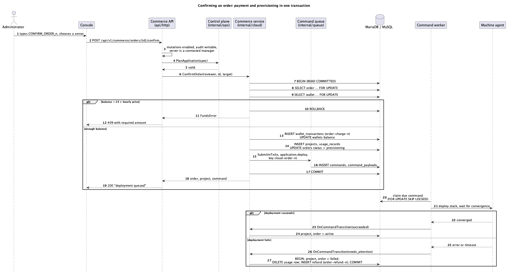
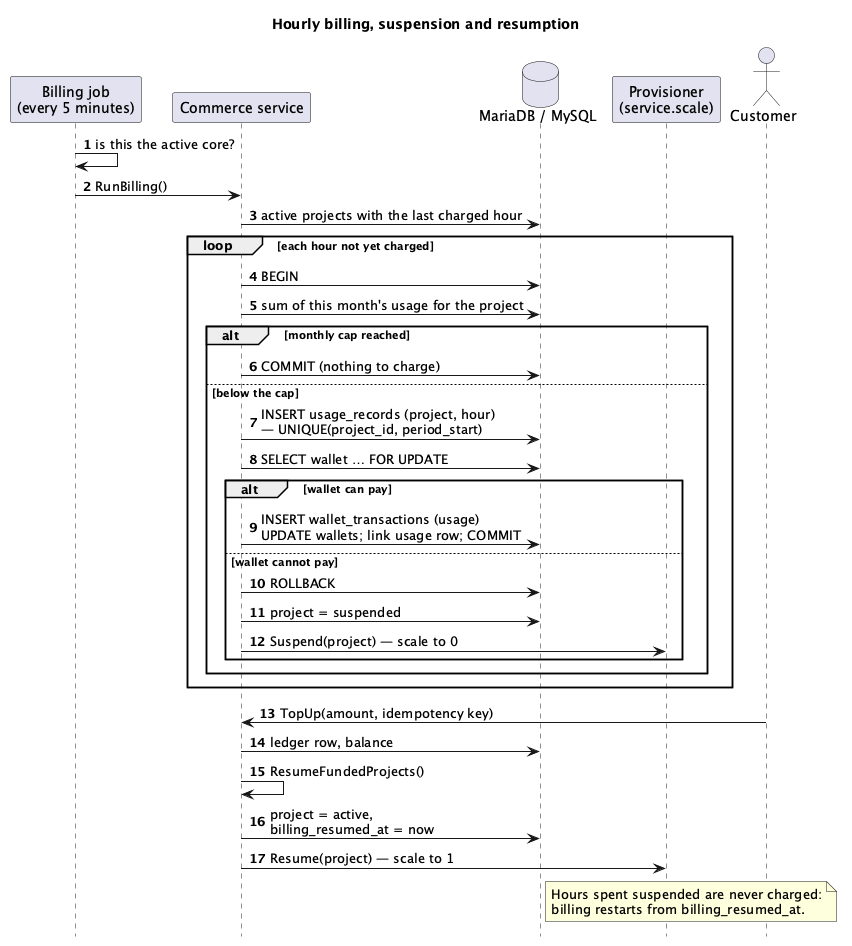

# مقدمه و اهداف

## مروری بر نیازمندی‌ها

سوارم‌آپس کلود میزبانی کانتینر می‌فروشد. مشتریان کیف پول را شارژ و پلن سفارش می‌دهند؛ مدیران سفارش‌ها را تأیید می‌کنند؛ سکو هر برنامه را روی Docker Swarm مستقر و به‌صورت ساعتی حساب می‌کند. مشخصات نیازمندی‌های نرم‌افزار نیازمندی‌ها را به‌طور کامل بیان می‌کند.

## اهداف کیفیت

| اولویت | هدف کیفیت | انگیزه |
|---|---|---|
| ۱ | **یکپارچگی پول** | موجودی هرگز نباید منفی شود یا از دفتر کل منحرف گردد و هیچ درخواستی نباید دو بار هزینه یا اعتبار ثبت کند. |
| ۲ | **استقرار اتمی** | مشتری هرگز نباید برای استقراری که درخواست نشده پرداخت کند یا استقراری که پرداخت نشده دریافت کند. |
| ۳ | **امنیت** | مشتریان باید از یکدیگر و از بخش مدیریت جدا باشند و رازها رمزشده بمانند. |
| ۴ | **قابلیت حمل** | سامانه باید روی MariaDB 11.4 و MySQL 8.4 اجرا شود. |
| ۵ | **بهره‌برداری‌پذیری** | شکست‌ها باید قابل مشاهده، توضیح‌داده‌شده و قابل بازیابی توسط مدیر باشند و هر تغییر ممیزی شود. |

: اهداف کیفیت

## ذی‌نفعان

| ذی‌نفع | انتظار |
|---|---|
| استاد درس | سامانه‌ای کامل و درست با SQL، دارای پنل مدیریت و فروشگاه، با مستندات دانشگاهی. |
| مشتریان | راهی ساده و قابل اعتماد برای اجرای یک ایمیج و پرداخت فقط برای آنچه اجرا می‌شود. |
| مدیران | کنترل بر سفارش‌ها، قیمت‌ها، پول و سکو، با شواهد برای هر تصمیم. |
| توسعه‌دهندگان | مرزهای روشن ماژول‌ها، آزمون روی هر دو موتور و نمودارهای منطبق با کد. |

: ذی‌نفعان

# محدودیت‌ها

## محدودیت‌های فنی

- **TC-1** زبان Go برای سرور و React با کیت مؤلفه‌ی موجود برای رابط‌ها.
- **TC-2** MySQL یا MariaDB برای همه‌ی وضعیت کنترل‌گر، محدود به ویژگی‌های مشترک هر دو موتور.
- **TC-3** رابط‌های عمومی موجود مخزن‌های SwarmOps حفظ می‌شوند.
- **TC-4** کلید رمزنگاری داده هرگز در پایگاه داده ذخیره نمی‌شود.
- **TC-5** در هر زمان یک هسته‌ی فعال روی خوشه عمل می‌کند.

## محدودیت‌های سازمانی

- **OC-1** یک توسعه‌دهنده، در یک نیم‌سال تحصیلی.
- **OC-2** همه‌چیز باید روی لپ‌تاپ قابل نمایش باشد: Swarm تک‌گره، پایگاه داده‌ی محلی، عامل ماشین روی loopback.
- **OC-3** با هیچ ارائه‌دهنده‌ی پرداخت واقعی نباید تماس گرفته شود.

## قراردادها

- کد Go از سبک موجود مخزن پیروی می‌کند و با `go vet` بررسی می‌شود.
- کنسول از قواعد معماری اطلاعات خود که `operator-workflows.test.mjs` اعمال می‌کند پیروی می‌کند: یک رجیستری ناوبری، مسیر برای هر صفحه، عبارت تأیید تایپی برای کنش‌های مخرب و قالب‌بندی تاریخ و پول در یک ماژول.
- پول به‌صورت ریال صحیح در ستون‌های `BIGINT` ذخیره می‌شود و هرگز به‌صورت عدد اعشاری شناور.

# زمینه و دامنه

## زمینه‌ی کسب‌وکار

شکل ۱ سند مدل معماری C4 زمینه‌ی کسب‌وکار را نشان می‌دهد: مشتریان و مدیران از سوارم‌آپس کلود استفاده می‌کنند و سامانه روی خوشه‌ی Docker Swarm مستقر می‌کند که ایمیج‌ها را از رجیستری‌ها دریافت و گواهی را از مرجع ACME می‌گیرد.

## زمینه‌ی فنی

| مسیر | پروتکل و قالب | احراز هویت |
|---|---|---|
| مرورگر → هسته (فروشگاه) | HTTPS، JSON، `/api/store/v1` | کوکی نشست `swarmops_store_session` و سرآیند `X-CSRF-Token` |
| مرورگر → هسته (کنسول) | HTTPS، JSON، `/api/v1` | کوکی نشست اپراتور و توکن CSRF |
| هسته → پایگاه داده | پروتکل MySQL روی TCP | DSN از فایل محافظت‌شده |
| هسته → عامل ماشین | HTTPS، JSON | گواهی TLS سنجاق‌شده و کلید API |
| عامل → Docker Engine | Docker Engine API روی سوکت محلی | مجوزهای سوکت محلی |
| بازدیدکننده → دروازه → برنامه | HTTP/HTTPS از طریق Traefik | وابسته به برنامه |

: زمینه‌ی فنی

# راهبرد راه‌حل

| هدف یا محدودیت | رویکرد | محل |
|---|---|---|
| یکپارچگی پول | دفتر کل فقط‌افزودنی منبع حقیقت است؛ موجودی نهان با هر سطر قفل و به‌روز می‌شود؛ قید CHECK موجودی منفی را منع می‌کند؛ کلیدهای یکتایی برای هر کاربر یکتا هستند. | بخش ۸.۳؛ ADR-0008 |
| استقرار اتمی | فرمان استقرار با `SubmitInTx` درون تراکنش تأیید درج می‌شود (صندوق خروجی تراکنشی). | بخش ۶.۱ |
| یک مالک برای کار پس‌زمینه | فقط هسته‌ی فعال کارگر فرمان و صورتحساب را اجرا می‌کند؛ سطرهای یگانه با `FOR UPDATE` قفل می‌شوند. | بخش ۸.۵ |
| قابلیت حمل | زیرمجموعه‌ی مشترک SQL؛ مجموعه‌ی کامل آزمون روی هر دو موتور. | بخش ۸.۲ |
| حفظ SwarmOps | مخزن‌ها رابط خود را حفظ می‌کنند؛ فقط سازنده‌ها تغییر می‌کنند. | ADR-0008 |
| صورتحساب به سبک Heroku و لیارا | هزینه‌ی ساعتی، یک سطر برای هر پروژه در هر ساعت، با سقف ماهانه، تعلیق و ازسرگیری. | بخش ۶.۳ |
| امنیت | bcrypt، کوکی HttpOnly و SameSite=Strict، توکن CSRF، ورود با محدودیت نرخ، ستون‌های مهروموم‌شده با داده‌ی همراه و ممیزی. | بخش ۸.۴ |

: راهبرد راه‌حل

# نمای بلوک‌های سازنده

## سطح ۱: ظرف‌ها

سامانه از فروشگاه، کنسول مدیریت، هسته‌ی SwarmOps و پایگاه داده‌ی کنترل‌گر تشکیل شده است؛ عامل ماشین، دروازه و برنامه‌ها در خوشه اجرا می‌شوند (شکل ۲ سند مدل C4).

## سطح ۲: مؤلفه‌های هسته

شکل‌های ۳ و ۴ سند مدل C4 هسته و سرویس تجارت را نشان می‌دهند. بسته‌های مهم این پروژه:

| بسته | مسئولیت |
|---|---|
| `internal/sqlstore` | استخر، `WithTx` با تکرار، مهاجرت‌ها، ستون‌های مهروموم‌شده، دسته‌بندی خطا. |
| `internal/sqlstore/migrations` | `0001_audit.sql` تا `0009_plan_text.sql`. |
| `internal/cloud` | قواعد کسب‌وکار تجارت. |
| `internal/queue` | مخزن فرمان (`Store`) و کارگر (`Worker`). |
| `internal/audit`، `internal/ops`، `internal/source`، `internal/remote`، `internal/coretopology`، `internal/agentpull` | مخزن‌های SwarmOps، اکنون روی SQL، و صفحه‌ی کنترل. |
| `api/http` | مسیریابی HTTP، احراز هویت، APIهای فروشگاه و تجارت. |
| `cmd/api` | اتصال اجزای فرایند، `migrate-state`، حلقه‌ی صورتحساب. |
| `web/src/store` | فروشگاه. |
| `web/src/screens/sales` | بخش فروش کنسول. |

: بسته‌ها

## نگاشت فایل‌های پیشین به جدول‌ها

| فایل پیشین | جدول‌ها |
|---|---|
| `audit.sealed` | `audit_events`، `audit_event_details` |
| `applications.sealed` | `applications`، `application_env`، `application_health_command`، `application_databases`، `application_database_env`، `application_outcomes` |
| `database-credentials.sealed` | `database_credentials`، `application_database_credentials` |
| `source-connections.sealed`، `source-settings.sealed` | `source_connections`، `source_settings`، `source_private_hosts` |
| `servers.sealed`، `server-keys.sealed` | `servers`، `server_agent_events`، `server_keys` |
| `core-topology.sealed` | `core_authority`، `core_members`، `core_handoffs` |
| `agent-pull-registry.sealed` | `agent_ca`، `agents`، `agent_enrollment_tokens`، `agent_claims` |
| `traefik-routing.sealed` | `routing_clusters`، `routes`، `route_hosts`، `dependency_bindings`، `service_route_declarations`، `routing_domains`، `dns_credential_versions`، `dns_records`، `route_certificates`، `route_certificate_domains`، `route_runtime`، `route_runtime_entry_points`، `route_runtime_errors` |
| `commands/commands.sealed` | `commands`، `command_payloads`، `command_events`، `command_outputs`، `command_locks` |

: محل کنونی داده‌ی هر مخزن پیشین

# نمای زمان اجرا

## تأیید یک سفارش

شکل ۱ تأیید و آنچه پس از آن رخ می‌دهد را نشان می‌دهد.

{width=100%}

هر بررسی‌ای که بدون هزینه می‌تواند شکست بخورد، پیش از باز شدن تراکنش انجام می‌شود: فعال بودن تغییرات، قابل نوشتن بودن دفتر ممیزی و مخزن فرمان، مدیر متصل بودن سرور و موفقیت برنامه در برنامه‌ریزی. درون تراکنش، `lockPendingOrder` سطر سفارش را قفل و در انتظار بودن آن را بررسی می‌کند و تنها پس از آن سطر کیف پول قفل می‌شود. هر مسیری که پول را تغییر می‌دهد همین قاعده را دارد: ابتدا سطر کسب‌وکار خودش را قفل می‌کند و سطر کیف پول را در آخر. آن سطر هنگام تأیید سفارش است، هنگام بازپرداخت پروژه و هنگام صورتحساب سطر مصرف تازه. دو تراکنش از این نوع ممکن است منتظر یک کیف پول بمانند اما سطرهای یکدیگر را نگه نمی‌دارند؛ اگر سرور باز هم یکی را لغو کند، `WithTx` آن را تکرار می‌کند. هزینه کلید یکتایی `order-charge-<id>` و فرمان کلید `cloud-order-<id>` دارد؛ بنابراین تأیید تکراری نه دو بار کسر می‌کند و نه دو بار در صف قرار می‌دهد.

## اجرای فرمان و تکرار

کارگر هر ۲۵۰ میلی‌ثانیه بررسی می‌کند. `ClaimDue` تا زمانی که فرمان دیگری در حال اجراست چیزی برنمی‌دارد؛ در غیر این صورت قدیمی‌ترین فرمان سررسیده را (به ترتیب `created_at` و `seq`) با `FOR UPDATE SKIP LOCKED` قفل می‌کند. کارگر آن را در یک مهلت اجرا می‌کند: ده دقیقه برای کنش‌های معمول مانند `application.deploy`، ۳۵ دقیقه برای ساخت ایمیج و ۵۰ دقیقه برای استقرار از کد منبع و آماده‌سازی سرور. شکستی که دائمی علامت نخورده باشد با فاصله‌ی افزایشی تا `max_attempts` (برای استقرار سه بار) تکرار می‌شود؛ پس از آن فرمان با کد شکست، خلاصه و راهنمای بازیابی به `needs_attention` می‌رود. هر گذار به‌صورت سطر `command_events` ثبت و به `RecordCommandTransition` داده می‌شود که سرویس تجارت را آگاه می‌کند.

## صورتحساب ساعتی، تعلیق و ازسرگیری

شکل ۲ صورتحساب را نشان می‌دهد.

{width=100%}

کلید یکتای `usage_records(project_id, period_start)` کسر دوم برای یک ساعت را ناممکن می‌کند، حتی اگر دو اجرای صورتحساب هم‌پوشانی داشته باشند. سقف ماهانه در همان تراکنش با مجموع مصرف ماه مقایسه می‌شود. وقتی کیف پول توان پرداخت ندارد، هزینه برگشت داده می‌شود، پروژه معلق و با فرمان `service.scale` متوقف می‌شود. شارژ، `ResumeFundedProjects` را فرا می‌خواند که `billing_resumed_at` را تنظیم می‌کند؛ بنابراین صورتحساب از زمان ازسرگیری ادامه می‌یابد و ساعت‌های تعلیق هرگز حساب نمی‌شوند.

## ورود به فروشگاه و محافظت درخواست‌ها

ورود یک سطر نشست با درهم‌سازی SHA-256 توکن نشست و یک توکن CSRF تصادفی ایجاد می‌کند. مرورگر توکن را فقط در کوکی HttpOnly و توکن CSRF را در بدنه‌ی پاسخ دریافت می‌کند. هر تغییر توکن CSRF را در یک سرآیند می‌فرستد که با مقایسه‌ی زمان‌ثابت بررسی می‌شود. پس از هشت تلاش ناموفق برای یک کلید در پانزده دقیقه، ورود رد می‌شود. اگر تغییری به دلیل توکن CSRF کهنه‌ی صفحه رد شود (مثلاً پس از ورود از زبانه‌ای دیگر)، فروشگاه یک بار نشست فعلی را می‌خواند و تغییر را با همان کلید یکتایی تکرار می‌کند.

## راه‌اندازی و مهاجرت طرح‌واره

در راه‌اندازی، هسته پایگاه داده را باز می‌کند و `Migrate` را اجرا می‌کند. این تابع قفل نام‌دار `swarmops_schema_migrations` را با `GET_LOCK` می‌گیرد (حداکثر ۶۰ ثانیه انتظار)، پیوستگی نسخه‌های اعمال‌شده و برابری جمع‌آزمای آن‌ها با فایل‌های جاسازی‌شده را بررسی و مهاجرت‌های باقی‌مانده را به ترتیب اعمال می‌کند. تنها پس از آن مخزن‌ها ساخته می‌شوند. هسته‌ی فعال فرمان‌های قطع‌شده را بازیابی و کارگر و حلقه‌ی پنج‌دقیقه‌ای صورتحساب را آغاز می‌کند.

# نمای استقرار

شکل‌های ۷ و ۸ سند مدل C4 استقرار تولیدی مورد نظر و محیط درستی‌سنجی را نشان می‌دهند. پیکربندی تولید از فایل‌ها خوانده می‌شود:

| تنظیم | کاربرد |
|---|---|
| `SWARMOPS_DATABASE_DSN_FILE` | فایل محافظت‌شده‌ی حاوی DSN. |
| `SWARMOPS_DATABASE_MAX_OPEN_CONNS` | حد بالای استخر اتصال. |
| فایل‌های کلید داده و کلید نشست | رمزنگاری ستون‌های محرمانه و امضای نشست‌های اپراتور. |
| راز Swarm با نام `swarmops_database_dsn` | همان DSN وقتی هسته به‌صورت سرویس Swarm اجرا می‌شود (`deploy/stacks/swarmops.yml`). |

: پیکربندی استقرار

پشتیبان‌گیری با `mysqldump --single-transaction` انجام می‌شود که بدون مسدود کردن نویسندگان، تصویری سازگار از InnoDB می‌گیرد. چون ستون‌های محرمانه با کلیدی بیرون از پایگاه داده رمز شده‌اند، پشتیبان باید همراه نسخه‌ای جداگانه و محافظت‌شده از آن کلید نگهداری شود. راهنمای نصب و بهره‌برداری پشتیبان‌گیری، بازیابی و ارتقا را شرح می‌دهد.

# مفاهیم فراگیر

## ماندگاری و تراکنش‌ها

همه‌ی نوشتن‌هایی که به هم تعلق دارند در `sqlstore.DB.WithTx` با سطح جداسازی READ COMMITTED اجرا می‌شوند. READ COMMITTED به جای پیش‌فرض InnoDB یعنی REPEATABLE READ انتخاب شد، چون کد سطرهایی را که برای به‌روزرسانی می‌خواند صریحاً قفل می‌کند؛ این سطح از قفل‌های شکاف (gap lock) پرس‌وجوهای بازه‌ای در REPEATABLE READ پرهیز می‌کند که درج‌های نامرتبط را پشت سر هم می‌انداختند، مثلاً سطرهای مصرف پروژه‌های مختلف. تراکنشی که سرور با خطای ۱۲۱۳ (بن‌بست) یا ۱۲۰۵ (اتمام مهلت انتظار قفل) لغو کند، به‌طور کامل تا چهار بار تکرار می‌شود و میان تلاش‌ها به اندازه‌ی مجذور شماره‌ی تلاش × ۱۵ میلی‌ثانیه صبر می‌کند؛ کل تابع تکرار می‌شود، پس اثر ناقصی نشت نمی‌کند.

## قابلیت حمل میان MariaDB و MySQL

فقط ویژگی‌های موجود در هر دو موتور استفاده می‌شوند. دو تفاوت بر پیاده‌سازی اثر گذاشت:

- `sensitive` در هر دو واژه‌ی رزروشده است، پس ستون `is_sensitive` نام گرفت.
- شماره‌ی خطای نقض CHECK متفاوت است (۳۸۱۹ در MySQL و ۴۰۲۵ در MariaDB) و `sqlstore.IsCheckViolation` هر دو را می‌شناسد.

زمان‌ها به‌صورت `DATETIME(6)` در UTC ذخیره می‌شوند و زمان‌های واردشده تا میکروثانیه بریده می‌شوند تا مقادیر روی هر دو موتور برابر مقایسه شوند.

## پول

- **واحد.** مبالغ اعداد صحیح به ریال هستند و به تومان نمایش داده می‌شوند.
- **دفتر کل.** هر تغییر یک سطر `wallet_transactions` با نوع، مبلغ علامت‌دار، موجودی حاصل، مرجع و کلید یکتایی اختیاری است. `UNIQUE(user_id, idempotency_key)` تکرار را ایمن می‌کند. `wallets.balance_rial` نهان در همان تراکنش سطر و زیر قفل سطر کیف پول به‌روز می‌شود و `CHECK (balance_rial >= 0)` اضافه‌برداشت را منع می‌کند. کنسول برابری موجودی با مجموع دفتر کل را بررسی می‌کند.
- **نرمال‌زدایی.** نگهداری موجودی نهان گامی آگاهانه دور از فرم نرمال سخت است: بررسی ذخیره و اضافه‌برداشت را به خواندن یک سطر زیر قفل تبدیل می‌کند، به جای جمع زدن دفتر کلی که پیوسته بزرگ می‌شود. دفتر کل همچنان مرجع است.
- **مالیات.** قیمت‌ها شامل مالیات‌اند. مالیات موجود در جمع *T* با نرخ *r* واحد پایه برابر ⌊*T*·*r*/(10000 + *r*)⌋ است و جمع جزء فاکتور *T* منهای آن مالیات است.

## امنیت

- **مشتریان.** گذرواژه‌ها با bcrypt (هزینه‌ی ۱۲) ذخیره می‌شوند؛ ایمیل ناشناخته در برابر یک درهم‌سازی ساختگی بررسی می‌شود تا زمان پاسخ با گذرواژه‌ی نادرست برابر باشد. نشست‌ها به‌صورت درهم‌سازی توکن ذخیره می‌شوند، نه خود توکن. کوکی‌ها HttpOnly، SameSite=Strict و در صورت پیکربندی Secure هستند. تغییرات توکن CSRF می‌خواهند.
- **جداسازی.** هر پرس‌وجوی مشتری با شناسه‌ی کاربر نشست محدود می‌شود؛ مسیرهای مدیریت فقط نشست اپراتور را می‌پذیرند.
- **رازها.** ستون‌های محرمانه با AES-GCM مهروموم می‌شوند؛ داده‌ی همراه `swarmops-sql:<table>.<column>:<keys>` هر متن رمزشده را به سطرش پیوند می‌دهد و مقداری که جای دیگری کپی شود باز نمی‌شود.
- **ممیزی.** رویدادهای تجاری با کنشگر در دفتر ممیزی ثبت می‌شوند:
  - از سوی مشتری: ثبت‌نام، شارژ و ثبت سفارش؛
  - از سوی مدیر: تأیید سفارش (با فرمان در صف‌شده) و رد، اصلاح کیف پول، تغییر وضعیت مشتری، تغییر پلن، صدور فاکتور و اجرای دستی صورتحساب.
- **تأیید.** کنش‌های پرهزینه یا مخرب کنسول، تایپ عبارتی مانند `CONFIRM_ORDER_3` را می‌خواهند.

## هم‌زمانی و مالکیت

قفل‌های سطری جایگزین قفل‌های درون‌فرایندی مخزن‌های فایلی شده‌اند؛ پس درستی دیگر به وجود تنها یک فرایند وابسته نیست. کاری که یک مالک دارد یک سطر یگانه را قفل می‌کند: `core_authority` برای توپولوژی هسته و دوره‌ی اقتدار و `agent_ca` برای مرجع گواهی عامل‌ها. فرمان‌های نام‌دار با درج یا به‌روزرسانی سطری در `command_locks` پشت سر هم اجرا می‌شوند. فقط هسته‌ی فعال فرمان‌ها را بازیابی و اجرا می‌کند و صورتحساب انجام می‌دهد.

## مدیریت خطا

خطاهای تجاری در یک جا (`cloudError`) به پاسخ‌های HTTP نگاشته می‌شوند:

| خطا | وضعیت | بدنه |
|---|---|---|
| اعتبارسنجی | ۴۲۲ | `error` و `field` مربوط |
| ذخیره‌ی ناکافی | ۴۰۹ | `error`، `balanceRial`، `requiredRial` |
| موجودی ناکافی، تعارض (مثلاً نام تکراری) | ۴۰۹ | `error` |
| یافت نشد | ۴۰۴ | `error` |
| اعتبارنامه‌ی نادرست، نشست منقضی | ۴۰۱ | `error` |
| ممنوع، توکن CSRF نامعتبر | ۴۰۳ | `error` |
| هر خطای دیگر | ۵۰۰ | پیام عمومی و شناسه‌ی درخواست؛ علت ثبت می‌شود |

: نگاشت خطا

## بین‌المللی‌سازی

فروشگاه فرهنگ‌های انگلیسی و فارسی با کلیدهای یکسان دارد و سامانه‌ی نوع، کلیدی را که در یکی نباشد رد می‌کند. انتخاب فارسی، کیت مؤلفه را به چیدمان راست‌به‌چپ و محلی `fa-IR` تغییر می‌دهد که ارقام و تاریخ‌ها را فارسی قالب‌بندی می‌کند. متن فارسی پلن‌ها (توضیح و ویژگی‌ها) در پایگاه داده کنار متن انگلیسی ذخیره می‌شود. پیام‌های اعتبارسنجی سرور فقط انگلیسی‌اند.

## آزمون

`sqltest` به هر آزمون یک طرح‌واره‌ی یک‌بارمصرف روی سرور واقعی می‌دهد. آزمون‌ها این موارد را پوشش می‌دهند:

- هم‌زمانی: پنجاه کسر موازی از یک کیف پول؛
- یکتایی؛
- اتمی بودن: تأییدی که فرمانش در صف قرار نگیرد هزینه‌ای کسر نمی‌کند؛
- سقف صورتحساب و تعلیق؛
- فاکتورها؛
- مجوزها از طریق HTTP؛
- مهاجرت‌ها، از جمله بن‌بستی اجباری که `WithTx` باید از آن جان سالم به در ببرد.

یکپارچه‌سازی پیوسته مجموعه را روی MariaDB و MySQL اجرا می‌کند و طرح و گزارش آزمون نتایج را آورده است.

# تصمیم‌های معماری

| تصمیم | خلاصه | سند |
|---|---|---|
| وضعیت کنترل‌گر در MySQL یا MariaDB | هر یازده مخزن به یک پایگاه داده‌ی رابطه‌ای با مهاجرت و ستون مهروموم‌شده منتقل می‌شوند. | ADR-0008 (`docs/adr/ADR-0008-sql-controller-state.md`) |
| صندوق خروجی تراکنشی برای استقرار | فرمان استقرار درون تراکنش تأیید درج می‌شود، نه پس از آن. | همین سند، بخش ۶.۱ |
| دفتر کل فقط‌افزودنی با موجودی نهان | دفتر کل مرجع است؛ موجودی نهانی قفل‌شده با محافظت قید CHECK است. | بخش ۸.۳ |
| کیف پول و تأیید مدیر | کیف پول پیش‌پرداخت با شارژ شبیه‌سازی‌شده؛ هر سفارش را مدیری تأیید می‌کند که سرور را انتخاب می‌کند. | پیشنهاد پروژه، بخش ۶ |
| صورتحساب ساعتی با سقف ماهانه | یک سطر مصرف برای هر پروژه در هر ساعت؛ تعلیق به جای بدهی. | بخش ۶.۳ |
| فروشگاه به‌عنوان ورودی دوم Vite | `store.html` جداگانه با کیت مؤلفه‌ی مشترک که همان باینری ارائه می‌کند. | سند مدل C4، بخش ۳ |

: تصمیم‌های معماری

# نیازمندی‌های کیفیت

## سناریوهای کیفیت

| کیفیت | سناریو | پاسخ مورد انتظار | شاهد |
|---|---|---|---|
| یکپارچگی | پنجاه کسر هم‌زمان ۳۰٬۰۰۰ ریالی از کیف پولی با ۱٬۰۰۰٬۰۰۰ ریال. | دقیقاً ۳۳ موفق و ۱۷ رد می‌شوند؛ موجودی ۱۰٬۰۰۰ و برابر دفتر کل است. | `TestConcurrentChargesNeverOverdrawAndMatchTheLedger` |
| یکپارچگی | یک درخواست شارژ دو بار با یک کلید یکتایی فرستاده می‌شود. | کیف پول یک بار اعتبار می‌گیرد. | `TestATopUpIsCreditedOncePerIdempotencyKey` |
| اتمی بودن | صف فرمان هنگام تأیید، استقرار را رد می‌کند. | هزینه‌ای کسر نمی‌شود و سفارش در انتظار می‌ماند. | `TestAConfirmationThatCannotQueueItsDeploymentChargesNothing` |
| قابلیت اطمینان | استقرار پس از کسر هزینه شکست می‌خورد. | سفارش ناموفق می‌شود و یک بازپرداخت ثبت می‌شود، حتی اگر نتیجه دو بار گزارش شود. | `TestTheDeploymentOutcomeActivatesOrFailsAndRefundsOnce`؛ سفارش‌های ۱ و ۲ در اجرای سرتاسری |
| امنیت | مشتری سفارش مشتری دیگری را درخواست می‌کند. | ۴۰۴ و هیچ اطلاعاتی فاش نمی‌شود. | آزمون‌های HTTP در `api/http/cloud_api_test.go` |
| امنیت | تغییری با توکن CSRF کهنه فرستاده می‌شود. | ۴۰۳؛ فروشگاه یک بار با توکن فعلی بازیابی می‌کند. | سناریوی تیکت در اجرای سرتاسری |
| قابلیت حمل | مجموعه‌ی کامل آزمون روی هر موتور اجرا می‌شود. | همه‌ی آزمون‌ها روی MariaDB 11.4 و MySQL 8.4 موفق‌اند. | طرح و گزارش آزمون |

: سناریوهای کیفیت

# ریسک‌ها و بدهی فنی

| ریسک یا بدهی | اثر | راهکار ممکن |
|---|---|---|
| کارگر هر بار یک فرمان اجرا می‌کند و استقرار منتظر هم‌گرایی سرویس می‌ماند. | ایمیجی که هرگز سالم نشود، همه‌ی فرمان‌های دیگر را تا مهلت ده دقیقه‌ای مسدود می‌کند (با سفارش ۲ مشاهده شد). | شکست زودهنگام استقرار پس از شکست‌های مکرر بررسی سلامت، یا اجرای هم‌زمان فرمان‌های سرورهای مختلف. |
| پروژه‌ی ناموفق نام برنامه‌اش را نگه می‌دارد. | مشتری نمی‌تواند با همان نام دوباره سفارش دهد. | آزاد کردن نام پروژه‌های ناموفق یا امکان حذف آن‌ها توسط مشتری. |
| صورتحساب بر اساس وضعیت پروژه است، نه اجرای مشاهده‌شده. | ساعت‌هایی که میزبان خاموش بوده حساب می‌شوند (نقص D-10). | حساب کردن فقط ساعت‌هایی که Swarm وظیفه‌ی در حال اجرا گزارش می‌کند. |
| دامنه‌ی عمومی پیش‌فرض وجود ندارد. | مشتریان از اینترنت به برنامه‌ی خود دسترسی ندارند. | دامنه‌ی wildcard سکو با گواهی DNS-01. |
| پرداخت شبیه‌سازی می‌شود. | در وضعیت کنونی برای استفاده‌ی تجاری مناسب نیست. | اتصال درگاه؛ کلید یکتایی برای مرجع درگاه آماده است. |
| صورتحساب هر پنج دقیقه اجرا می‌شود. | هزینه‌ی یک ساعت ممکن است تا پنج دقیقه پس از آغاز ساعت ثبت شود. | پذیرفتنی؛ در صورت نیاز کوتاه کردن بازه. |
| پیام‌های سرور فقط انگلیسی‌اند. | مشتریان فارسی‌زبان خطاهای اعتبارسنجی را به انگلیسی می‌بینند. | بازگرداندن کلید پیام و ترجمه در فروشگاه. |
| پایگاه داده یک نمونه است. | نقطه‌ی شکست یکتا است. | استقرار MariaDB یا MySQL تکثیرشده. |
| تیکت از نشانی خودش باز نمی‌شود. | پیوند به یک تیکت فهرست تیکت‌ها را باز می‌کند. | تجزیه‌ی شناسه‌ی تیکت در مسیر فروشگاه. |

: ریسک‌ها و بدهی فنی

# واژه‌نامه

اصطلاحات به‌کاررفته در بخش ۱.۳ مشخصات نیازمندی‌های نرم‌افزار تعریف شده‌اند.
