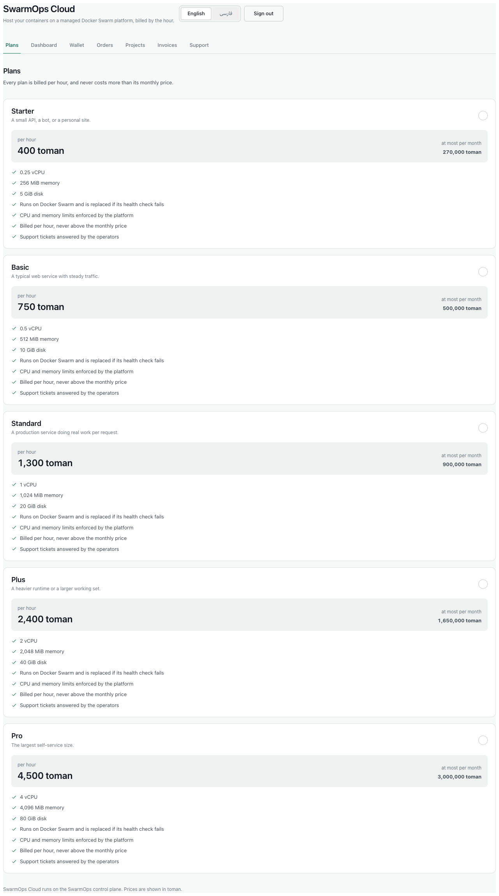
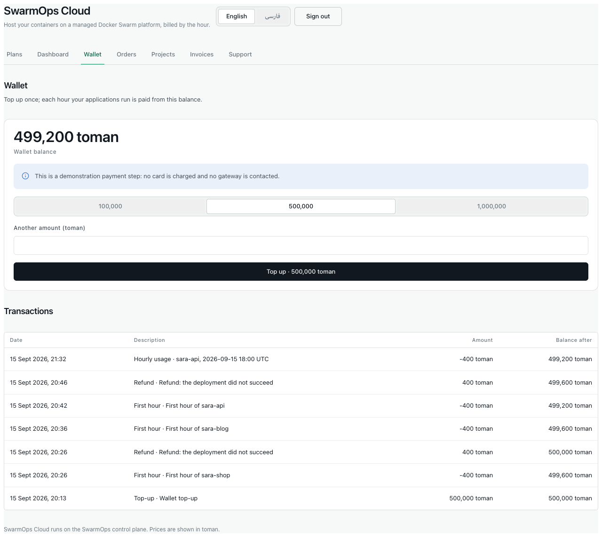
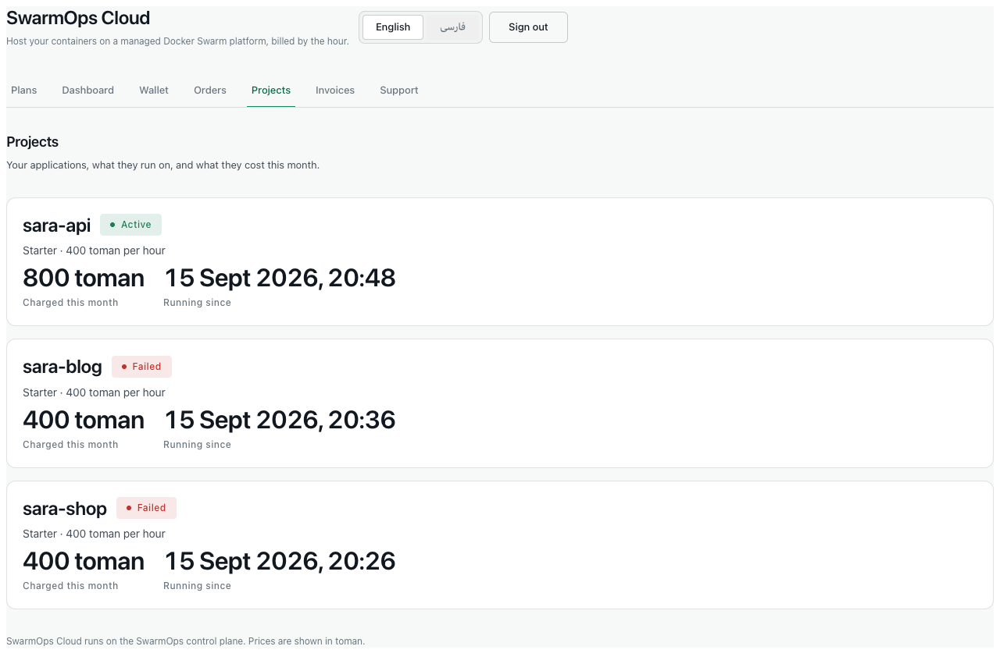

# About this manual

SwarmOps Cloud runs container applications on Docker Swarm and bills them by the hour from a prepaid wallet. Customers use the **storefront**, at `/store` on the platform's address. Administrators use the **administration console**, at `/`.

Amounts are shown in **tomans**. Internally the platform counts rials (10 rials = 1 toman), so API responses and database reports show ten times the toman figure.

Button and field names are shown in **bold**. A path such as *Sales › Orders* means "open Sales in the side bar, then Orders".

# Part I — Customers

## The storefront at a glance

The storefront's header holds three controls:

- the language switch (**English** / **فارسی**);
- **Sign in** or **Sign out**;
- once signed in, the tabs **Plans**, **Dashboard**, **Wallet**, **Orders**, **Projects**, **Invoices** and **Support**.

{width=90%}

The storefront follows your device's light or dark setting, and works on a phone as well as on a computer.

{width=90%}

## Choosing the language

Press **فارسی** for Persian or **English** for English. In Persian the whole page runs right to left, and numbers, dates and amounts use Persian digits. Your choice is remembered on that device.

{width=40%}

## Creating an account

1. Press **Sign in**, then **Already have an account? Sign in** or the registration link, to reach **Create your account**.
2. Enter your **Full name**, **Email** and a **Password** of 10 to 72 characters.
3. Press **Create account**.

You are signed in and taken to your wallet. Each email address can hold one account.

{width=90%}

After several failed attempts in a short time, the storefront asks you to wait a few minutes before trying again. This protects your account from password guessing.

## Topping up the wallet

Your applications are paid for from the wallet, so it must hold money before an order can be approved.

1. Open **Wallet**.
2. Choose a preset amount — **100,000**, **500,000** or **1,000,000** toman — or type another amount under **Another amount (toman)**. One top-up may be between 10,000 and 200,000,000 toman.
3. Press **Top up · … toman**.

The balance rises, and the top-up appears under **Transactions** with the balance after it.

{width=90%}

> **Demonstration payment.** This installation does not contact a payment gateway, and no card is charged. The page says so in a blue notice. If a top-up request is sent twice, for example after a network error, the wallet is credited only once.

## Ordering a plan

Each plan gives your application a fixed amount of CPU, memory and disk. It has a price per hour and a **most you can pay in a month**.

1. Open **Plans** and choose a plan.
2. The checkout shows the plan's **Price per hour**, **Most you can pay in a month** and **Required wallet balance at approval**, which is 24 hours of the plan's price.
3. Fill in the form:
   - **Application name** — a lowercase letter followed by lowercase letters, digits or hyphens, at most 41 characters. The name must not be in use.
   - **Container image** — an image already published to a registry, with a tag other than `latest` (for example `ghcr.io/acme/shop:1.0.0`).
   - **Port the application listens on**.
   - **Note for the reviewer** — optional.
4. Press **Place order**.

{width=90%}

> **Before you order, check your image.** The platform starts your application only when it is healthy. Your image must answer `GET /healthz` with status 200 on the port you give, and it must contain `wget` or `curl`, which the health check uses. An image that does not meet these requirements will fail to start, and the charge is refunded.

No money moves when you place an order. An administrator reviews it first.

## Following your orders

**Orders** lists every order with its status.

| Status | Meaning | What you can do |
|---|---|---|
| In review | Waiting for an administrator. | **Cancel order**. |
| Deploying | Approved; the first hour has been charged and the application is starting. | Wait. |
| Active | Your application is running and billed by the hour. | See **Projects**. |
| Failed | The application did not start. The first hour was refunded automatically. | Check the image requirements and order again under a new name. |
| Rejected | An administrator declined the order; the reason is shown. | Correct the problem and order again. |
| Cancelled | You cancelled the order. | — |

: Order statuses

{width=90%}

## Your projects

A project is an application created by an approved order. **Projects** shows, for each one:

- its status;
- its plan and price per hour;
- the amount **Charged this month**;
- when it has been **Running since**.

{width=90%}

**How charging works.**

- A running project is charged its hourly price once for each hour. The platform checks every few minutes, so a charge can appear a few minutes after the hour begins.
- In one calendar month a project is never charged more than its plan's monthly price.
- If the wallet cannot pay for the next hour, the project is **suspended**: it stops running and is not charged. A banner offers **Top up**.
- As soon as a top-up covers the next hour, the project starts again. The hours it spent suspended are never charged.

## Invoices

At the end of each month you receive one invoice for your usage. It lists each project with its hours and amount. Prices include value-added tax (10 %), and the invoice states the tax contained in the total. Because charges are paid from the prepaid wallet, every invoice is marked **paid**. Open an invoice to see its lines.

{width=90%}

> The invoice in this screenshot comes from the test run. It includes two first hours that were refunded before a defect was corrected (Test Plan and Report, defect D-2). On an installation with the correction, refunded hours never appear on an invoice.

## Support

1. Open **Support**.
2. Under **New ticket**, enter a **Subject** (3–160 characters) and a **Message** (under 5,000 characters). Optionally choose **About a project** and a **Priority** (low, normal or high).
3. Press **Open ticket**.

Replies from administrators appear in the conversation, and the ticket's status changes from *Open* to *Answered*. You can reply again or close the ticket.

{width=90%}

## Signing out and security

Press **Sign out** to end your session on that device. A session also ends by itself after 12 hours. If you sign in from another tab, the storefront continues to work in the first tab without reloading.

## Messages you may see

| Message | Meaning and remedy |
|---|---|
| *use between 10 and 72 characters* | The password is too short or too long. |
| *an account with this email already exists* | Sign in instead, or use another email address. |
| *the application name "…" is already taken* | Choose another name. |
| *image must not use the latest tag* / *image must use a non-latest tag or digest* | Give the image a version tag, such as `:1.0.0`. |
| *top up between … and … rials* | The amount is outside the allowed range (10,000 to 200,000,000 toman). |
| *Too many sign-in attempts; wait a few minutes* | Wait, then try again. |
| *Your session has expired* | Sign in again. |

: Storefront messages

Validation messages from the server are in English, including on the Persian storefront.

# Part II — Administrators

## Signing in and the Sales area

Open the console at the platform's address and sign in with the operator account. The side bar's **Sales** area has five pages: **Orders**, **Customers**, **Plans**, **Billing** and **Support**. The rest of the console — **Apps**, **Machines**, **Traffic**, **Activity** and **Control** — operates the platform itself.

## Preparing the platform

An order can be confirmed only on a **connected Swarm manager**, and an application can be deployed only when the **managed Traefik gateway** is installed.

1. **Connect a server.** Use **Connect a server** and follow the installation command, or use the development machine agent on a local installation. The header shows **Agent connected** when it is reachable.
2. **Install the gateway.** Open *Traffic › Gateway*. The **Installation prerequisites** list states what is missing: the external `traefik` network, a manager labelled `nim.edge=true`, the dynamic configuration, the dashboard login secret, the ACME contact email and the dashboard hostname.
   - Enter the ACME email and dashboard hostname under *Traffic › Gateway settings*.
   - When every missing item can be created automatically, press **Fix all N prerequisites**. Save the dashboard login it shows once.
   - Press **Install gateway**, type `DEPLOY_TRAEFIK`, and press **Install gateway** again.

{width=90%}

## Reviewing orders

*Sales › Orders* shows how many orders are pending, deploying, active and failed. The list can be filtered by status.

{width=90%}

To decide an order:

1. Press **Review** on a pending order. The panel shows the customer, application, image, port, plan and the customer's note.
2. **To confirm:**
   - Choose the server under **Deploy on**; only connected Swarm managers are offered.
   - Type the phrase shown, for example `CONFIRM_ORDER_3`.
   - Press **Confirm and deploy**.
3. **To reject:** enter **Reason for rejecting (sent to the customer)** and press **Reject order**.

Confirming charges the first hour, creates the project and queues the deployment in one step. If any part cannot happen — the wallet holds less than 24 hours of the price, the server is not a manager, or the application is invalid on that server — nothing is charged and the console explains why.

After confirmation the order is *provisioning* until the deployment finishes. If the deployment succeeds, the order becomes *active*. If it fails, the order becomes *failed* and the first hour is refunded automatically. *Activity › Runs* shows the deployment's steps and, for a failure, its cause.

{width=90%}

> **A deployment that never becomes healthy occupies the command queue** until its ten-minute timeout, and other commands wait meanwhile. When a deployment stays in *provisioning*, check its run in *Activity* and the application's health endpoint.

## Customers and wallets

*Sales › Customers* lists every storefront account with its balance, live projects, pending orders and status. Press **Wallet** to open a customer's ledger.

{width=90%}

- **ledger consistent** confirms that the balance equals the sum of the ledger. If it ever shows **ledger mismatch**, stop and investigate before any adjustment.
- **To correct a balance,** enter an **Adjustment (toman)** — negative to deduct — and a **Reason (kept in the ledger)** of at least a few words, then press **Record adjustment**. An adjustment is a new ledger row; existing rows are never edited, and a balance cannot become negative.
- **To suspend a customer,** type the phrase shown (for example `SUSPEND_CUSTOMER_1`) and confirm. Every session of the customer ends and they cannot sign in. Their running projects are not stopped. Reactivate the same way.

Every adjustment and status change is recorded in the audit log under your name.

## Plans

*Sales › Plans* lists the catalogue. Press **New plan** or **Edit** to open the editor:

| Field | Rule |
|---|---|
| Code | 2–32 lowercase letters, digits or hyphens; cannot be changed after creation. |
| Name | Required. |
| Description, Description (Persian) | Each under 255 characters. The Persian text is shown on the Persian storefront. |
| CPU (millicores) | 100–64,000 (1,000 millicores = 1 vCPU). |
| Memory (MiB) | 128–262,144. |
| Disk (GiB) | — |
| Price per hour (rial), Monthly cap (rial) | The hourly price must be positive; the cap at least one hour's price. The hint shows each in tomans. |
| Features, Features (Persian) | One per line; at most 12 in each language, each under 160 characters. |
| Storefront availability | **Offered** or **Withdrawn**. |

: Plan fields

{width=90%}

A price change applies to new orders only; existing orders and projects keep the prices they were placed at. Withdrawing a plan hides it from the storefront without affecting existing projects. Only list features the platform actually provides.

## Billing and invoices

*Sales › Billing* shows:

- this month's revenue (charges less refunds);
- the active and suspended projects;
- the wallet float, meaning the money customers hold but have not spent;
- the projects with their charges this month;
- revenue by month;
- the invoices.

{width=90%}

Billing runs by itself every five minutes on the active controller. Use the two buttons only when you need them:

- **Run billing now** charges any hours not yet charged. Running it twice charges nothing twice.
- **Issue invoices** for the chosen month. Issuing a month twice creates no duplicate invoices. The previous month's invoices are also issued automatically.

Press **Lines** on an invoice to see its projects, hours and amounts, with the tax it contains.

{width=90%}

## Support

*Sales › Support* lists tickets by status: **open** (waiting for you), **answered** and **closed**. Press **Open** to read a conversation. Type your answer under **Reply** and press **Send reply**; the ticket becomes *answered*. Press **Close ticket** when the matter is resolved.

{width=90%}

## Messages you may see

| Message | Meaning and remedy |
|---|---|
| *The customer's wallet does not hold the required reserve* | The wallet holds less than 24 hours of the plan's price. Ask the customer to top up. |
| *The selected server is not connected to a Swarm manager* | Choose a connected manager, or connect one first. |
| *Choose a saved server to deploy on* | No server was chosen. |
| *This order is …, not pending* | Someone else has already decided the order. Refresh the list. |
| *This control-plane replica is standby…* | This controller is not the active one. Use the active controller. |
| *Remote mutations are disabled on this control plane* | The controller was started without mutations enabled. |
| Deployment failure `gateway_required` | Install the gateway (see *Preparing the platform*). |

: Console messages
