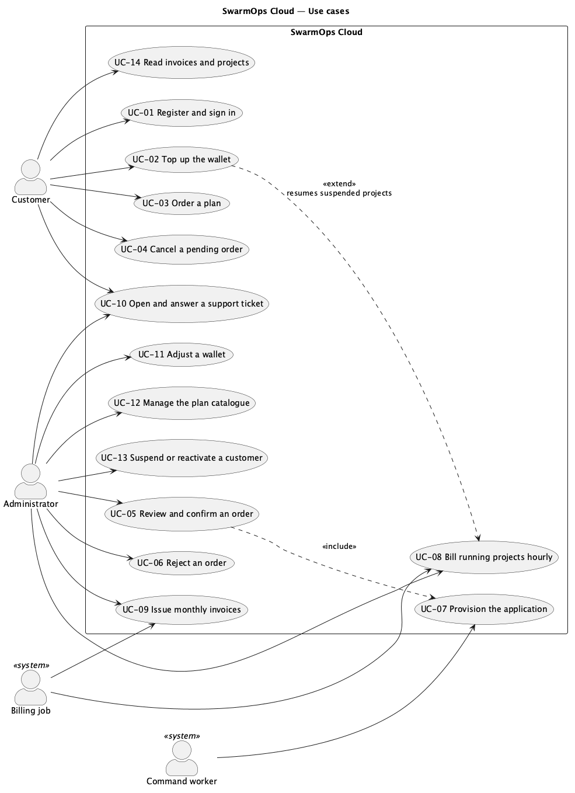

# مقدمه

## هدف

این مشخصات تعیین می‌کند سوارم‌آپس کلود چه کاری باید انجام دهد و چه کیفیت‌هایی باید داشته باشد. مخاطبان آن بازبینان پروژه، توسعه‌دهندگانی که سامانه را نگهداری می‌کنند و آزمون‌گرانی هستند که از آن حالت‌های آزمون استخراج می‌کنند.

## دامنه

سوارم‌آپس کلود به مشتریان امکان خرید میزبانی کانتینر و به مدیران امکان اداره‌ی کسب‌وکار و سکو را می‌دهد. سامانه از این بخش‌ها تشکیل شده است:

- **فروشگاه**، جایی که مشتریان ثبت‌نام می‌کنند، کیف پول پیش‌پرداخت را شارژ می‌کنند، پلن سفارش می‌دهند، سفارش‌ها و پروژه‌ها را دنبال می‌کنند، فاکتورها را می‌خوانند و تیکت پشتیبانی باز می‌کنند؛
- **کنسول مدیریت**، جایی که مدیران سفارش‌ها را تأیید یا رد می‌کنند، پلن‌ها، کیف پول‌ها، صورتحساب و تیکت‌ها را مدیریت می‌کنند و سرورها، دروازه و برنامه‌ها را اداره می‌کنند؛
- **هسته‌ی SwarmOps**، سروری که هر دو را پیاده می‌کند، همه‌ی وضعیت را در MariaDB یا MySQL نگه می‌دارد و برنامه‌ها را از طریق عامل ماشین روی Docker Swarm مستقر می‌کند.

پردازش پرداخت واقعی، دامنه‌ی عمومی پیش‌فرض برای برنامه‌ها، تأیید ایمیل و اجرای چندمنطقه‌ای خارج از دامنه‌ی این نسخه است.

## تعاریف، سرواژه‌ها و اختصارات

| اصطلاح | معنا |
|---|---|
| مدیر | کسی که سوارم‌آپس کلود را از طریق کنسول اداره می‌کند. |
| عامل (agent) | عامل ماشین SwarmOps: سرویسی روی هر سرور که عملیات Docker و Swarm را برای هسته انجام می‌دهد. |
| فرمان (command) | یک واحد کار پایدار و نوع‌دار (مانند `application.deploy`) که در پایگاه داده ذخیره و توسط کارگر فرمان اجرا می‌شود. |
| هسته (Core) | فرایند سرور هسته‌ی SwarmOps. |
| CSRF | جعل درخواست میان‌سایتی. |
| DSN | نام منبع داده: رشته‌ی اتصال پایگاه داده. |
| دفتر کل | فهرست فقط‌افزودنی تراکنش‌های کیف پول. |
| صندوق خروجی (outbox) | الگوی صندوق خروجی تراکنشی: پیامی (در اینجا یک فرمان) در همان تراکنشی نوشته می‌شود که تغییر تجاری ایجادکننده‌ی آن. |
| PaaS | سکوی سرویس (Platform as a Service). |
| پلن | یک محصول: محدودیت پردازنده، حافظه و دیسک با قیمت ساعتی و سقف ماهانه. |
| پروژه | برنامه‌ی مشتری که از یک سفارش تأییدشده ایجاد می‌شود. |
| ریال، تومان | واحدهای پول ایران. مبالغ به ریال ذخیره و به تومان نمایش داده می‌شوند (هر تومان = ۱۰ ریال). |
| SPA | برنامه‌ی تک‌صفحه‌ای. |
| مدیر Swarm | گره‌ای در Docker Swarm که می‌تواند سرویس‌ها را زمان‌بندی کند. |

: تعاریف

## مراجع

::: ltr
[1] ISO/IEC/IEEE 29148:2018, *Systems and software engineering — Life cycle processes — Requirements engineering*.

[2] S. Brown, "The C4 model for visualising software architecture," <https://c4model.com>.

[3] SwarmOps Cloud, *Project Proposal*, September 2026.

[4] SwarmOps Cloud, *C4 Architecture Model*, *Database Design* and *API Reference*, September 2026.
:::

## نمای کلی سند

بخش ۲ محصول را به‌طور کلی توصیف می‌کند. بخش ۳ نیازمندی‌های مشخص را فهرست می‌کند. بخش ۴ حالت‌های کاربرد را شرح می‌دهد. بخش ۵ نیازمندی‌ها را به اهداف، پیاده‌سازی و درستی‌سنجی ردیابی می‌کند.

# توصیف کلی

## دیدگاه محصول

سوارم‌آپس کلود، SwarmOps را گسترش می‌دهد؛ صفحه‌ی کنترلی موجود برای Docker Swarm. SwarmOps از پیش سرورها را ثبت می‌کرد، استک برنامه‌ها را تولید می‌کرد، دروازه‌ی Traefik را نصب می‌کرد، تغییرات را به‌صورت فرمان در صف قرار می‌داد و اقدامات اپراتور را ممیزی می‌کرد. این نسخه ذخیره‌سازی مبتنی بر فایل آن را با یک پایگاه داده‌ی رابطه‌ای جایگزین می‌کند و زیرسامانه‌ی تجاری و فروشگاه را می‌افزاید. شکل ۱ سامانه را در محیطش نشان می‌دهد؛ سند مدل C4 آن را به تفصیل شرح می‌دهد.

{width=100%}

## کارکردهای محصول

- حساب مشتری با نشست، محافظت CSRF و ورود با محدودیت نرخ.
- کاتالوگ پلن که مدیران ویرایش می‌کنند و مشتریان از آن سفارش می‌دهند.
- کیف پول پیش‌پرداختی که هر تغییرش یک سطر دفتر کل است.
- سفارش‌هایی که مدیران تأیید می‌کنند، با پرداخت و استقرار در یک تراکنش.
- استقرار خودکار ایمیج سفارش‌داده‌شده روی یک مدیر Swarm، با بازپرداخت در صورت شکست.
- صورتحساب ساعتی با سقف ماهانه، تعلیق وقتی کیف پول توان پرداخت ندارد و ازسرگیری پس از شارژ.
- فاکتور ماهانه با مالیات بر ارزش افزوده‌ی منظورشده.
- تیکت پشتیبانی میان مشتریان و مدیران.
- گزارش مشتریان، درآمد و فعالیت سکو.
- عملیات موجود SwarmOps: سرورها، دروازه، برنامه‌ها، اجرای فرمان‌ها و ممیزی.

## دسته‌های کاربران و ویژگی‌های آن‌ها

| دسته‌ی کاربر | ویژگی‌ها | رابط |
|---|---|---|
| مشتری | توسعه‌دهنده یا کسب‌وکار کوچک. ساخت و انتشار ایمیج کانتینر را می‌داند؛ نیازی به دانستن Swarm ندارد. ممکن است فارسی را ترجیح دهد. | فروشگاه |
| مدیر | سرویس را اداره می‌کند. Docker Swarm و قواعد صورتحساب سکو را می‌شناسد. | کنسول مدیریت |
| بازدیدکننده‌ی برنامه | از برنامه‌ای که مشتری مستقر کرده استفاده می‌کند. هرگز SwarmOps را نمی‌بیند. | برنامه‌ی مشتری |
| کار صورتحساب و کارگر فرمان | بخش‌هایی از هسته که بدون دخالت انسان، بر اساس زمان‌بندی یا زمان سررسید یک فرمان عمل می‌کنند. | داخلی |

: دسته‌های کاربران

## محیط عملیاتی

- **هسته:** یک باینری Go 1.26 روی Ubuntu 24.04 یا macOS.
- **پایگاه داده:** MariaDB 11.4 LTS یا MySQL 8.4 LTS، موتور InnoDB، مجموعه‌نویسه‌ی `utf8mb4`.
- **خوشه:** Docker Swarm روی گره‌های Ubuntu که عامل SwarmOps را اجرا می‌کنند، با دروازه‌ی Traefik v3.6 روی یک مدیر با برچسب `nim.edge=true`.
- **کاربران:** مرورگرهای رایج رومیزی و همراه، تا عرض صفحه‌ی ۴۰۰ پیکسل.

## محدودیت‌های طراحی و پیاده‌سازی

- **C-1** فقط ویژگی‌های مشترک MariaDB 11.4 و MySQL 8.4 مجاز است: تراکنش‌های InnoDB، قید CHECK، ستون JSON، `SELECT … FOR UPDATE SKIP LOCKED` و `GET_LOCK`.
- **C-2** کلید رمزنگاری داده هرگز نباید در پایگاه داده ذخیره شود.
- **C-3** در هر زمان فقط یک هسته می‌تواند روی خوشه عمل کند؛ هسته‌ی *فعال* که با یک دوره‌ی اقتدار (authority epoch) مشخص می‌شود.
- **C-4** رابط‌های عمومی Go مخزن‌های موجود SwarmOps باید حفظ شوند تا بقیه‌ی SwarmOps از تغییر ذخیره‌سازی متأثر نشود.
- **C-5** کنسول باید قواعد معماری اطلاعات خود را رعایت کند: یک رجیستری ناوبری، مسیر برای هر صفحه، عبارت تأیید تایپی برای کنش‌های مخرب و نمایش هر داده‌ی دریافتی از API.

## فرض‌ها و وابستگی‌ها

- **A-1** پرداخت شبیه‌سازی می‌شود: شارژ، کیف پول را بدون تماس با درگاه اعتبار می‌دهد و فروشگاه این را اعلام می‌کند.
- **A-2** ایمیج سفارش‌داده‌شده در رجیستری‌ای منتشر شده که خوشه به آن دسترسی دارد، روی درگاه سفارش‌داده‌شده به `GET /healthz` با وضعیت ۲۰۰ پاسخ می‌دهد و برای این بررسی `wget` یا `curl` دارد.
- **A-3** پیش از استقرار سفارش‌ها، یک مدیر Swarm متصل است و دروازه‌ی مدیریت‌شده‌ی Traefik روی آن نصب شده است.
- **A-4** برنامه‌ها یک مسیر داخلی درون خوشه دریافت می‌کنند؛ در این نسخه دامنه‌ی عمومی تخصیص داده نمی‌شود.

# نیازمندی‌های مشخص

هر نیازمندی یک شناسه، یک بیان و یک اولویت دارد: **M** (الزامی) یا **S** (توصیه‌شده).

## نیازمندی‌های رابط خارجی

### رابط‌های کاربری

- **UI-1 (M)** فروشگاه در `/store` ارائه می‌شود و این صفحات را دارد که هر یک نشانی مخصوص دارند: پلن‌ها، ورود، ثبت‌نام، داشبورد، کیف پول، پرداخت یک پلن، سفارش‌ها، پروژه‌ها، فاکتورها و پشتیبانی.
- **UI-2 (M)** کنسول یک بخش فروش با پنج صفحه دارد — سفارش‌ها، مشتریان، پلن‌ها، صورتحساب و پشتیبانی — که در ناوبری و مسیریاب کنسول ثبت شده‌اند.
- **UI-3 (M)** فروشگاه به انگلیسی و فارسی ارائه می‌شود؛ فارسی چیدمان راست‌به‌چپ و ارقام فارسی دارد و انتخاب در مرورگر به خاطر سپرده می‌شود.
- **UI-4 (M)** مبالغ به تومان با جداکننده‌ی هزارگان نمایش داده می‌شوند و فروشگاه اعلام می‌کند که قیمت‌ها به تومان است.
- **UI-5 (M)** هر وضعیت با کلمه در کنار رنگش نمایش داده می‌شود.
- **UI-6 (S)** صفحات در عرض ۴۰۰ پیکسل کار می‌کنند. فروشگاه از تم روشن یا تیره‌ی بیننده پیروی می‌کند؛ کنسول تم روشنی را که پیش از این پروژه داشت حفظ می‌کند.

### رابط‌های نرم‌افزاری

- **SI-1 (M)** هسته با DSN خوانده‌شده از یک فایل محافظت‌شده (در محیط تولید) به MariaDB 11.4 یا MySQL 8.4 وصل می‌شود و UTC، `parseTime` و `utf8mb4` را اجبار می‌کند.
- **SI-2 (M)** هسته عامل ماشین را از طریق HTTPS با گواهی سنجاق‌شده (pinned) و کلید API فرا می‌خواند.
- **SI-3 (M)** عامل استک‌ها را از طریق Docker Engine API مستقر می‌کند و دروازه Traefik v3.6 است.

### رابط‌های ارتباطی

- **CI-1 (M)** فروشگاه `/api/store/v1` و کنسول `/api/v1` را فرا می‌خوانند، هر دو با JSON روی HTTPS.
- **CI-2 (M)** نشست فروشگاه در کوکی `swarmops_store_session` است (HttpOnly، SameSite=Strict، Path=/، و Secure وقتی کوکی امن پیکربندی شده باشد). هر درخواستی که داده را تغییر می‌دهد، توکن نشست را در سرآیند `X-CSRF-Token` می‌فرستد.

## نیازمندی‌های کارکردی

### حساب‌ها (ACC)

- **FR-ACC-1 (M)** بازدیدکننده می‌تواند با نشانی ایمیل، نام کامل و گذرواژه‌ی ۱۰ تا ۷۲ نویسه ثبت‌نام کند. ایمیل باید معتبر و استفاده‌نشده باشد.
- **FR-ACC-2 (M)** مشتری ثبت‌نام‌شده می‌تواند با ایمیل و گذرواژه وارد شود. گذرواژه‌ها به‌صورت درهم‌سازی bcrypt (هزینه‌ی ۱۲) ذخیره می‌شوند؛ رد کردن ایمیل ناشناخته همان‌قدر طول می‌کشد که گذرواژه‌ی نادرست.
- **FR-ACC-3 (M)** پس از هشت تلاش ناموفق ورود برای یک کلید در پانزده دقیقه، تلاش‌های بعدی تا پایان این بازه رد می‌شوند.
- **FR-ACC-4 (M)** هر نشست دوازده ساعت دوام دارد؛ خروج آن را باطل می‌کند.
- **FR-ACC-5 (M)** درخواستی که داده را تغییر می‌دهد، مگر آنکه توکن CSRF آن با نشست برابر باشد، با وضعیت ۴۰۳ رد می‌شود.
- **FR-ACC-6 (S)** وقتی توکن فروشگاه به دلیل تغییر نشست رد می‌شود (مثلاً پس از ورود از زبانه‌ای دیگر)، فروشگاه یک بار نشست فعلی را می‌خواند و درخواست را با همان کلید یکتایی تکرار می‌کند.
- **FR-ACC-7 (M)** مدیر می‌تواند مشتری را تعلیق کند؛ تعلیق همه‌ی نشست‌های او را باطل و از ورودش جلوگیری می‌کند، اما پروژه‌های در حال اجرا را متوقف نمی‌کند. مدیر می‌تواند مشتری را دوباره فعال کند.
- **FR-ACC-8 (M)** اپراتور کنسول با یک حساب مدیر بازنمایی می‌شود تا تصمیم‌هایی مانند بازبینی سفارش و اصلاح کیف پول به یک کاربر نسبت داده شوند.

### کاتالوگ (CAT)

- **FR-CAT-1 (M)** هر کسی می‌تواند پلن‌های در حال عرضه را به ترتیب نمایش، با پردازنده، حافظه، دیسک، قیمت ساعتی، سقف ماهانه، توضیح و ویژگی‌ها ببیند. فروشگاه فارسی، توضیح و ویژگی‌های فارسی پلن را در صورت وجود و در غیر این صورت نسخه‌ی انگلیسی را نشان می‌دهد.
- **FR-CAT-2 (M)** مدیر می‌تواند پلن بسازد یا ویرایش کند:
  - کد ۲ تا ۳۲ نویسه از حروف کوچک، ارقام یا خط تیره؛
  - نام الزامی؛ توضیح و نسخه‌ی فارسی آن هر کدام کمتر از ۲۵۵ نویسه؛
  - پردازنده ۱۰۰ تا ۶۴٬۰۰۰ میلی‌هسته و حافظه ۱۲۸ مگابایت تا ۲۵۶ گیگابایت؛
  - قیمت ساعتی مثبت و سقف ماهانه دست‌کم برابر یک ساعت؛
  - حداکثر ۱۲ ویژگی به هر زبان، هر کدام کمتر از ۱۶۰ نویسه.
- **FR-CAT-3 (M)** مدیر می‌تواند پلنی را از عرضه خارج کند؛ پلن خارج‌شده از فروشگاه پنهان می‌شود ولی به سفارش‌ها و پروژه‌های موجود متصل می‌ماند.
- **FR-CAT-4 (M)** هر سفارش قیمت‌های ساعتی و ماهانه‌ی زمان ثبت را نگه می‌دارد؛ تغییر قیمت بعدی بر آن اثری ندارد.

### کیف پول (WAL)

- **FR-WAL-1 (M)** هر مشتری یک کیف پول دارد که موجودی آن هرگز منفی نمی‌شود.
- **FR-WAL-2 (M)** مشتری می‌تواند بین ۱۰۰٬۰۰۰ و ۲٬۰۰۰٬۰۰۰٬۰۰۰ ریال شارژ کند. هر شارژ یک کلید یکتایی دارد؛ تکرار درخواست با همان کلید، کیف پول را فقط یک بار اعتبار می‌دهد.
- **FR-WAL-3 (M)** هر تغییر موجودی به‌صورت یک سطر دفتر کل با نوع (`topup`، `order_charge`، `usage`، `refund` یا `adjustment`)، مبلغ علامت‌دار، موجودی پس از تراکنش، مرجع و توضیح ثبت می‌شود. سطرهای دفتر کل هرگز به‌روزرسانی یا حذف نمی‌شوند.
- **FR-WAL-4 (M)** مدیر می‌تواند کیف پول را با مبلغی غیرصفر و دلیل مشخص اصلاح کند؛ اصلاح یک سطر دفتر کل است و نمی‌تواند موجودی را منفی کند.
- **FR-WAL-5 (M)** کنسول نشان می‌دهد آیا موجودی کیف پول با مجموع دفتر کل آن برابر است.
- **FR-WAL-6 (M)** شارژ، پروژه‌های معلق مشتری را که موجودی جدید توان پرداختشان را دارد از سر می‌گیرد.

### سفارش‌ها (ORD)

- **FR-ORD-1 (M)** مشتری واردشده می‌تواند یک پلن در حال عرضه را با این اطلاعات سفارش دهد:
  - نام برنامه: یک حرف کوچک و سپس حداکثر ۴۰ حرف کوچک، رقم یا خط تیره، که استفاده‌نشده باشد؛
  - ایمیج کانتینر با برچسبی غیر از `latest`، یا یک digest؛
  - درگاهی که برنامه روی آن گوش می‌دهد؛
  - یادداشت اختیاری کمتر از ۵۰۰ نویسه.
- **FR-ORD-2 (M)** سفارش جدید در وضعیت `pending` است و مشتری تا زمانی که در این وضعیت است می‌تواند آن را لغو کند.
- **FR-ORD-3 (M)** مدیر می‌تواند سفارش در انتظار را با دلیلی که مشتری می‌بیند رد کند.
- **FR-ORD-4 (M)** مدیر می‌تواند سفارش در انتظار را با انتخاب یک مدیر Swarm متصل تأیید کند. کنسول ابتدا تایپ عبارت `CONFIRM_ORDER_<id>` را می‌خواهد. هسته تأیید را در این حالت‌ها رد می‌کند:
  - تغییرات غیرفعال باشد؛
  - ذخیره‌سازی فرمان یا دفتر ممیزی در دسترس نباشد؛
  - سرور ناشناخته باشد یا مدیر Swarm نباشد؛
  - برنامه در برنامه‌ریزی روی آن سرور رد شود.
- **FR-ORD-5 (M)** تأیید مستلزم آن است که کیف پول دست‌کم ۲۴ ساعت قیمت ساعتی پلن را داشته باشد.
- **FR-ORD-6 (M)** تأیید یک تراکنش پایگاه داده است: کیف پول را قفل می‌کند، ساعت نخست را کسر می‌کند، پروژه و نخستین رکورد مصرف آن را می‌سازد و فرمان `application.deploy` را با کلید یکتایی `cloud-order-<id>` درج می‌کند. یا همه‌ی این‌ها انجام می‌شوند یا هیچ‌کدام.
- **FR-ORD-7 (M)** سفارش وقتی استقرارش موفق شود `active` و وقتی ناموفق شود `failed` می‌شود (شکل ۲).

{width=90%}

### استقرار (PRV)

- **FR-PRV-1 (M)** کارگر فرمان استقرار را روی سرور انتخاب‌شده اجرا می‌کند، برنامه را به پردازنده و حافظه‌ی پلن محدود می‌کند و آن را از طریق دروازه مسیریابی می‌کند.
- **FR-PRV-2 (M)** وقتی فرمان استقرار به `needs_attention`، `failed` یا `cancelled` برسد، پروژه و سفارش `failed` می‌شوند، هزینه‌ی ساعت نخست دقیقاً یک بار بازپرداخت می‌شود (کلید یکتایی `order-refund-<id>`) و رکورد مصرف آن ساعت حذف می‌شود تا نه نمایش داده شود و نه در فاکتور بیاید.
- **FR-PRV-3 (M)** فقط هسته‌ی فعال فرمان‌ها را اجرا و نتیجه‌شان را ثبت می‌کند.

### صورتحساب (BIL)

- **FR-BIL-1 (M)** هر پروژه‌ی در حال اجرا برای هر ساعت تقویمی یک بار با قیمت ساعتی‌اش حساب می‌شود؛ کسر دوم برای یک پروژه و یک ساعت ناممکن است.
- **FR-BIL-2 (M)** هزینه‌های یک پروژه در یک ماه تقویمی هرگز از سقف ماهانه‌ی پلن بیشتر نمی‌شود.
- **FR-BIL-3 (M)** صورتحساب هر پنج دقیقه به‌طور خودکار روی هسته‌ی فعال اجرا می‌شود و مدیر می‌تواند آن را به‌صورت دستی اجرا کند؛ اجرای دوباره هیچ ساعتِ حساب‌شده‌ای را دوباره حساب نمی‌کند.
- **FR-BIL-4 (M)** وقتی کیف پول نتواند ساعت بعدی یک پروژه را بپردازد، پروژه `suspended` می‌شود و سرویسش به صفر مقیاس داده می‌شود.
- **FR-BIL-5 (M)** وقتی شارژی بتواند ساعت بعدی را بپردازد، پروژه‌ی معلق از سر گرفته و سرویسش دوباره مقیاس داده می‌شود؛ ساعت‌های تعلیق حساب نمی‌شوند.

### فاکتورها (INV)

- **FR-INV-1 (M)** برای هر ماه تقویمی، هر مشتری که مصرف داشته یک فاکتور دریافت می‌کند که ساعت‌ها و مبلغ هر پروژه را فهرست می‌کند.
- **FR-INV-2 (M)** قیمت‌ها شامل مالیات بر ارزش افزوده با نرخ قابل پیکربندی (پیش‌فرض ۱۰٪) هستند. مالیات موجود در یک جمع برابر `total × rate / (10000 + rate)` است که نرخ به واحد پایه (basis point) است. در هر فاکتور، جمع = جمع جزء + مالیات.
- **FR-INV-3 (M)** فاکتورها با قالب `INV-YYYYMM-NNNNNN` شماره‌گذاری و به‌صورت پرداخت‌شده صادر می‌شوند، چون هزینه‌ها از کیف پول پیش‌پرداخت کسر می‌شوند.
- **FR-INV-4 (M)** فاکتورهای ماه گذشته به‌طور خودکار صادر می‌شوند و مدیر می‌تواند فاکتورهای ماه دلخواه را صادر کند؛ صدور دوباره تکراری ایجاد نمی‌کند.
- **FR-INV-5 (M)** مشتری فقط فاکتورهای خود را می‌بیند؛ مدیر همه را.

### پشتیبانی (SUP)

- **FR-SUP-1 (M)** مشتری می‌تواند تیکتی با این اطلاعات باز کند:
  - موضوع ۳ تا ۱۶۰ نویسه؛
  - پیام کمتر از ۵٬۰۰۰ نویسه؛
  - اولویت کم، معمولی یا زیاد؛
  - در صورت تمایل، یکی از پروژه‌های خودش.
- **FR-SUP-2 (M)** مشتریان و مدیران می‌توانند پاسخ دهند؛ پاسخ مدیر تیکت را `answered` می‌کند و هر دو طرف می‌توانند آن را ببندند.
- **FR-SUP-3 (M)** مشتری فقط تیکت‌های خود را می‌بیند.

### گزارش‌ها (REP)

- **FR-REP-1 (M)** کنسول این موارد را نشان می‌دهد:
  - درآمد این ماه (هزینه‌ها منهای بازپرداخت‌ها)؛
  - تعداد پروژه‌های فعال و معلق؛
  - مجموع موجودی نزد مشتریان.
- **FR-REP-2 (M)** کنسول مشتریان را با موجودی، پروژه‌های زنده و سفارش‌های در انتظار، و درآمد ماهانه را با مبالغ کسرشده، بازپرداخت‌شده و شارژشده و تعداد مشتریان پرداخت‌کننده فهرست می‌کند.

### عملیات سکو (OPS)

- **FR-OPS-1 (M)** عملیات موجود SwarmOps در دسترس مدیران می‌ماند: سرورها، نصب و ترمیم دروازه، برنامه‌ها، اجرای فرمان‌ها و ممیزی.
- **FR-OPS-2 (M)** هر اقدام تغییردهنده‌ی مدیر در دفتر ممیزی ثبت می‌شود.

### مدیریت داده (DAT)

- **FR-DAT-1 (M)** همه‌ی وضعیت کنترل‌گر SwarmOps در پایگاه داده‌ی رابطه‌ای ذخیره می‌شود: ممیزی، برنامه‌ها، اعتبارنامه‌ها، اتصالات و تنظیمات منبع، سرورها و کلیدها، توپولوژی هسته، رجیستری عامل‌ها، مسیریابی و صف فرمان‌ها.
- **FR-DAT-2 (M)** طرح‌واره با مهاجرت‌های شماره‌دار SQL به ترتیب ایجاد می‌شود؛ جمع‌آزمای هر مهاجرت ثبت و بررسی می‌شود و یک قفل پایگاه داده از مهاجرت هم‌زمان دو فرایند جلوگیری می‌کند.
- **FR-DAT-3 (M)** فرمان `migrate-state` فایل‌های رمزشده‌ی موجود را به پایگاه داده وارد می‌کند و فایل‌ها را به‌عنوان پشتیبان نگه می‌دارد.
- **FR-DAT-4 (M)** ستون‌های محرمانه با AES-GCM رمز می‌شوند و داده‌ی همراه، هر مقدار را به جدول، ستون و سطرش پیوند می‌دهد تا مقدار رمزشده‌ای که به سطر دیگری کپی شود قابل رمزگشایی نباشد.

## نیازمندی‌های غیرکارکردی

### امنیت

- **NFR-SEC-1 (M)** محافظت‌های مشخص‌شده باید برقرار باشند: درهم‌سازی bcrypt گذرواژه، نشست در کوکی HttpOnly و SameSite=Strict، توکن CSRF برای هر تغییر و ورود با محدودیت نرخ (FR-ACC-2 تا FR-ACC-5).
- **NFR-SEC-2 (M)** مشتری هرگز نمی‌تواند سفارش، پروژه، فاکتور، کیف پول یا تیکت مشتری دیگری را بخواند یا تغییر دهد؛ هیچ نشست مشتری به مسیرهای مدیریت نمی‌رسد.
- **NFR-SEC-3 (M)** رازها در پایگاه داده رمزشده‌اند (FR-DAT-4) و کلید داده و DSN از فایل‌هایی خوانده می‌شوند که فقط سرویس می‌تواند بخواند.
- **NFR-SEC-4 (M)** کنش‌های مخرب یا پرهزینه‌ی مدیر در کنسول به عبارت تأیید تایپی نیاز دارند.

### یکپارچگی و قابلیت اطمینان

- **NFR-REL-1 (M)** ثابت‌های مالی زیر درخواست‌های هم‌زمان برقرار می‌مانند: موجودی هرگز منفی نیست، با مجموع دفتر کل برابر است و هیچ درخواست یکتایی دو بار اعمال نمی‌شود.
- **NFR-REL-2 (M)** تراکنش‌ها در سطح جداسازی READ COMMITTED اجرا می‌شوند و پس از بن‌بست (خطای ۱۲۱۳) یا اتمام مهلت انتظار قفل (۱۲۰۵) به‌طور خودکار تکرار می‌شوند.
- **NFR-REL-3 (M)** قیدهای پایگاه داده — کلیدهای اصلی و خارجی، کلیدهای یکتا و قیدهای CHECK — یکپارچگی را مستقل از کد برنامه تضمین می‌کنند.
- **NFR-REL-4 (M)** راه‌اندازی دوباره‌ی هسته هیچ فرمان، هزینه یا سفارش پذیرفته‌شده‌ای را از دست نمی‌دهد.

### کارایی و مقیاس‌پذیری

- **NFR-PERF-1 (M)** هر کلید خارجی و هر ستونی که برای فیلتر یا مرتب‌سازی یک پرس‌وجوی پرتکرار به کار می‌رود، نمایه دارد.
- **NFR-PERF-2 (M)** برداشتن فرمان‌های سررسیده از قفل سطر با `SKIP LOCKED` استفاده می‌کند تا کار در انتظار مانع برداشتن نشود.
- **NFR-PERF-3 (S)** مخزن‌ها به‌جای نگهداری کل داده در حافظه، در صورت نیاز از پایگاه داده می‌خوانند؛ اتصالات زنده‌ی مدیر سرور و حافظه‌های نهان آن استثنا هستند.

### قابلیت حمل

- **NFR-PORT-1 (M)** سامانه بدون تغییر روی MariaDB 11.4 و MySQL 8.4 اجرا می‌شود و مجموعه‌ی کامل آزمون‌های خودکار روی هر دو موفق است.

### کاربردپذیری و دسترس‌پذیری

- **NFR-USE-1 (M)** پیام‌های خطای اعتبارسنجی فیلد را نام می‌برند و راه اصلاح را می‌گویند.
- **NFR-USE-2 (S)** صفحه‌ی پرداخت فروشگاه پیش از سفارش، الزامات ایمیج (برچسب، نقطه‌ی سلامت) را بیان می‌کند.
- **NFR-USE-3 (M)** وضعیت هرگز فقط با رنگ منتقل نمی‌شود (UI-5).

### نگهداشت‌پذیری

- **NFR-MAINT-1 (M)** آزمون‌های خودکار حساب‌ها، هم‌زمانی کیف پول، یکتایی، اتمی بودن سفارش، صورتحساب، تعلیق، فاکتور، تیکت، گزارش و رابط‌های HTTP را پوشش می‌دهند و یکپارچه‌سازی پیوسته آن‌ها را روی هر دو موتور اجرا می‌کند.
- **NFR-MAINT-2 (M)** نمودارهای معماری به‌صورت متن کنار کد نگهداری و در ساخت مستندات تولید می‌شوند.

# حالت‌های کاربرد

شکل ۳ کنشگرها و حالت‌های کاربرد را نشان می‌دهد. حالت‌های اصلی در ادامه شرح داده شده‌اند؛ بقیه مستقیماً از نیازمندی‌های کارکردی نام‌برده‌شده پیروی می‌کنند.

{width=100%}

## UC-03 سفارش یک پلن

| | |
|---|---|
| **کنشگر** | مشتری |
| **نیازمندی‌ها** | FR-ORD-1، FR-ORD-2، FR-CAT-4 |
| **پیش‌شرط** | مشتری وارد شده و پلن در حال عرضه است. |
| **جریان اصلی** | ۱. مشتری در صفحه‌ی پلن‌ها یک پلن انتخاب می‌کند. ۲. صفحه‌ی پرداخت قیمت ساعتی، سقف ماهانه و موجودی لازم در زمان تأیید را نشان می‌دهد. ۳. مشتری نام برنامه، ایمیج، درگاه و در صورت تمایل یادداشت را وارد می‌کند. ۴. مشتری سفارش را ثبت می‌کند. ۵. سامانه سفارش را با قیمت‌های فعلی ذخیره و آن را *در حال بررسی* نشان می‌دهد. |
| **جریان‌های جایگزین** | ۳الف. فیلدی نامعتبر است: سامانه فیلد و قاعده را نام می‌برد و چیزی ذخیره نمی‌شود. ۳ب. نام گرفته شده است: سامانه این را اعلام می‌کند. |
| **پس‌شرط** | یک سفارش در انتظار وجود دارد؛ هیچ پولی جابه‌جا نشده است. |

: حالت کاربرد UC-03

## UC-05 بازبینی و تأیید سفارش

| | |
|---|---|
| **کنشگر** | مدیر |
| **نیازمندی‌ها** | FR-ORD-4، FR-ORD-5، FR-ORD-6، FR-PRV-1، FR-PRV-2 |
| **پیش‌شرط** | سفارش در انتظار است؛ یک مدیر Swarm متصل است و دروازه نصب شده است. |
| **جریان اصلی** | ۱. مدیر بخش فروش › سفارش‌ها را باز می‌کند و *Review* را می‌زند. ۲. سامانه مشتری، برنامه، ایمیج، درگاه، پلن و یادداشت را نشان می‌دهد و سرورهای واجد شرایط را فهرست می‌کند. ۳. مدیر سرور را انتخاب و `CONFIRM_ORDER_<id>` را تایپ می‌کند. ۴. مدیر تأیید می‌کند. ۵. سامانه در یک تراکنش ساعت نخست را کسر، پروژه را ایجاد و استقرار را در صف قرار می‌دهد. ۶. کارگر برنامه را مستقر می‌کند؛ سفارش و پروژه فعال می‌شوند. |
| **جریان‌های جایگزین** | ۴الف. کیف پول کمتر از ۲۴ ساعت قیمت را دارد: سامانه رد می‌کند و مبلغ لازم را اعلام می‌کند. ۴ب. سرور مدیر متصل نیست یا برنامه در برنامه‌ریزی رد می‌شود: سامانه رد می‌کند و هزینه‌ای کسر نمی‌شود. ۶الف. استقرار شکست می‌خورد: سفارش و پروژه ناموفق می‌شوند و ساعت بازپرداخت می‌شود. |
| **پس‌شرط** | یا برنامه اجرا می‌شود و ساعت نخست پرداخت شده، یا هیچ هزینه‌ی خالصی باقی نمانده است. |

: حالت کاربرد UC-05

## UC-08 صورتحساب ساعتی پروژه‌های در حال اجرا

| | |
|---|---|
| **کنشگر** | کار صورتحساب (یا مدیر به‌صورت دستی) |
| **نیازمندی‌ها** | FR-BIL-1 تا FR-BIL-5 |
| **پیش‌شرط** | این هسته، هسته‌ی فعال است. |
| **جریان اصلی** | ۱. برای هر پروژه‌ی فعال، سامانه ساعت‌هایی را که از زمان فعال‌سازی یا ازسرگیری هنوز حساب نشده‌اند تعیین می‌کند. ۲. برای هر ساعت، تا سقف ماهانه، کیف پول را حساب و مصرف را در یک تراکنش ثبت می‌کند. |
| **جریان‌های جایگزین** | ۲الف. کیف پول توان پرداخت ندارد: پروژه معلق و سرویسش به صفر مقیاس داده می‌شود. ۲ب. ساعت قبلاً حساب شده است: کاری انجام نمی‌شود. |
| **پس‌شرط** | هر ساعت گذشته‌ی هر پروژه‌ی در حال اجرا دقیقاً یک بار حساب شده است، یا پروژه معلق است. |

: حالت کاربرد UC-08

## UC-10 بازکردن و پاسخ به تیکت پشتیبانی

| | |
|---|---|
| **کنشگرها** | مشتری، مدیر |
| **نیازمندی‌ها** | FR-SUP-1 تا FR-SUP-3 |
| **جریان اصلی** | ۱. مشتری در صفحه‌ی پشتیبانی تیکتی باز می‌کند. ۲. مدیر آن را در بخش فروش › پشتیبانی با وضعیت *open* می‌بیند. ۳. مدیر پاسخ می‌دهد؛ تیکت *answered* می‌شود. ۴. مشتری پاسخ را می‌خواند و می‌تواند پاسخ دهد یا تیکت را ببندد. |
| **پس‌شرط** | گفتگو ذخیره شده و فقط برای مشتری و مدیران قابل مشاهده است. |

: حالت کاربرد UC-10

# ردیابی

جدول زیر هر گروه از نیازمندی‌ها را به هدفی که به آن خدمت می‌کند (پیشنهاد پروژه)، پیاده‌سازی تحقق‌دهنده و درستی‌سنجی نشان‌دهنده ردیابی می‌کند. نام آزمون‌ها به آزمون‌های Go در مخزن اشاره دارد؛ *E2E* گام‌های اجرای سرتاسری در سند طرح و گزارش آزمون است.

| نیازمندی‌ها | هدف | پیاده‌سازی | درستی‌سنجی |
|---|---|---|---|
| FR-DAT-1 تا FR-DAT-4 | O1 | `internal/sqlstore`، مهاجرت‌های `0001`–`0007`، یازده مخزن بازنویسی‌شده، `cmd/api/migrate_state.go` | آزمون‌های مخزن‌ها روی MariaDB و MySQL؛ آزمون‌های مهاجرت و تکرار بن‌بست `internal/sqlstore` |
| FR-ACC-1 تا FR-ACC-5، FR-ACC-7 | O2، O3 | `internal/cloud/accounts.go`، `api/http/cloud_api.go` | `TestRegisterLoginAndSessionsAreSafe`، `TestASuspendedCustomerLosesEverySession`؛ ثبت‌نام و ورود در E2E |
| FR-ACC-6 | O2 | `web/src/store/api.ts` | تیکت با توکن کهنه در E2E (۴۰۳، خواندن نشست، ۲۰۱) |
| FR-CAT-1 تا FR-CAT-4 | O2، O3، O6 | `internal/cloud/catalog.go`، مهاجرت `0009`، فروش › پلن‌ها | `TestPlansKeepEnglishAndPersianText`، `TestSeededPlansOnlyPromiseWhatAnOrderProvides`، `TestOrdersRefuseTakenNamesAndInvalidApplications` |
| FR-WAL-1 تا FR-WAL-6 | O4 | `internal/cloud/wallet.go`، مهاجرت `0008` | `TestConcurrentChargesNeverOverdrawAndMatchTheLedger`، `TestATopUpIsCreditedOncePerIdempotencyKey`؛ شارژ در E2E |
| FR-ORD-1 تا FR-ORD-7 | O2، O3، O5 | `internal/cloud/orders.go`، `queue.Store.SubmitInTx` | `TestConfirmingAnOrderChargesProvisionsAndQueuesTogether`، `TestAConfirmationThatCannotQueueItsDeploymentChargesNothing`، `TestConfirmationRequiresTheReserve`؛ سفارش‌های ۱ تا ۳ در E2E |
| FR-PRV-1 تا FR-PRV-3 | O5 | `OnCommandTransition`، کارگر فرمان | `TestTheDeploymentOutcomeActivatesOrFailsAndRefundsOnce`؛ بازپرداخت سفارش‌های ۱ و ۲ و فعال‌سازی سفارش ۳ در E2E |
| FR-BIL-1 تا FR-BIL-5 | O4 | `internal/cloud/billing.go`، `cmd/api/cloud_billing.go` | `TestBillingIsHourlyCappedAndIdempotent`، `TestAWalletThatCannotPaySuspendsAndATopUpResumesWithoutBackCharging` |
| FR-INV-1 تا FR-INV-5 | O3، O4 | `internal/cloud/invoices.go` | `TestInvoicesStateIncludedTaxAndAreIssuedOnce` |
| FR-SUP-1 تا FR-SUP-3 | O2، O3 | `internal/cloud/tickets.go`، فروش › پشتیبانی | `TestTicketsAreVisibleOnlyToTheirCustomerAndAdministrators`؛ باز شدن و پاسخ تیکت در E2E |
| FR-REP-1، FR-REP-2 | O3 | `internal/cloud/reports.go`، نماهای مهاجرت `0008` | `TestReportsReadTheViews` |
| FR-OPS-1، FR-OPS-2 | O3 | عملیات موجود SwarmOps، `internal/audit` | آزمون‌های موجود SwarmOps؛ ترمیم پیش‌نیازها و نصب دروازه در E2E |
| UI-1 تا UI-6 | O2، O3، O6 | `web/src/store`، `web/src/screens/sales` | آزمون‌های قواعد کنسول (`operator-workflows.test.mjs`)؛ E2E به انگلیسی و فارسی |
| NFR-SEC-1 تا NFR-SEC-4 | O4 | موارد بالا | آزمون‌های مجوز HTTP در `api/http/cloud_api_test.go` |
| NFR-REL-1 تا NFR-REL-4 | O4، O5 | `sqlstore.WithTx`، قیدهای مهاجرت‌ها | آزمون‌های هم‌زمانی و اتمی بودن بالا؛ آزمون تکرار بن‌بست |
| NFR-PORT-1 | O1 | SQL مستقل از موتور | مجموعه‌ی کامل آزمون روی MariaDB 11.4 و MySQL 8.4 |

: ردیابی نیازمندی‌ها
