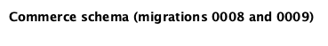

# مقدمه

پایگاه داده دو کاربرد دارد. جایگزین فایل‌های رمزشده‌ای است که SwarmOps وضعیت کنترل‌گر خود را در آن‌ها نگه می‌داشت (سرورها، برنامه‌ها، مسیریابی، صف فرمان‌ها، دفتر ممیزی و دیگران) و داده‌های تازه‌ی تجاری را نیز نگه می‌دارد: مشتریان، پلن‌ها، کیف پول‌ها، سفارش‌ها، پروژه‌ها، مصرف، فاکتورها و تیکت‌های پشتیبانی. نگهداری هر دو در یک پایگاه داده تصمیم محوری طراحی است: تأیید سفارش باید کیف پول را حساب کند و استقرار را در یک تراکنش در صف قرار دهد (سند معماری نرم‌افزار، بخش ۶.۱).

## نیازمندی‌های داده

| شناسه | نیازمندی | منبع |
|---|---|---|
| D-1 | موجودی کیف پول هرگز منفی نیست و همیشه با مجموع دفتر کل آن برابر است. | FR-WAL-1، FR-WAL-3، NFR-REL-1 |
| D-2 | شارژ، هزینه یا بازپرداخت تکراری حداکثر یک بار اعمال می‌شود. | FR-WAL-2، FR-PRV-2 |
| D-3 | هر پروژه حداکثر یک بار در هر ساعت حساب می‌شود و هزینه‌ی ماهانه‌اش از سقف پلن بیشتر نمی‌شود. | FR-BIL-1، FR-BIL-2 |
| D-4 | تأیید، هزینه و درخواست استقرار با هم ثبت می‌شوند. | FR-ORD-6 |
| D-5 | هر ارجاع به سطری موجود اشاره می‌کند. | NFR-REL-3 |
| D-6 | رازها بدون کلید داده‌ی جداگانه خوانا نیستند. | FR-DAT-4 |
| D-7 | طرح‌واره بدون تغییر روی MariaDB 11.4 و MySQL 8.4 اجرا می‌شود. | NFR-PORT-1 |
| D-8 | گزارش‌ها بدون کد برنامه در دسترس‌اند. | FR-REP-1، FR-REP-2 |

: نیازمندی‌های داده

# مدل مفهومی

دامنه‌ی تجارت این موجودیت‌ها و رابطه‌ها را دارد:

- **کاربر** مشتری یا مدیر است. هر مشتری دقیقاً یک **کیف پول** دارد و هر تغییر آن یک **تراکنش کیف پول** است.
- **پلن** به یک **دسته‌ی محصول** تعلق دارد و **ویژگی‌هایی** به هر زبان دارد.
- مشتری **سفارش** ثبت می‌کند. هر سفارش یک یا چند **قلم سفارش** دارد که هر یک پلن، برنامه‌ی درخواستی و قیمت‌های زمان ثبت را نام می‌برد. مدیران سفارش‌ها را بازبینی می‌کنند.
- قلم سفارش تأییدشده یک **پروژه** ایجاد می‌کند. پروژه برای هر ساعت حساب‌شده یک **رکورد مصرف** می‌گیرد که هر یک با یک تراکنش کیف پول پرداخت شده است.
- مشتری هر ماه یک **فاکتور** دریافت می‌کند. **سطرهای فاکتور** رکوردهای مصرف تحت پوشش را خلاصه می‌کنند و هر رکورد مصرف حداکثر در یک فاکتور می‌آید.
- مشتری **تیکت پشتیبانی** باز می‌کند که **پیام‌های تیکت** مشتری یا مدیران را در بر دارد.

دامنه‌ی سکو از گروه‌هایی تشکیل شده که پیش‌تر فایل‌های جداگانه بودند:

- **ممیزی:** رویدادها و جزئیاتشان؛
- **برنامه‌ها:** محیط، پایگاه‌های داده، فرمان سلامت و نتیجه‌ها، به‌علاوه‌ی اعتبارنامه‌ها؛
- **منبع:** اتصالات، تنظیمات و میزبان‌های خصوصی؛
- **سرورها:** کلیدها و رویدادهای عامل؛
- **توپولوژی هسته:** اقتدار، اعضا و جابه‌جایی‌ها؛
- **رجیستری عامل:** مرجع گواهی، عامل‌ها، توکن‌ها و ادعاها؛
- **مسیریابی:** خوشه‌ها، مسیرها و میزبان‌هایشان، DNS، گواهی‌ها و مشاهدات زمان اجرا؛
- **صف فرمان‌ها:** فرمان‌ها، محموله‌ها، رویدادها، خروجی‌ها و قفل‌ها.

استقرار دو دامنه را به هم وصل می‌کند: `command_id` پروژه فرمان `application.deploy` استقراردهنده‌ی آن را نام می‌برد و `app_name` آن نام برنامه‌ای است که آن فرمان ساخته است.

# مدل منطقی

شکل ۱ طرح‌واره‌ی تجارت را با همه‌ی ستون‌ها و شکل ۲ جدول‌های طرح‌واره‌ی سکو را با کلیدها و رابطه‌هایشان نشان می‌دهد. نمادگذاری پای کلاغی به کار رفته است: خط یعنی *دقیقاً یک*، دایره یعنی *صفر* و چنگال یعنی *چند*. برچسب‌های نمودار نام‌های واقعی جدول و ستون است.

{width=100%}

{width=100%}

هر دو نمودار با `docs/cloud/tools/schema_docs.py` از طرح‌واره‌ی واقعی تولید می‌شوند؛ بنابراین نمی‌توانند از مهاجرت‌ها فاصله بگیرند.

# طراحی فیزیکی

## موتور، مجموعه‌نویسه و زمان

همه‌ی جدول‌ها از InnoDB، موتور تراکنشی MariaDB و MySQL، با `utf8mb4` و `utf8mb4_unicode_ci` استفاده می‌کنند که متن فارسی و هر خط دیگری را درست ذخیره می‌کند. اتصال UTC و `parseTime` را اجبار می‌کند. همه‌ی زمان‌ها `DATETIME(6)` در UTC با دقت میکروثانیه‌اند، به جز مرز ساعت در `usage_records.period_start` که `DATETIME` با دقت ثانیه است و دوره‌های فاکتور که `DATE` هستند.

## نوع‌ها

| نوع مقدار | نوع ستون | دلیل |
|---|---|---|
| پول | `BIGINT` (علامت‌دار برای مبالغ دفتر کل، بی‌علامت برای قیمت‌ها) | ریال صحیح و دقیق؛ بدون خطای گردکردن. بزرگ‌ترین شارژ (۲×۱۰۹ ریال) بسیار کمتر از حد ۹٫۲×۱۰۱۸ است. |
| کلیدهای جانشین | `BIGINT UNSIGNED AUTO_INCREMENT` | هرگز دوباره استفاده نمی‌شوند؛ دامنه‌ی کافی. |
| شناسه‌ی فرمان | `CHAR(36)` | شناسه‌هایی که برنامه تولید می‌کند تا شناسه‌ی فرمان پیش از درج معلوم باشد. |
| توکن نشست | `CHAR(64)` | درهم‌سازی SHA-256 توکن به‌صورت هگز؛ خود توکن هرگز ذخیره نمی‌شود. |
| وضعیت‌ها و انواع | `VARCHAR(16)` با قید CHECK | قابل حمل میان دو موتور و قابل گسترش با مهاجرت؛ قید CHECK همان محافظت `ENUM` را می‌دهد. |
| سندهای کامل مسیریابی | `JSON` (در MariaDB به‌صورت `LONGTEXT` با بررسی `JSON_VALID`) | بخش ۵.۱. |
| رازها | `VARBINARY` / `BLOB` حاوی متن رمز AES-GCM | بخش ۹. |

: انتخاب نوع ستون‌ها

## مهاجرت‌ها

طرح‌واره با نُه فایل SQL ساخته می‌شود که در باینری جاسازی و در راه‌اندازی به ترتیب اعمال می‌شوند (سند معماری نرم‌افزار، بخش ۶.۵).

| مهاجرت | جدول‌ها | محتوا |
|---|---|---|
| `0001_audit.sql` | ۲ | رویدادها و جزئیات ممیزی |
| `0002_applications.sql` | ۸ | برنامه‌ها، محیط، فرمان سلامت، پایگاه‌های داده، نتیجه‌ها، اعتبارنامه‌ها |
| `0003_source.sql` | ۳ | اتصالات، تنظیمات و میزبان‌های خصوصی منبع |
| `0004_servers.sql` | ۳ | سرورها، رویدادهای عامل، کلیدها |
| `0005_core_and_agents.sql` | ۷ | اقتدار، اعضا و جابه‌جایی‌های هسته؛ مرجع گواهی، عامل‌ها، توکن‌ها، ادعاها |
| `0006_routing.sql` | ۱۳ | خوشه‌های مسیریابی، مسیرها، میزبان‌ها، اتصال‌ها، اعلان‌ها، دامنه‌ها، DNS، گواهی‌ها، زمان اجرا |
| `0007_command_queue.sql` | ۵ | فرمان‌ها، محموله‌ها، رویدادها، خروجی‌ها، قفل‌ها |
| `0008_commerce.sql` | ۱۵ + ۳ نما | طرح‌واره‌ی تجارت |
| `0009_plan_text.sql` | ۰ | توضیح و ویژگی‌های فارسی پلن‌ها؛ اصلاح ویژگی‌های اولیه |
| *اجراکننده* | ۱ | `schema_migrations` |
| **جمع** | **۵۷ + ۳ نما** | |

: مهاجرت‌ها

## قراردادهای نام‌گذاری

نام قیدها نوع و جدول را بیان می‌کند: `uq_` برای کلید یکتا، `ix_` برای نمایه‌ی ثانویه، `fk_` برای کلید خارجی و `ck_` برای قید CHECK. نمونه‌ها: `uq_usage_records_hour`، `ix_orders_queue`، `fk_wallet_transactions_wallet` و `ck_wallets_non_negative`. بنابراین پیام خطا قاعده‌ی نقض‌شده را نام می‌برد.

# نرمال‌سازی

## فرم نرمال اول

هر ستون یک مقدار اتمی دارد و گروه تکراری وجود ندارد. مقادیری که می‌توانستند فهرست باشند، جدول جداگانه‌اند و هر سطر در صورت اهمیت ترتیب، مرتب است: ویژگی‌های پلن (`plan_features`)، متغیرهای محیطی برنامه (`application_env`)، آرگومان‌های فرمان سلامت (`application_health_command`)، نام‌های میزبان مسیر (`route_hosts`) و دامنه‌های گواهی (`route_certificate_domains`).

**استثنا.** `routing_clusters.settings_json`، `cutover_json` و `cutover_rollback_json` سندهای کامل JSON را نگه می‌دارند: تنظیمات دروازه‌ی خوشه، برنامه‌ی جابه‌جایی و بازگشت آن. مخزن مسیریابی این سندها را همیشه به‌صورت یکجا، زیر قفل سطر خوشه، می‌خواند، اعتبارسنجی و می‌نویسد و هیچ پرس‌وجویی بر اساس فیلدی درون آن‌ها فیلتر نمی‌کند. شکستن آن‌ها به سطرها جدول‌های فراوانی می‌ساخت که هرگز پرس‌وجو نمی‌شوند و اعتبارسنجی سند را از یک جا به جاهای بسیار منتقل می‌کرد. مسیرها، دامنه‌ها، رکوردهای DNS و گواهی‌های درون یک خوشه جدول‌های نرمال معمولی‌اند، چون *به‌صورت تکی* پرس‌وجو می‌شوند.

## فرم نرمال دوم

تقریباً همه‌ی جدول‌ها کلید تک‌ستونی دارند، پس وابستگی جزئی ممکن نیست. در جدول‌های دارای کلید مرکب، ویژگی‌ها به کل کلید وابسته‌اند:

- `plan_features(plan_id, locale, position)`: یک ویژگی، ویژگیِ *همان* جایگاه در *همان* پلن و به *همان* زبان است.
- `application_env(application, name)`: یک مقدار، مقدار *همان* متغیر در *همان* برنامه است.

## فرم نرمال سوم و BCNF

هیچ ویژگی غیرکلیدی به ویژگی غیرکلیدی دیگری وابسته نیست. سه طراحی که شبیه وابستگی متعدی به نظر می‌رسند، در واقع چنین نیستند:

- **قیمت‌ها در `order_items` و `projects`.** قیمت‌های ساعتی و ماهانه در زمان سفارش از پلن کپی می‌شوند. به `plan_id` وابسته نیستند: آنچه مشتری پذیرفته را ثبت می‌کنند که باید پس از تغییر قیمت پلن ثابت بماند (FR-CAT-4). قیمت فعلی پلن و قیمت پذیرفته‌شده‌ی سفارش دو واقعیت متفاوت‌اند.
- **`orders.user_id` و `projects.user_id`.** مالک پروژه از طریق قلم سفارش و سفارش هم قابل دسترسی است. در پروژه ذخیره می‌شود چون همه‌ی پرس‌وجوهای مشتری با `user_id` محدود می‌شوند (NFR-SEC-2) و یک بار، در تراکنش تأیید، نوشته می‌شود و هرگز تغییر نمی‌کند.
- **`invoice_lines.project_id` و مبلغ سطر.** فاکتور صادرشده سندی تاریخی است؛ سطرهایش نباید با تغییر بعدی رکوردهای مصرف تغییر کنند، پس مبالغ فاکتورشده را ذخیره می‌کنند.

هر تعیین‌کننده در جدول‌های تجارت یک کلید نامزد است — برای نمونه در `users`، `email` یکتاست و `id` و `email` تنها تعیین‌کننده‌ها هستند — پس طرح‌واره‌ی تجارت در فرم نرمال بویس-کاد نیز هست.

## نرمال‌زدایی آگاهانه

| مقدار ذخیره‌شده | قابل استخراج از | چرا ذخیره می‌شود | سازگاری چگونه حفظ می‌شود |
|---|---|---|---|
| `wallets.balance_rial` | `SUM(wallet_transactions.amount_rial)` | بررسی ذخیره و اضافه‌برداشت باید یک سطر را زیر قفل بخواند، نه دفتر کلی رو به رشد را جمع بزند. | در همان تراکنش سطر دفتر کل و زیر `FOR UPDATE` کیف پول به‌روز می‌شود؛ `CHECK (balance_rial >= 0)`؛ کنسول برابری با دفتر کل را بررسی می‌کند. |
| `wallet_transactions.balance_after_rial` | مجموع جاری سطرهای قبلی | موجودی حاصل هر سطر را بدون تابع پنجره‌ای روی کل دفتر کل نشان می‌دهد. | با همان کد و در همان تراکنش نوشته می‌شود؛ `CHECK (balance_after_rial >= 0)`. |
| `invoices.subtotal_rial`، `tax_rial`، `total_rial` | مجموع سطرها و فرمول مالیات | فاکتور صادرشده ثابت است؛ محاسبه‌ی دوباره ممکن است سندی قانونی را تغییر دهد. | `CHECK (total_rial = subtotal_rial + tax_rial)`. |
| ستون‌های سلامت عامل در `servers` | آخرین سطر `server_agent_events` | کنسول سرورها را با سلامتشان در یک پرس‌وجو فهرست می‌کند. | همراه درج رویداد به‌روز می‌شوند. |

: نرمال‌زدایی آگاهانه

# قیدهای یکپارچگی

## کلیدها

هر جدول کلید اصلی دارد. کلیدهای یکتا قواعد کسب‌وکار را بیان می‌کنند:

- `users.email` و `plans.code`؛
- `projects.app_name` که رقابت دو سفارش بر سر یک نام را حل می‌کند؛
- `invoices.number`؛
- `wallet_transactions(user_id, idempotency_key)`؛
- `usage_records(project_id, period_start)`؛
- `commands(actor, idempotency_key)`.

## کلیدهای خارجی

۴۸ کلید خارجی وجود دارد: ۱۸ RESTRICT، ۲۸ CASCADE و ۲ SET NULL. کلید خارجی بدون بند صریح ON DELETE مانند RESTRICT رفتار می‌کند؛ فرهنگ داده قاعده‌ی مؤثر هر کلید را فهرست می‌کند. طرح‌واره‌ی تجارت هر قاعده را بر اساس معنای ارجاع انتخاب می‌کند:

| قاعده | ارجاع‌ها | دلیل |
|---|---|---|
| RESTRICT | کیف پول‌ها، سطرهای دفتر کل، سفارش‌ها، اقلام سفارش، پروژه‌ها، رکوردهای مصرف و فاکتورها به کاربران، پلن‌ها، کیف پول‌ها، پروژه‌ها و فاکتورهایشان | پول و تاریخچه به این سطرها ارجاع می‌دهند؛ سطر مورد ارجاع قابل حذف نیست. |
| CASCADE | کاربر ← نشست‌ها، پلن ← ویژگی‌ها، سفارش ← اقلام، فاکتور ← سطرها، تیکت ← پیام‌ها | فرزند بدون والد معنایی ندارد. |
| SET NULL | `invoice_lines.project_id`، `support_tickets.project_id` | سطر فاکتور یا تیکت باید حتی با حذف سطر پروژه باقی بماند؛ توضیح خود را دارد. |

: قاعده‌های کلید خارجی در طرح‌واره‌ی تجارت

بیشتر قاعده‌های CASCADE طرح‌واره‌ی سکو، سطرهای جزئی را همراه والد حذف می‌کنند؛ مانند کلیدها و رویدادهای عامل یک سرور، متغیرهای محیطی یک برنامه و رویدادها و خروجی‌های یک فرمان.

## قیدهای CHECK

۴۲ قید CHECK وجود دارد، از جمله:

| قید | قاعده |
|---|---|
| `ck_wallets_non_negative` | `balance_rial >= 0` |
| `ck_wallet_transactions_kind` | `kind IN ('topup','order_charge','usage','refund','adjustment')` |
| `ck_wallet_transactions_amount` | `amount_rial <> 0` |
| `ck_wallet_transactions_balance` | `balance_after_rial >= 0` |
| `ck_invoices_total` | `total_rial = subtotal_rial + tax_rial` |
| `ck_orders_review` | `status IN ('pending','cancelled') OR reviewed_at IS NOT NULL`: سفارش تأییدشده، ردشده یا ناموفق همیشه زمان بازبینی را ثبت دارد |
| `ck_plan_features_locale` | `locale IN ('en','fa')` |
| `ck_commands_state` | فهرست بسته‌ی وضعیت‌های فرمان |
| `ck_agent_ca_singleton`، `ck_source_settings_singleton` | `id = 1`، پس جدول دقیقاً یک سطر دارد |
| `ck_applications_resources` | `cpus > 0 AND memory_mib > 0 AND port > 0` |

: نمونه‌هایی از قیدهای CHECK

MySQL نقض CHECK را با خطای ۳۸۱۹ و MariaDB با خطای ۴۰۲۵ گزارش می‌کند؛ `sqlstore.IsCheckViolation` هر دو را می‌شناسد.

# نمایه‌ها و طرح اجرای پرس‌وجو

هر کلید خارجی نمایه دارد و هر پرس‌وجوی پرتکرار نمایه‌ای منطبق با فیلتر و ترتیبش دارد. طرح‌های زیر با `EXPLAIN` روی MariaDB 11.4 در پایگاه داده‌ی توسعه‌ی به‌کاررفته در اجرای سرتاسری تولید شده‌اند. آن پایگاه داده کوچک است؛ هرجا انتخاب بهینه‌ساز برای جدول‌های کوچک با جدول‌های بزرگ‌تر متفاوت باشد، ذکر شده است.

| پرس‌وجو | نمایه | طرح مشاهده‌شده |
|---|---|---|
| برداشتن فرمان سررسید بعدی: `WHERE state IN ('queued','retry_scheduled') AND (next_attempt_at IS NULL OR next_attempt_at <= now) ORDER BY created_at, seq LIMIT 1 FOR UPDATE SKIP LOCKED` | `ix_commands_runnable` | `range` روی `ix_commands_runnable` با شرط نمایه، سپس مرتب‌سازی اندک سطرهای قابل اجرا |
| جمع مصرف ماهانه‌ی یک پروژه: `WHERE project_id = ? AND period_start >= ? AND period_start < ?` | `uq_usage_records_hour (project_id, period_start)` | `range` روی `uq_usage_records_hour` |
| صف سفارش‌های در انتظار: `WHERE status = 'pending' ORDER BY placed_at` | `ix_orders_queue (status, placed_at)` | `ref` روی `ix_orders_queue` با *Using index* (پوششی، بدون مرتب‌سازی) |
| دفتر کل یک مشتری: `WHERE user_id = ? ORDER BY id DESC LIMIT 50` | `ix_wallet_transactions_user (user_id, created_at)` | روی شش سطر، بهینه‌ساز کلید اصلی را پیمود؛ با دفتر کل واقعی، نمایه‌ی `user_id` گزینشی است |

: نمایه‌های پرس‌وجوهای پرتکرار

کلید `uq_usage_records_hour` دو نقش دارد: نمایه‌ی جمع ماهانه و قیدی که کسر دوم یک ساعت را ناممکن می‌کند.

# تراکنش‌ها، جداسازی و هم‌زمانی

## سطح جداسازی

همه‌ی تراکنش‌های برنامه در **READ COMMITTED** اجرا می‌شوند. هر خواندنی که نتیجه‌اش درباره‌ی نوشتنی تصمیم می‌گیرد با `SELECT … FOR UPDATE` انجام می‌شود؛ پس محافظتی که تصویر سازگار REPEATABLE READ می‌داد به‌طور صریح به دست می‌آید، بدون قفل‌های شکافی که REPEATABLE READ روی خواندن‌های بازه‌ای می‌گیرد و درج‌های نامرتبط — مانند سطرهای مصرف پروژه‌های مختلف — را منتظر یکدیگر می‌گذارد. تراکنشی که سرور برای شکستن بن‌بست (خطای ۱۲۱۳) یا انتظار قفل (۱۲۰۵) لغو کند، به‌طور کامل تا چهار بار تکرار می‌شود.

## ناهنجاری‌های مهارشده

| ناهنجاری | محل احتمالی | پیشگیری |
|---|---|---|
| به‌روزرسانی از دست رفته | دو کسر یک موجودی را می‌خوانند و هر دو بازمی‌نویسند. | سطر کیف پول پیش از خواندن موجودی با `FOR UPDATE` قفل می‌شود. |
| اضافه‌برداشت هم‌زمان | پنجاه کسر موازی از موجودی بیشتر می‌شوند. | قفل سطر آن‌ها را پشت سر هم می‌اندازد و `ck_wallets_non_negative` هر کسری را که باز هم اضافه‌برداشت کند رد می‌کند. نتیجه‌ی آزمون: ۳۳ موفق، ۱۷ رد و موجودی برابر دفتر کل. |
| اعمال دوباره‌ی تکرار | کلاینت پس از اتمام مهلت شارژ را تکرار می‌کند. | `UNIQUE(user_id, idempotency_key)`؛ تلاش دوم تراکنش نخست را برمی‌گرداند. |
| صورتحساب دوباره‌ی یک ساعت | دو اجرای صورتحساب هم‌پوشانی دارند. | `UNIQUE(project_id, period_start)` روی `usage_records`. |
| تأیید دوباره | دو مدیر یک سفارش را تأیید می‌کنند. | سطر سفارش قفل می‌شود و باید هنوز `pending` باشد؛ تأیید دوم تعارض دریافت می‌کند. |
| هزینه بدون استقرار | فرایند میان کسر و در صف گذاشتن متوقف می‌شود. | هر دو در یک تراکنش‌اند (صندوق خروجی تراکنشی). |
| برداشت دوباره‌ی فرمان | دو کارگر یک فرمان را برمی‌دارند. | `FOR UPDATE SKIP LOCKED` در برداشتن. |
| فاکتور بدون یک ساعت | صورتحساب میان جمع زدن و علامت‌گذاری مصرف فاکتورشده ساعتی می‌افزاید. | صدور فاکتور سطرهای مصرف فاکتورنشده را پیش از جمع زدن با `FOR UPDATE` قفل می‌کند. |
| مهاجرت هم‌زمان | دو هسته هم‌زمان راه می‌افتند. | `GET_LOCK('swarmops_schema_migrations', 60)`. |
| دو مالک فعال | دو هسته هر دو خود را فعال می‌پندارند. | سطر یگانه‌ی `core_authority` که با `FOR UPDATE` قفل می‌شود، دوره‌ی اقتدار را نگه می‌دارد. |

: ناهنجاری‌های هم‌زمانی و پیشگیری از آن‌ها

# نماها

سه نما گزارش‌ها را بدون کد برنامه در اختیار مدیران می‌گذارند (D-8). تعریف کامل آن‌ها در سند انگلیسی و در مهاجرت `0008_commerce.sql` آمده است:

- **`v_customer_accounts`**: برای هر مشتری، موجودی، تعداد پروژه‌های زنده (در حال استقرار، فعال یا معلق) و سفارش‌های در انتظار؛
- **`v_order_queue`**: سفارش‌های در انتظار با ایمیل و موجودی مشتری، نام برنامه، پلن و قیمت‌ها؛
- **`v_revenue_by_month`**: برای هر ماه، مبلغ کسرشده (هزینه‌ی سفارش و مصرف)، بازپرداخت‌شده، شارژشده و تعداد مشتریان پرداخت‌کننده، از روی دفتر کل.

::: ltr
```sql
CREATE VIEW v_revenue_by_month AS
SELECT DATE_FORMAT(t.created_at, '%Y-%m') AS month,
       SUM(CASE WHEN t.kind IN ('order_charge', 'usage')
                THEN -t.amount_rial ELSE 0 END) AS charged_rial,
       SUM(CASE WHEN t.kind = 'refund' THEN t.amount_rial ELSE 0 END) AS refunded_rial,
       SUM(CASE WHEN t.kind = 'topup' THEN t.amount_rial ELSE 0 END) AS topped_up_rial,
       COUNT(DISTINCT t.user_id) AS paying_customers
FROM wallet_transactions t
GROUP BY DATE_FORMAT(t.created_at, '%Y-%m');
```
:::

# امنیت داده‌ی ذخیره‌شده

ستون‌هایی که رازها را نگه می‌دارند متن رمز AES-GCM ذخیره می‌کنند:

- مقادیر محیطی برنامه؛
- اعتبارنامه‌های پایگاه داده؛
- توکن اتصالات منبع و گذرواژه‌ی رجیستری در تنظیمات منبع؛
- رازهای ارائه‌دهندگان DNS؛
- کلیدهای سرور؛
- کلید خصوصی مرجع گواهی عامل‌ها؛
- محموله‌ها و خروجی‌های فرمان.

کلید رمزنگاری از فایلی محافظت‌شده خوانده می‌شود و هرگز در پایگاه داده نوشته نمی‌شود (D-6). هر متن رمز با داده‌ی همراه `swarmops-sql:<table>.<column>:<key values>` به محل خود پیوند خورده است؛ مقداری که به سطر یا ستون دیگری کپی شود به‌جای رمزگشایی در احراز اصالت شکست می‌خورد. پس کسی که پشتیبان پایگاه داده را دارد اما کلید را ندارد، نه رازها را می‌بیند و نه راهی برای جابه‌جایی آن‌ها میان سطرها دارد.

گذرواژه‌ها هرگز ذخیره نمی‌شوند: `users.password_hash` درهم‌سازی bcrypt را نگه می‌دارد. توکن نشست فروشگاه فقط به‌صورت درهم‌سازی SHA-256 ذخیره می‌شود.

**توصیه برای محیط تولید.** مهاجرت‌ها را با حسابی اجرا کنید که اجازه‌ی تغییر طرح‌واره دارد و هسته را با حسابی که فقط به عملیات داده روی طرح‌واره‌ی `swarmops` محدود است.

# پرس‌وجوهای نمونه

کیف پول‌هایی که موجودی‌شان با مجموع دفتر کل متفاوت است. نتیجه‌ی مورد انتظار خالی است و پس از اجرای سرتاسری روی پایگاه داده‌ی توسعه نیز خالی بود:

::: ltr
```sql
SELECT w.user_id, w.balance_rial, COALESCE(SUM(t.amount_rial), 0) AS ledger_sum
FROM wallets w
LEFT JOIN wallet_transactions t ON t.user_id = w.user_id
GROUP BY w.user_id, w.balance_rial
HAVING w.balance_rial <> COALESCE(SUM(t.amount_rial), 0);
```
:::

مشتریان با بیشترین مصرف در ماه جاری:

::: ltr
```sql
SELECT p.user_id, u.email, SUM(r.amount_rial) AS usage_rial
FROM usage_records r
JOIN projects p ON p.id = r.project_id
JOIN users u ON u.id = p.user_id
WHERE r.period_start >= DATE_FORMAT(UTC_TIMESTAMP(), '%Y-%m-01')
GROUP BY p.user_id, u.email
ORDER BY usage_rial DESC
LIMIT 10;
```
:::

پروژه‌هایی که استقرار ناموفق آن‌ها را بدون سرویس در حال اجرا گذاشته است:

::: ltr
```sql
SELECT p.app_name, p.status, c.state, c.failure_code, c.failure_summary
FROM projects p
JOIN commands c ON c.id = p.command_id
WHERE p.status = 'failed';
```
:::

# پشتیبان‌گیری، بازیابی و ارتقا

- **پشتیبان‌گیری:** `mysqldump --single-transaction --routines --triggers swarmops`، تصویری سازگار از InnoDB بدون قفل کردن نویسندگان. پشتیبان باید همراه نسخه‌ای جداگانه و محافظت‌شده از کلید داده نگهداری شود؛ هیچ‌یک به‌تنها کافی نیست.
- **بازیابی:** بارگذاری خروجی در طرح‌واره‌ای خالی و راه‌اندازی هسته با همان کلید. اجراکننده‌ی مهاجرت جمع‌آزماهای ثبت‌شده را بررسی و فقط مهاجرت‌های جدیدتر را اعمال می‌کند.
- **ارتقا از فایل‌های پیشین:** `swarmops-core migrate-state` هر مخزن پیشین را در یک تراکنش به جدول‌هایش وارد می‌کند و فایل‌ها را به‌عنوان پشتیبان سر جایشان می‌گذارد.

# پیوست: فرهنگ داده

فرهنگ داده‌ی زیر از طرح‌واره‌ی واقعی تولید شده است. برای هر جدول کاربرد آن، برای هر ستون نوع، تهی‌پذیری، کلید و پیش‌فرض، و سپس کلیدهای خارجی با قاعده‌ی حذف و قیدهای CHECK آمده است. نام جدول‌ها و ستون‌ها همان نام‌های واقعی در پایگاه داده است.
