# درباره‌ی این راهنما

سوارم‌آپس کلود برنامه‌های کانتینری را روی Docker Swarm اجرا و هزینه‌ی آن‌ها را به‌صورت ساعتی از کیف پول پیش‌پرداخت کسر می‌کند. مشتریان از **فروشگاه** در نشانی `/store` سکو و مدیران از **کنسول مدیریت** در `/` استفاده می‌کنند.

مبالغ به **تومان** نمایش داده می‌شوند. سکو در درون به ریال حساب می‌کند (هر تومان = ۱۰ ریال)، پس پاسخ‌های API و گزارش‌های پایگاه داده ده برابر عدد تومانی را نشان می‌دهند.

نام دکمه‌ها و فیلدها **پررنگ** آمده است. فروشگاه به فارسی و انگلیسی است؛ کنسول مدیریت فقط انگلیسی است، پس در بخش دوم نام‌های کنسول به انگلیسی آمده‌اند. مسیری مانند *Sales › Orders* یعنی ابتدا Sales را در نوار کناری و سپس Orders را باز کنید.

# بخش اول — مشتریان

## نگاهی به فروشگاه

سرآیند فروشگاه سه بخش دارد:

- کلید تغییر زبان (**English** / **فارسی**)؛
- دکمه‌ی **ورود** یا **خروج**؛
- پس از ورود، زبانه‌های **پلن‌ها**، **داشبورد**، **کیف پول**، **سفارش‌ها**، **پروژه‌ها**، **صورتحساب‌ها** و **پشتیبانی**.

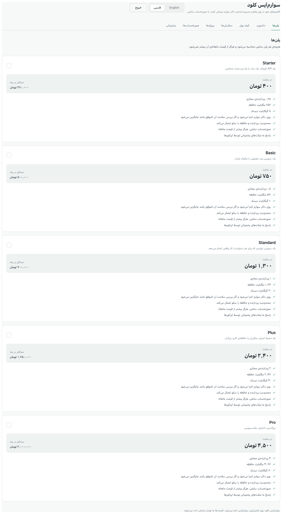{width=80%}

فروشگاه از تنظیم روشن یا تیره‌ی دستگاه شما پیروی می‌کند و روی گوشی همراه نیز مانند رایانه کار می‌کند.

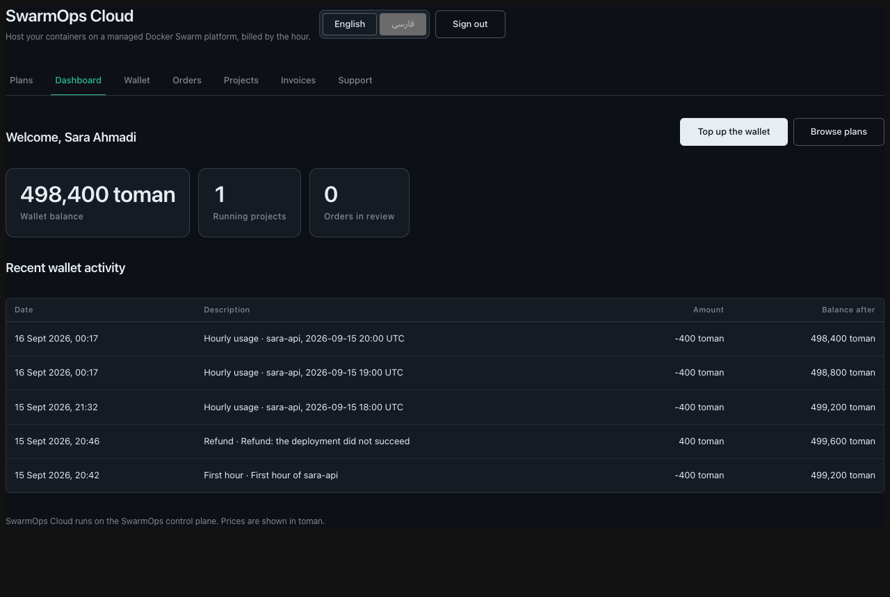{width=90%}

## انتخاب زبان

برای فارسی **فارسی** و برای انگلیسی **English** را بزنید. در فارسی کل صفحه راست‌به‌چپ است و اعداد، تاریخ‌ها و مبالغ با ارقام فارسی نمایش داده می‌شوند. انتخاب شما روی همان دستگاه به خاطر سپرده می‌شود.

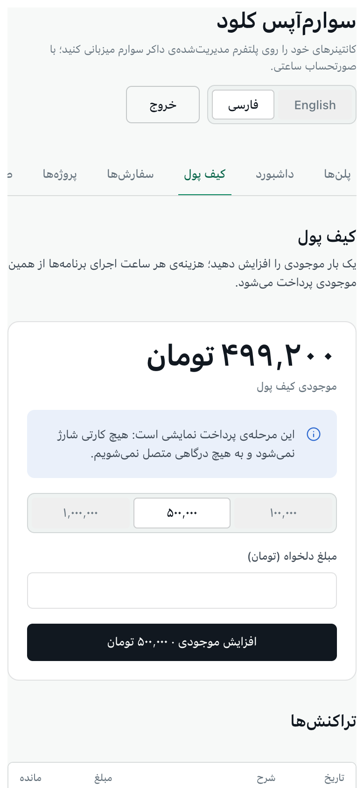{width=40%}

## ساختن حساب

1. **ورود** را بزنید و سپس با پیوند **ایجاد حساب** به صفحه‌ی **حساب خود را بسازید** بروید.
2. **نام و نام خانوادگی**، **ایمیل** و **رمز عبور** دست‌کم ۱۰ و حداکثر ۷۲ کاراکتری را وارد کنید.
3. **ایجاد حساب** را بزنید.

وارد می‌شوید و به کیف پول خود می‌روید. هر ایمیل فقط یک حساب دارد. پس از چند تلاش ناموفق در زمانی کوتاه، فروشگاه از شما می‌خواهد چند دقیقه صبر کنید؛ این کار حساب شما را در برابر حدس زدن رمز محافظت می‌کند.

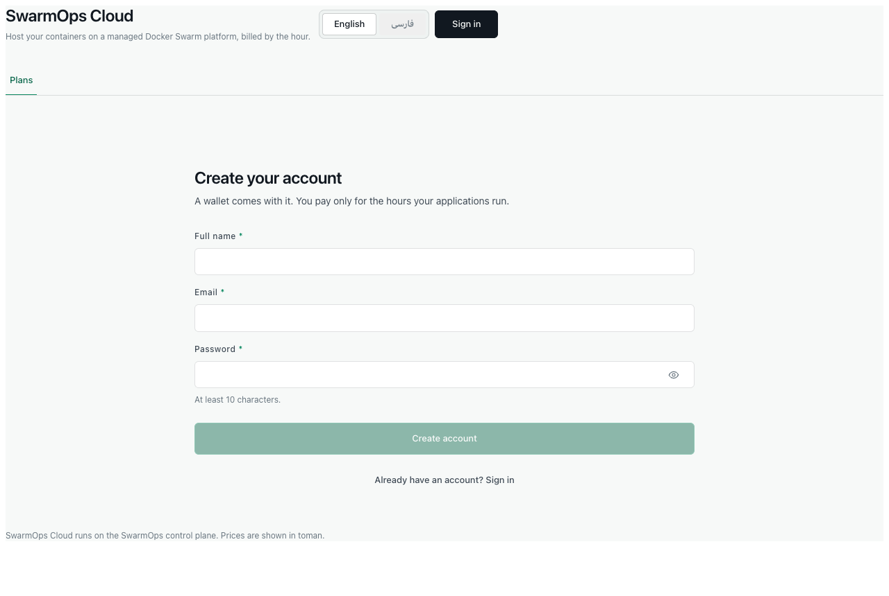{width=80%}

## افزایش موجودی کیف پول

هزینه‌ی برنامه‌ها از کیف پول پرداخت می‌شود، پس پیش از تأیید هر سفارش باید در آن پول باشد.

1. **کیف پول** را باز کنید.
2. یکی از مبالغ آماده — **۱۰۰٬۰۰۰**، **۵۰۰٬۰۰۰** یا **۱٬۰۰۰٬۰۰۰** تومان — را انتخاب کنید یا مبلغ دیگری را در **مبلغ دلخواه (تومان)** بنویسید. هر بار می‌توانید بین ۱۰٬۰۰۰ و ۲۰۰٬۰۰۰٬۰۰۰ تومان شارژ کنید.
3. **افزایش موجودی** را بزنید.

موجودی افزایش می‌یابد و شارژ در بخش **تراکنش‌ها** همراه موجودی پس از آن نمایش داده می‌شود.

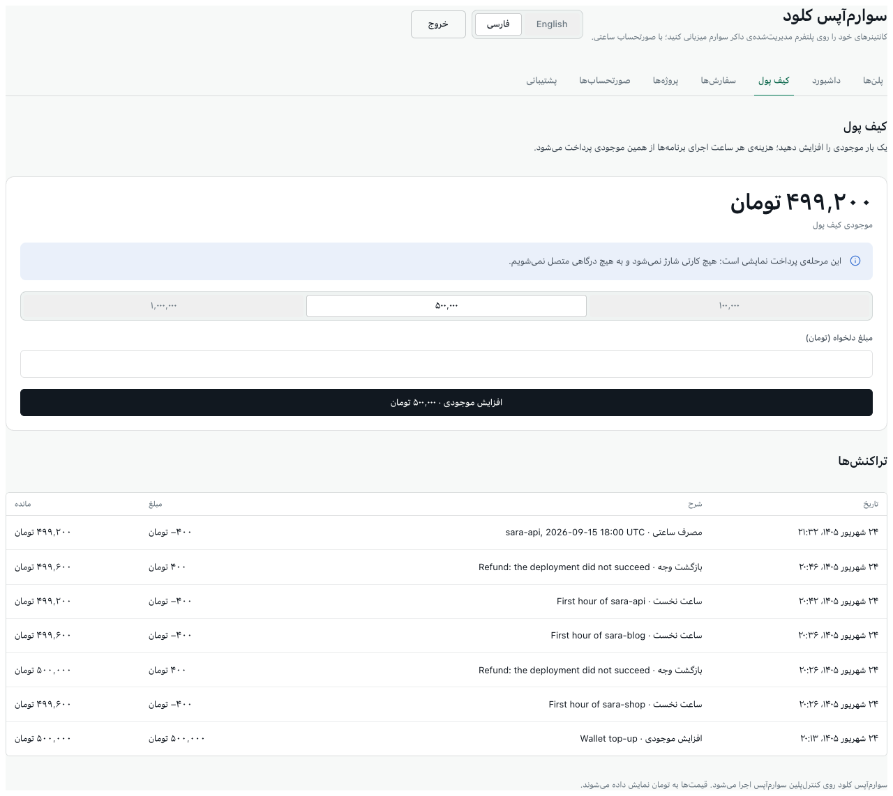{width=80%}

> **پرداخت نمایشی.** این نصب با هیچ درگاه پرداختی تماس نمی‌گیرد و هیچ کارتی شارژ نمی‌شود؛ صفحه این را در کادری آبی اعلام می‌کند. اگر درخواست شارژی (مثلاً پس از خطای شبکه) دو بار فرستاده شود، کیف پول فقط یک بار اعتبار می‌گیرد.

## سفارش یک پلن

هر پلن مقدار ثابتی پردازنده، حافظه و دیسک به برنامه‌ی شما می‌دهد، قیمتی **در ساعت** و **حداکثر در ماه** دارد.

1. **پلن‌ها** را باز و یک پلن را انتخاب کنید.
2. صفحه‌ی سفارش **قیمت هر ساعت**، **حداکثر هزینه در یک ماه** و **موجودی لازم هنگام تأیید** (هزینه‌ی ۲۴ ساعت پلن) را نشان می‌دهد.
3. فرم را پر کنید:
   - **نام برنامه**: یک حرف کوچک انگلیسی و سپس حروف کوچک، رقم یا خط تیره، حداکثر ۴۱ کاراکتر؛ نام نباید در استفاده باشد.
   - **ایمیج کانتینر**: ایمیجی منتشرشده در یک رجیستری با تگی غیر از `latest` (مثلاً `ghcr.io/acme/shop:1.0.0`).
   - **پورتی که برنامه روی آن گوش می‌دهد**.
   - **یادداشت برای بررسی‌کننده (اختیاری)**.
4. **ثبت سفارش** را بزنید.

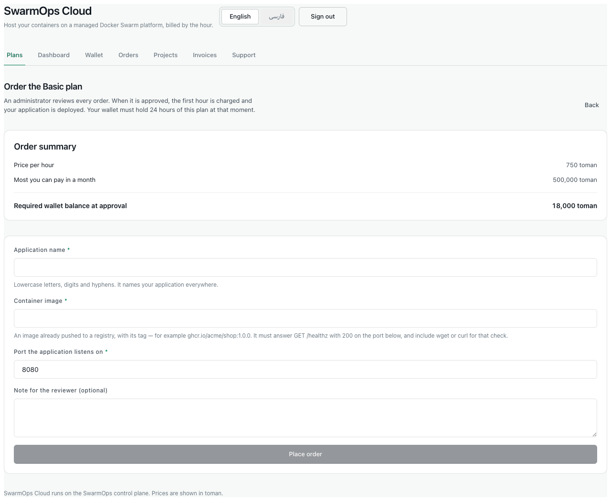{width=80%}

> **پیش از سفارش ایمیج خود را بررسی کنید.** سکو برنامه را فقط وقتی سالم باشد آغاز می‌کند. ایمیج باید روی پورتی که داده‌اید به `GET /healthz` با کد ۲۰۰ پاسخ دهد و `wget` یا `curl` را که بررسی سلامت به کار می‌برد داشته باشد. ایمیجی که این شرایط را نداشته باشد آغاز نمی‌شود و هزینه بازپرداخت می‌شود.

ثبت سفارش هیچ پولی جابه‌جا نمی‌کند؛ ابتدا مدیری آن را بررسی می‌کند.

## دنبال کردن سفارش‌ها

**سفارش‌ها** همه‌ی سفارش‌ها را با وضعیتشان فهرست می‌کند.

| وضعیت | معنا | کاری که می‌توانید بکنید |
|---|---|---|
| در انتظار بررسی | منتظر مدیر. | **لغو سفارش**. |
| در حال استقرار | تأیید شده؛ ساعت نخست کسر شده و برنامه در حال آغاز است. | صبر کنید. |
| فعال | برنامه اجرا می‌شود و ساعتی حساب می‌شود. | **پروژه‌ها** را ببینید. |
| ناموفق | برنامه آغاز نشد؛ ساعت نخست خودکار بازپرداخت شد. | الزامات ایمیج را بررسی و با نامی جدید دوباره سفارش دهید. |
| رد شده | مدیر سفارش را نپذیرفت؛ دلیل نمایش داده می‌شود. | مشکل را برطرف و دوباره سفارش دهید. |
| لغو شده | خودتان سفارش را لغو کردید. | — |

: وضعیت‌های سفارش

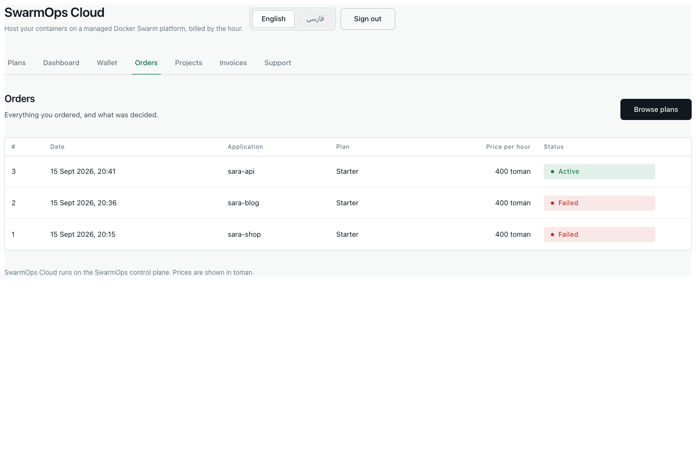{width=80%}

## پروژه‌های شما

پروژه برنامه‌ای است که از سفارش تأییدشده ایجاد می‌شود. **پروژه‌ها** برای هر یک این موارد را نشان می‌دهد:

- وضعیت؛
- پلن و قیمت هر ساعت؛
- **هزینه‌ی این ماه**؛
- **در حال اجرا از**.

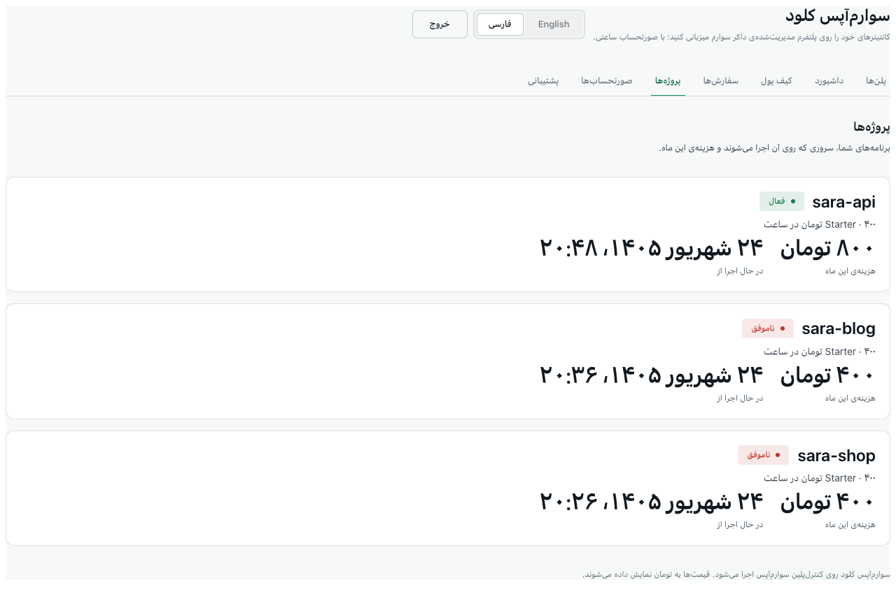{width=80%}

**شیوه‌ی محاسبه‌ی هزینه.**

- پروژه‌ی در حال اجرا برای هر ساعت یک بار با قیمت ساعتی‌اش حساب می‌شود. سکو هر چند دقیقه بررسی می‌کند، پس هزینه ممکن است چند دقیقه پس از آغاز ساعت ثبت شود.
- در یک ماه تقویمی هزینه‌ی پروژه هرگز از قیمت ماهانه‌ی پلن بیشتر نمی‌شود.
- اگر کیف پول نتواند ساعت بعد را بپردازد، پروژه **معلق** می‌شود: متوقف می‌شود و هزینه‌ای ندارد. کادری افزایش موجودی را پیشنهاد می‌کند.
- به محض آنکه شارژ ساعت بعد را پوشش دهد، پروژه دوباره آغاز می‌شود؛ ساعت‌های تعلیق هرگز حساب نمی‌شوند.

## صورتحساب‌ها

در پایان هر ماه یک صورتحساب برای مصرف شما صادر می‌شود که هر پروژه را با ساعت‌ها و مبلغش فهرست می‌کند. قیمت‌ها شامل مالیات بر ارزش افزوده (۱۰٪) هستند و صورتحساب مالیات موجود در جمع را بیان می‌کند. چون هزینه‌ها از کیف پول پیش‌پرداخت کسر می‌شوند، هر صورتحساب **پرداخت‌شده** است. برای دیدن سطرها، صورتحساب را باز کنید.

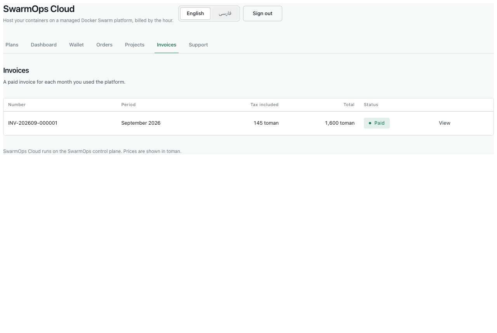{width=80%}

> صورتحساب این تصویر از اجرای آزمون است و دو ساعت نخستی را در بر دارد که پیش از رفع یک نقص بازپرداخت شده بودند (طرح و گزارش آزمون، نقص D-2). در نصبی که این رفع را دارد، ساعت‌های بازپرداخت‌شده هرگز در صورتحساب نمی‌آیند.

## پشتیبانی

1. **پشتیبانی** را باز کنید.
2. در **تیکت جدید**، **موضوع** (۳ تا ۱۶۰ کاراکتر) و **پیام** (کمتر از ۵٬۰۰۰ کاراکتر) را بنویسید؛ در صورت تمایل **درباره‌ی یک پروژه (اختیاری)** و **اولویت** (کم، معمولی یا زیاد) را انتخاب کنید.
3. **ثبت تیکت** را بزنید.

پاسخ مدیران در گفتگو نمایش داده و وضعیت تیکت از *باز* به *پاسخ داده شده* تغییر می‌کند. می‌توانید دوباره پاسخ دهید (**ارسال پاسخ**) یا تیکت را ببندید (**بستن تیکت**).

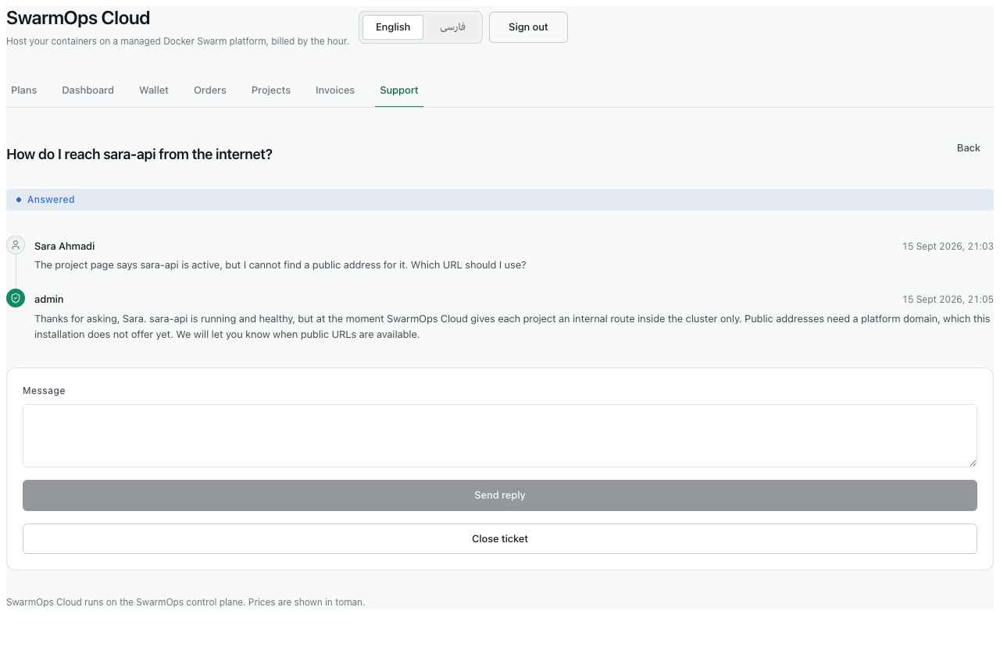{width=80%}

## خروج و امنیت

برای پایان دادن به نشست روی آن دستگاه **خروج** را بزنید؛ نشست پس از ۱۲ ساعت خودبه‌خود نیز پایان می‌یابد. اگر در زبانه‌ی دیگری وارد شوید، فروشگاه در زبانه‌ی نخست بدون بارگذاری دوباره به کار ادامه می‌دهد.

## پیام‌هایی که ممکن است ببینید

پیام‌های اعتبارسنجی سرور به انگلیسی‌اند، حتی در فروشگاه فارسی:

| پیام | معنا و راه‌حل |
|---|---|
| *use between 10 and 72 characters* | رمز عبور بسیار کوتاه یا بلند است. |
| *an account with this email already exists* | وارد شوید یا ایمیل دیگری به کار ببرید. |
| *the application name "…" is already taken* | نام دیگری انتخاب کنید. |
| *image must not use the latest tag* | به ایمیج تگ نسخه، مانند `:1.0.0`، بدهید. |
| *top up between … and … rials* | مبلغ خارج از بازه‌ی مجاز (۱۰٬۰۰۰ تا ۲۰۰٬۰۰۰٬۰۰۰ تومان) است. |
| *Too many sign-in attempts; wait a few minutes* | صبر کنید و دوباره تلاش کنید. |
| *Your session has expired* | دوباره وارد شوید. |

: پیام‌های فروشگاه

# بخش دوم — مدیران

## ورود و بخش فروش

کنسول را در نشانی سکو باز کنید و با حساب اپراتور وارد شوید. بخش **Sales** در نوار کناری پنج صفحه دارد: **Orders**، **Customers**، **Plans**، **Billing** و **Support**. بقیه‌ی کنسول — **Apps**، **Machines**، **Traffic**، **Activity** و **Control** — خود سکو را اداره می‌کند.

## آماده‌سازی سکو

سفارش فقط روی یک **مدیر Swarm متصل** تأیید می‌شود و برنامه فقط وقتی **دروازه‌ی مدیریت‌شده‌ی Traefik** نصب باشد مستقر می‌شود.

1. **اتصال سرور.** از **Connect a server** و فرمان نصب آن، یا در نصب محلی از عامل ماشین توسعه، استفاده کنید. وقتی سرور در دسترس باشد سرآیند **Agent connected** را نشان می‌دهد.
2. **نصب دروازه.** *Traffic › Gateway* را باز کنید. فهرست **Installation prerequisites** کمبودها را نشان می‌دهد: شبکه‌ی خارجی `traefik`، مدیری با برچسب `nim.edge=true`، پیکربندی پویا، راز ورود داشبورد، ایمیل تماس ACME و نام میزبان داشبورد.
   - ایمیل ACME و نام میزبان داشبورد را در *Traffic › Gateway settings* وارد کنید.
   - وقتی همه‌ی موارد ناقص خودکار قابل ساخت باشند، **Fix all N prerequisites** را بزنید و اطلاعات ورود داشبورد را که فقط یک بار نمایش داده می‌شود ذخیره کنید.
   - **Install gateway** را بزنید، `DEPLOY_TRAEFIK` را تایپ کنید و دوباره **Install gateway** را بزنید.

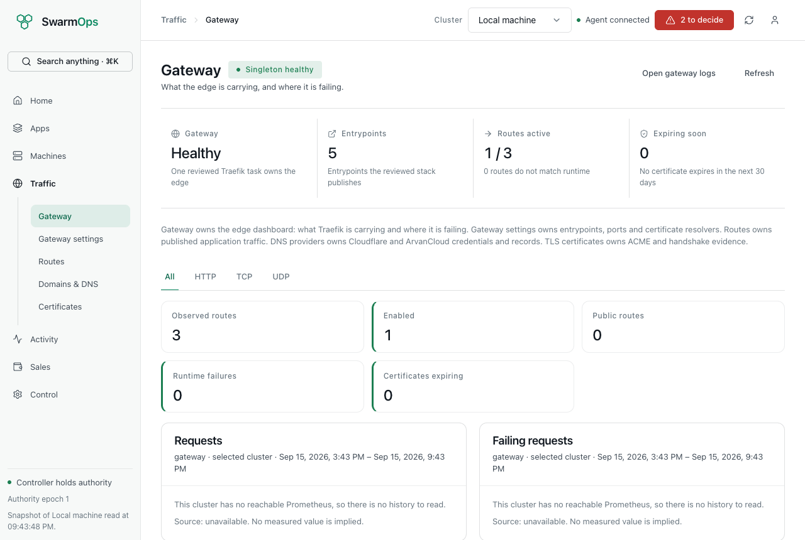{width=90%}

## بازبینی سفارش‌ها

*Sales › Orders* تعداد سفارش‌های در انتظار، در حال استقرار، فعال و ناموفق را نشان می‌دهد و فهرست را می‌توان با وضعیت فیلتر کرد.

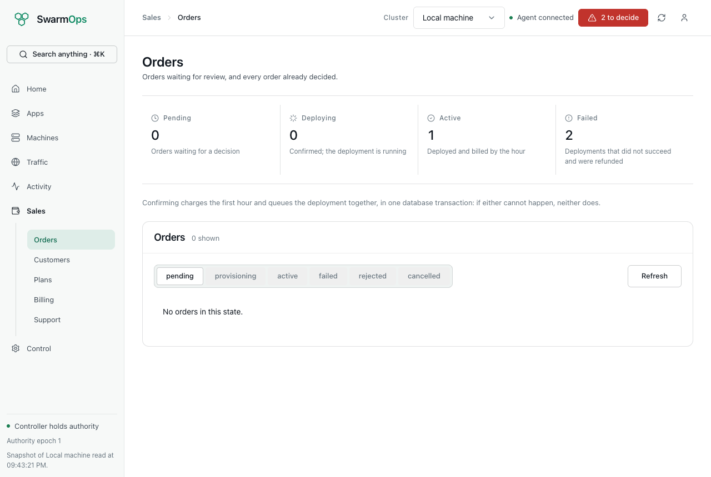{width=90%}

برای تصمیم درباره‌ی یک سفارش:

1. **Review** را روی سفارش در انتظار بزنید. پانل مشتری، برنامه، ایمیج، پورت، پلن و یادداشت مشتری را نشان می‌دهد.
2. **برای تأیید:**
   - سرور را در **Deploy on** انتخاب کنید؛ فقط مدیران Swarm متصل پیشنهاد می‌شوند.
   - عبارت نمایش‌داده‌شده، مثلاً `CONFIRM_ORDER_3`، را تایپ کنید.
   - **Confirm and deploy** را بزنید.
3. **برای رد:** دلیل را در **Reason for rejecting (sent to the customer)** بنویسید و **Reject order** را بزنید.

تأیید در یک گام ساعت نخست را کسر، پروژه را ایجاد و استقرار را در صف قرار می‌دهد. اگر هر بخشی ممکن نباشد — کیف پول کمتر از ۲۴ ساعت قیمت داشته باشد، سرور مدیر نباشد یا برنامه روی آن سرور نامعتبر باشد — هزینه‌ای کسر نمی‌شود و کنسول دلیل را توضیح می‌دهد.

پس از تأیید، سفارش تا پایان استقرار *provisioning* است؛ اگر استقرار موفق شود *active* و اگر شکست بخورد *failed* می‌شود و ساعت نخست خودکار بازپرداخت می‌شود. *Activity › Runs* گام‌های استقرار و در صورت شکست علت آن را نشان می‌دهد.

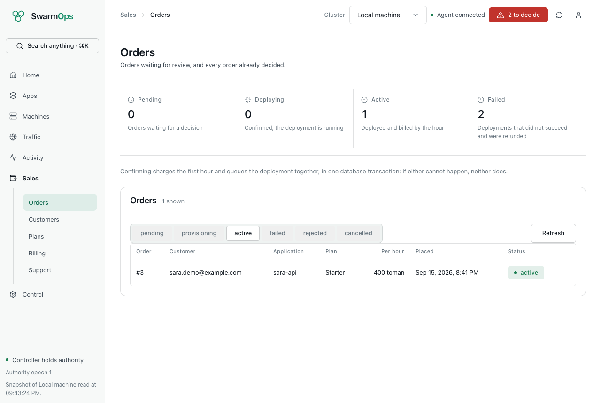{width=90%}

> **استقراری که هرگز سالم نشود، صف فرمان را تا مهلت ده‌دقیقه‌ای اشغال می‌کند** و فرمان‌های دیگر در این مدت منتظر می‌مانند. اگر استقراری در *provisioning* ماند، اجرای آن را در *Activity* و نقطه‌ی سلامت برنامه را بررسی کنید.

## مشتریان و کیف پول‌ها

*Sales › Customers* همه‌ی حساب‌های فروشگاه را با موجودی، پروژه‌های زنده، سفارش‌های در انتظار و وضعیت فهرست می‌کند. برای باز کردن دفتر کل یک مشتری **Wallet** را بزنید.

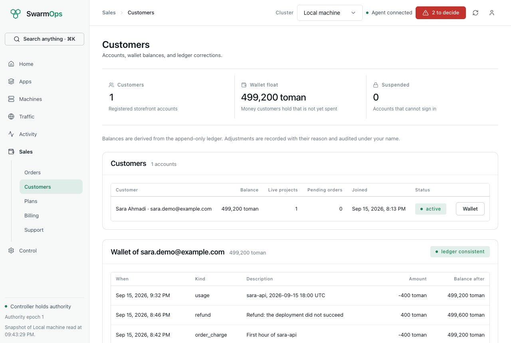{width=90%}

- **ledger consistent** تأیید می‌کند موجودی با مجموع دفتر کل برابر است. اگر روزی **ledger mismatch** دیدید، پیش از هر اصلاحی متوقف و بررسی کنید.
- **برای اصلاح موجودی**، **Adjustment (toman)** (منفی برای کسر) و **Reason (kept in the ledger)** را بنویسید و **Record adjustment** را بزنید. اصلاح یک سطر جدید دفتر کل است؛ سطرهای موجود هرگز ویرایش نمی‌شوند و موجودی منفی نمی‌شود.
- **برای تعلیق مشتری**، عبارت نمایش‌داده‌شده (مثلاً `SUSPEND_CUSTOMER_1`) را تایپ و تأیید کنید. همه‌ی نشست‌های مشتری پایان می‌یابد و نمی‌تواند وارد شود؛ پروژه‌های در حال اجرایش متوقف نمی‌شوند. فعال‌سازی دوباره نیز به همین شیوه است.

هر اصلاح و تغییر وضعیت به نام شما در دفتر ممیزی ثبت می‌شود.

## پلن‌ها

*Sales › Plans* کاتالوگ را فهرست می‌کند. برای باز کردن ویرایشگر **New plan** یا **Edit** را بزنید:

| فیلد | قاعده |
|---|---|
| Code | ۲ تا ۳۲ حرف کوچک، رقم یا خط تیره؛ پس از ساخت قابل تغییر نیست. |
| Name | الزامی. |
| Description، Description (Persian) | هر کدام کمتر از ۲۵۵ کاراکتر؛ متن فارسی در فروشگاه فارسی نمایش داده می‌شود. |
| CPU (millicores) | ۱۰۰ تا ۶۴٬۰۰۰ (هر ۱٬۰۰۰ میلی‌هسته = ۱ پردازنده‌ی مجازی). |
| Memory (MiB) | ۱۲۸ تا ۲۶۲٬۱۴۴. |
| Price per hour (rial)، Monthly cap (rial) | قیمت ساعتی مثبت و سقف دست‌کم برابر یک ساعت؛ راهنما هر یک را به تومان نشان می‌دهد. |
| Features، Features (Persian) | هر خط یک ویژگی؛ حداکثر ۱۲ مورد به هر زبان و هر مورد کمتر از ۱۶۰ کاراکتر. |
| Storefront availability | **Offered** یا **Withdrawn**. |

: فیلدهای پلن

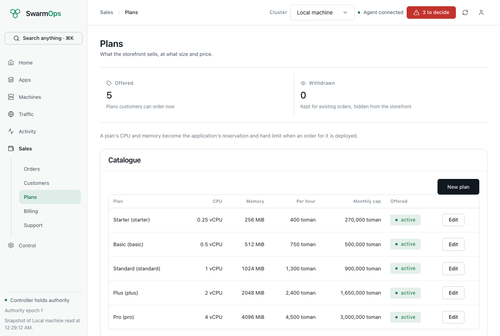{width=90%}

تغییر قیمت فقط بر سفارش‌های جدید اثر دارد؛ سفارش‌ها و پروژه‌های موجود قیمت زمان ثبت را نگه می‌دارند. خارج کردن پلن از عرضه آن را از فروشگاه پنهان می‌کند، بی‌آنکه بر پروژه‌های موجود اثر بگذارد. فقط ویژگی‌هایی را فهرست کنید که سکو واقعاً فراهم می‌کند.

## صورتحساب و فاکتورها

*Sales › Billing* این موارد را نشان می‌دهد:

- درآمد این ماه (هزینه‌ها منهای بازپرداخت‌ها)؛
- پروژه‌های فعال و معلق؛
- موجودی نزد مشتریان که هنوز خرج نشده است؛
- پروژه‌ها با هزینه‌ی این ماه؛
- درآمد ماهانه؛
- فاکتورها.

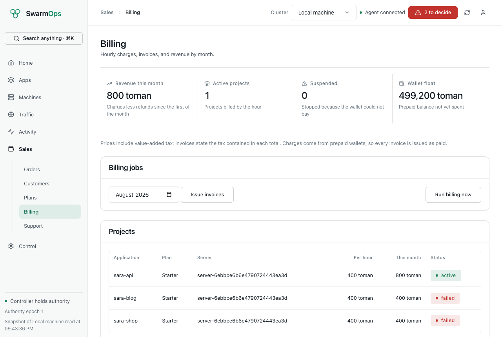{width=90%}

صورتحساب هر پنج دقیقه خودبه‌خود روی کنترل‌گر فعال اجرا می‌شود. دو دکمه را فقط در صورت نیاز به کار ببرید:

- **Run billing now** ساعت‌هایی را که هنوز حساب نشده‌اند حساب می‌کند؛ دو بار اجرا چیزی را دو بار حساب نمی‌کند.
- **Issue invoices** فاکتورهای ماه انتخاب‌شده را صادر می‌کند؛ صدور دوباره‌ی یک ماه تکراری نمی‌سازد. فاکتورهای ماه قبل خودکار نیز صادر می‌شوند.

برای دیدن پروژه‌ها، ساعت‌ها، مبالغ و مالیات یک فاکتور، **Lines** را بزنید.

{width=90%}

## پشتیبانی

*Sales › Support* تیکت‌ها را بر اساس وضعیت فهرست می‌کند: **open** (منتظر شما)، **answered** و **closed**. برای خواندن گفتگو **Open** را بزنید، پاسخ را در **Reply** بنویسید و **Send reply** را بزنید؛ تیکت *answered* می‌شود. پس از حل موضوع **Close ticket** را بزنید.

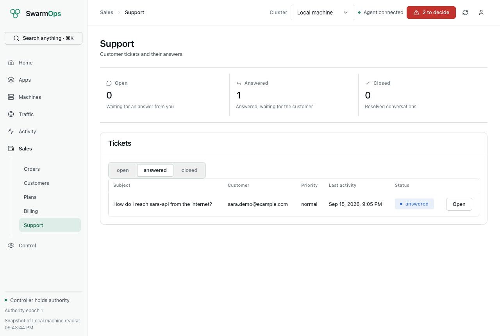{width=90%}

## پیام‌هایی که ممکن است ببینید

| پیام | معنا و راه‌حل |
|---|---|
| *The customer's wallet does not hold the required reserve* | کیف پول کمتر از ۲۴ ساعت قیمت پلن دارد؛ از مشتری بخواهید شارژ کند. |
| *The selected server is not connected to a Swarm manager* | مدیر متصلی انتخاب یا ابتدا یکی را وصل کنید. |
| *Choose a saved server to deploy on* | سروری انتخاب نشده است. |
| *This order is …, not pending* | کسی دیگر درباره‌ی سفارش تصمیم گرفته است؛ فهرست را تازه کنید. |
| *This control-plane replica is standby…* | این کنترل‌گر فعال نیست؛ از کنترل‌گر فعال استفاده کنید. |
| *Remote mutations are disabled on this control plane* | کنترل‌گر بدون فعال‌سازی تغییرات راه‌اندازی شده است. |
| شکست استقرار با `gateway_required` | دروازه را نصب کنید (بخش *آماده‌سازی سکو*). |

: پیام‌های کنسول
